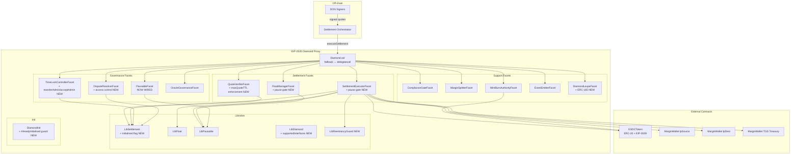
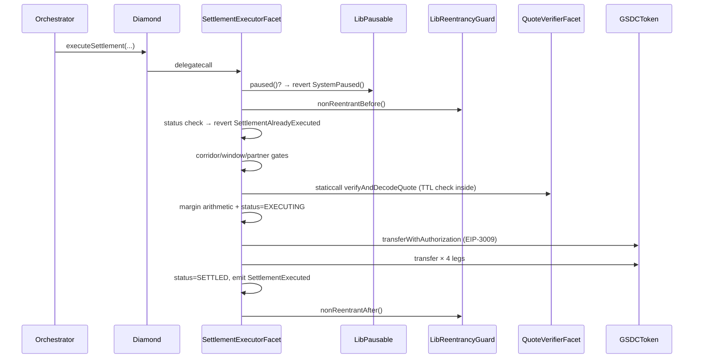

# Design Document — GSDC Audit & Test Coverage

## Overview

This document defines the technical design for closing the ten production-risk findings identified
during the deep security audit of the GSDC EIP-2535 Diamond contract suite, and for raising test
coverage from the current 90/85/90/90 gate to 100 % lines / branches / functions / statements.

The work is partitioned into two interlocking tracks:

1. **Production Fixes (Reqs 36–45)** — ten targeted contract changes that close verified
   vulnerabilities. Each change is append-only to `DiamondStorage` and backward-compatible with
   the existing test corpus.

2. **Test Coverage Uplift (Reqs 1–35)** — new test files that exercise every existing branch
   plus the branches introduced by the production fixes.

### Technology Constraints

| Layer | Version |
|---|---|
| Solidity | 0.8.24, viaIR=true, Cancun EVM |
| OpenZeppelin | v5 |
| Hardhat | 2.22 |
| ethers | v6 |
| solidity-coverage | 0.8.13 |
| Test framework | Chai + TypeScript |
| PBT library | `fast-check` 3.x |

---

## Architecture

### Component Diagram



### Settlement Execution Data Flow (Post-Fixes)



---

## Components and Interfaces

### Existing Components (Unchanged ABI)

All existing facets retain their current function selectors. The changes below are either additive
(new functions) or internal (no ABI change). This is important for the Diamond proxy because
selector collisions are permanent.

| Component | Role | Changed? |
|---|---|---|
| `Diamond.sol` | EIP-2535 proxy | No |
| `DiamondInit.sol` | One-shot initialiser | Yes – re-init guard |
| `SettlementExecutorFacet` | Atomic 4-leg settlement | Yes – pause gate, LibRG |
| `QuoteVerifierFacet` | EIP-712 verification | Yes – TTL enforcement |
| `TimeLockControllerFacet` | Governance time-lock | Yes – two-step admin |
| `FloatManagerFacet` | Float reservation | Yes – pause gate |
| `PausableFacet` | Emergency pause | Yes – wired in helpers.ts |
| `DisputeResolverFacet` | Dispute logging | Yes – access control |
| `LibSettlement` | Diamond storage | Yes – initialised flag |
| `LibReentrancyGuard` | Reentrancy library | New file |
| `ISettlementDiamond` | Aggregated interface | Yes – missing functions |

---

## Data Models

### Storage Layout — `LibSettlement.DiamondStorage`

Storage slot: `keccak256("gsdc.settlement.storage.v1")`

The Solidity storage layout is **append-only**. No existing slot is reordered or removed. Dead
fields are replaced with reserved sentinels that preserve the slot offset.

```
SLOT SEQUENCE (logical, not EVM slot numbers — mappings each consume one base slot)

[0]  mapping(address => PartnerConfig) partners
[1]  mapping(bytes32 => CorridorConfig) corridors
[2]  mapping(bytes32 => Settlement) settlements
[3]  mapping(address => uint256) floatReservations
[4]  mapping(bytes32 => uint256) settlementReservations
[5]  address gsdcToken
[6]  address tgsTreasuryWallet          ← RESERVED (see Req 39)
[7]  address tgsTreasuryMarginWallet
[8]  address admin
[9]  address pendingAdmin
[10] address oracleSigner
[11] uint32 maxQuoteTTL
[12] uint32 timeLockDelay
[13] mapping(bytes32 => uint256) pendingChanges
[14] mapping(bytes32 => bytes) pendingChangePayloads
[15] mapping(address => mapping(bytes32 => bool)) usedNonces  ← RESERVED (slot preserved, see Req 39)
[16] address[] oracleSigners
[17] uint256 oracleThreshold
[18] address orchestrator
[19] mapping(bytes32 => bytes32) pendingChangeKinds
[20] uint32 pendingTimeLockDelay
[21] uint256 pendingTimeLockDelayReadyAt
[22] bool initialised                   ← NEW (Req 42)
```

#### Before / After diff for Req 39 (Dead Storage Cleanup)

```solidity
// BEFORE
mapping(address => mapping(bytes32 => bool)) usedNonces;

// AFTER — preserves slot [15], zero-size sentinel, no state migration
bytes32 _reserved_slot_usedNonces;  // slot preserved; was mapping(address => mapping(bytes32 => bool))
```

```solidity
// tgsTreasuryWallet — BEFORE (slot [6])
address tgsTreasuryWallet;

// AFTER — field kept as-is but documented RESERVED; no reads removed
// Comment added: "RESERVED — previously used for treasury distribution,
// now superseded by tgsTreasuryMarginWallet. Do not remove (storage layout)."
address tgsTreasuryWallet; // RESERVED — do not read or write in new code
```

#### New field for Req 42 (DiamondInit re-initialisation guard)

```solidity
// Appended at the end of DiamondStorage — slot [22]
bool initialised;
```

### Storage Layout — `LibReentrancyGuard` (New)

Storage slot: `keccak256("gsdc.reentrancy.guard.v1")`

This is a brand-new isolated slot. It never collides with `LibSettlement` (different keccak) or
`LibDiamond` (different keccak) or `LibPausable` (different keccak).

```solidity
struct ReentrancyStorage {
    uint256 status;  // 1 = NOT_ENTERED, 2 = ENTERED
}
```

Constants:
- `NOT_ENTERED = 1`
- `ENTERED = 2`

Initialisation: on first call `status` reads as `0`. `nonReentrantBefore` treats `0` as
`NOT_ENTERED` (compatible with fresh Diamond storage).

### Storage Layout — `LibPausable` (Unchanged)

Storage slot: `keccak256("gsdc.pausable.storage")`

```solidity
struct PausableStorage {
    bool paused;
    address pausedBy;
    uint256 pausedAt;
}
```

### Storage Layout — `LibDiamond.DiamondStorage` (Unchanged)

Storage slot: `keccak256("diamond.standard.diamond.storage")`

The `supportedInterfaces` mapping already exists in `LibDiamond.DiamondStorage`. Req 41 writes
two new interface IDs into this existing mapping inside `DiamondInit.init`.

---

## Detailed Design — Production Fixes (Reqs 36–45)

### Fix 1 (Req 36): Wire PausableFacet into Settlement Execution

**Problem:** `PausableFacet` exists and the pause flag is written correctly, but nothing checks it
during settlement execution. The `pause()` function is therefore a no-op from a settlement-safety
perspective.

**Design:**

Add a `LibPausable.paused()` check as the very first statement (after the orchestrator role check)
in three functions:

- `SettlementExecutorFacet.executeSettlement`
- `SettlementExecutorFacet.executeSettlementAggregated`
- `FloatManagerFacet.reserveFloat`

New custom error on `SettlementExecutorFacet`:

```solidity
error SystemPaused();
```

The same error is appropriate on `FloatManagerFacet` since the pause is system-wide.

**Code change in `SettlementExecutorFacet` (both entry points):**

```solidity
function executeSettlement(...) external nonReentrant {
    LibSettlement.enforceOrchestrator();
    if (LibPausable.paused()) revert SystemPaused();   // ← NEW
    // ... rest unchanged
}
```

**helpers.ts change:** Add `"PausableFacet"` to the `facetNames` array so it is included in every
`deployFullDiamond` call. This is a one-line change to the array.

**Rationale:** The pause check must come before the reentrancy lock to allow the admin to pause a
system that is stuck mid-reentrancy-window, but the orchestrator check comes first to avoid
leaking system state to unauthenticated callers.

---

### Fix 2 (Req 37): Two-Step Admin Transfer

**Problem:** `DiamondStorage.pendingAdmin` field exists but nothing writes to or reads from it.
Admin transfer is effectively a one-step immediate operation, giving no reaction window.

**Design:**

Add two new functions to `TimeLockControllerFacet` (no new facet needed; avoids selector table
changes in other facets):

```solidity
// Errors
error ZeroAdmin();
error NotPendingAdmin();

// Events
event AdminTransferInitiated(address indexed currentAdmin, address indexed pendingAdmin);
event AdminTransferred(address indexed previousAdmin, address indexed newAdmin);

/// @notice Step 1 — admin nominates a successor.
function transferAdmin(address newAdmin) external {
    LibSettlement.enforceAdmin();
    if (newAdmin == address(0)) revert ZeroAdmin();
    LibSettlement.DiamondStorage storage ds = LibSettlement.diamondStorage();
    ds.pendingAdmin = newAdmin;
    emit AdminTransferInitiated(ds.admin, newAdmin);
}

/// @notice Step 2 — the nominee claims the admin role.
function acceptAdmin() external {
    LibSettlement.DiamondStorage storage ds = LibSettlement.diamondStorage();
    if (msg.sender != ds.pendingAdmin) revert NotPendingAdmin();
    address previous = ds.admin;
    ds.admin = msg.sender;
    ds.pendingAdmin = address(0);
    emit AdminTransferred(previous, msg.sender);
}
```

No storage layout change is required — `pendingAdmin` is already at slot [9].

**ISettlementDiamond additions:**

```solidity
function transferAdmin(address newAdmin) external;
function acceptAdmin() external;
```

---

### Fix 3 (Req 38): Enforce maxQuoteTTL in Quote Verification

**Problem:** `DiamondStorage.maxQuoteTTL` is initialised in `DiamondInit` and stored in storage,
but `QuoteVerifierFacet` never reads it. The TTL cap is a no-op.

**Design:**

Add a TTL check at the bottom of both `verifyAndDecodeQuote` and `verifyAndDecodeAggregatedQuote`,
after existing expiry/validity checks pass:

```solidity
error QuoteTTLExceeded(bytes32 quoteId, uint256 ttl, uint256 maxTTL);

// Inside verifyAndDecodeQuote, after existing checks:
uint32 maxTTL = LibSettlement.diamondStorage().maxQuoteTTL;
if (maxTTL > 0) {
    uint256 ttl = quote.validBefore - quote.validAfter;
    if (ttl > maxTTL) revert QuoteTTLExceeded(quote.quoteId, ttl, maxTTL);
}
```

The `maxTTL > 0` guard preserves backward compatibility: setting `maxQuoteTTL = 0` in
`DiamondInit` (as production tests currently do with `300`) means "no cap". The default of `300`
(5 minutes) in test fixtures will start enforcing TTL — existing test quotes use `validBefore =
blockTs + 3600` and `validAfter = 0`, giving `ttl = 3600 > 300`. Tests must therefore either
reduce `validBefore` to `blockTs + 300` or call `DiamondInit` with `maxQuoteTTL = 0` in fixtures
that aren't testing TTL. The design chooses to update `buildSignedQuote` to accept a `ttlSeconds`
option defaulting to `299` when `maxQuoteTTL = 300`.

---

### Fix 4 (Req 39): Remove / Clarify Dead Storage

**Problem:** Two storage fields are dead code that misleads auditors:
- `usedNonces` — was an early replay-protection mapping, superseded by EIP-3009's own nonce
  tracking. Never read or written in production paths.
- `tgsTreasuryWallet` — superseded by `tgsTreasuryMarginWallet`. Not used after B-5.

**Design:**

The storage layout must be preserved (EIP-2535 upgrades are append-only at the proxy level):

```solidity
// In LibSettlement.DiamondStorage — replace dead mapping with typed sentinel
// BEFORE:
mapping(address => mapping(bytes32 => bool)) usedNonces;

// AFTER:
bytes32 _reserved_slot_usedNonces;
// @dev RESERVED — was mapping(address=>mapping(bytes32=>bool)) usedNonces.
//      Slot preserved for storage layout. Field removed in audit fix Req-39.
//      Do NOT use this field.
```

For `tgsTreasuryWallet`, the field stays as an `address` but is explicitly annotated:

```solidity
address tgsTreasuryWallet;
// @dev RESERVED — superseded by tgsTreasuryMarginWallet (slot [7]).
//      Present only for storage layout preservation. Not written by any
//      current code path. May be removed in a future Diamond storage migration.
```

Add a `bool initialised` sentinel **at the end** of `DiamondStorage` (separate from this fix, see
Fix 6/Req 42) as documentation that the struct has been through `DiamondInit.init`.

---

### Fix 5 (Req 40): Fix `OutsideSettlementWindow(0)` → Pass Real `corridorId`

**Problem:** `_enforceWindow` reverts with `OutsideSettlementWindow(0)` (hardcoded zero) instead
of the actual `corridorId`. This makes on-chain error attribution ambiguous when multiple
corridors share the same window configuration.

**Design:**

Change the function signature to accept `corridorId` and pass it to the revert:

```solidity
// BEFORE
function _enforceWindow(LibSettlement.CorridorConfig storage c) internal view {
    // ...
    if (!inWindow) revert OutsideSettlementWindow(0);
}

// AFTER
function _enforceWindow(
    LibSettlement.CorridorConfig storage c,
    bytes32 corridorId
) internal view {
    // ...
    if (!inWindow) revert OutsideSettlementWindow(corridorId);
}
```

Both call sites inside `executeSettlement` and `executeSettlementAggregated` must be updated:

```solidity
// BEFORE
_enforceWindow(c);

// AFTER
_enforceWindow(c, corridorId);
```

The error ABI (`OutsideSettlementWindow(bytes32)`) does not change — only the argument value.

**Note on existing tests:** Requirements 7.5, 7.6, 7.10 currently assert `OutsideSettlementWindow(0)`.
After this fix those tests must assert `OutsideSettlementWindow(corridorId)` where `corridorId` is
the value passed to the test settlement call.

---

### Fix 6 (Req 41): Register ERC-165 Interface IDs in Diamond

**Problem:** `DiamondLoupeFacet.supportsInterface` relies on `ds_diamond.supportedInterfaces` but
the map is never written. Callers querying ERC-165 for the standard Diamond interface IDs get
`false` instead of `true`.

**Design:**

In `DiamondInit.init`, after writing all `LibSettlement.DiamondStorage` fields, add writes to
`LibDiamond.DiamondStorage.supportedInterfaces`:

```solidity
// EIP-2535 Diamond standard interface IDs
// IDiamondCut: 0x1f931c1c
// IDiamondLoupe: 0x48e2b093
import { LibDiamond } from "./libraries/LibDiamond.sol";

function init(InitArgs calldata a) external {
    // ... existing LibSettlement writes ...

    // Req 41: register ERC-165 interface IDs
    LibDiamond.DiamondStorage storage ds_diamond = LibDiamond.diamondStorage();
    ds_diamond.supportedInterfaces[0x1f931c1c] = true; // IDiamondCut
    ds_diamond.supportedInterfaces[0x48e2b093] = true; // IDiamondLoupe
}
```

The interface IDs are fixed constants from the EIP-2535 reference implementation (Nick Mudge).

---

### Fix 7 (Req 42): DiamondInit Re-initialisation Guard

**Problem:** `DiamondInit.init` has no guard against being called twice. A second `diamondCut`
that includes the init call would silently overwrite all governance addresses.

**Design:**

Append `bool initialised` at the end of `LibSettlement.DiamondStorage` (slot [22]):

```solidity
// In LibSettlement.DiamondStorage — append at end
bool initialised; // Req-42: re-init guard. Set to true by DiamondInit.init.
```

In `DiamondInit.init`, check and set this sentinel:

```solidity
error AlreadyInitialised();

function init(InitArgs calldata a) external {
    LibSettlement.DiamondStorage storage ds = LibSettlement.diamondStorage();
    if (ds.initialised) revert AlreadyInitialised();  // ← NEW
    // ... existing writes ...
    ds.initialised = true;  // ← NEW — mark as done
}
```

The `AlreadyInitialised` error is declared on `DiamondInit` itself (not a library) because it is
only ever emitted from that one contract.

---

### Fix 8 (Req 43): Access-Control `disputeSettlement`

**Problem:** `DisputeResolverFacet.disputeSettlement` is callable by any address. Any EOA can
emit a `SettlementDisputed` event for any settlement, polluting the audit trail and potentially
triggering off-chain dispute workflows incorrectly.

**Design:**

Restrict callers to the two LPs involved in the settlement or the orchestrator:

```solidity
error UnauthorisedDisputant(address caller);

function disputeSettlement(bytes32 settlementId, string calldata reason) external {
    LibSettlement.DiamondStorage storage ds = LibSettlement.diamondStorage();
    LibSettlement.Settlement storage stored = ds.settlements[settlementId];
    if (stored.status == 0) revert SettlementNotFound(settlementId);

    // Req-43: only the two LPs or the orchestrator may dispute
    if (
        msg.sender != stored.lpSource &&
        msg.sender != stored.lpDest &&
        msg.sender != ds.orchestrator
    ) revert UnauthorisedDisputant(msg.sender);

    emit SettlementDisputed(settlementId, msg.sender, reason);
}
```

**Rationale:** The orchestrator is included because it may need to programmatically open disputes
on behalf of a partner that cannot send transactions (e.g. custodied wallets). Admin is
intentionally excluded — admin dispute access would create a governance vector for manipulating
settlement records.

---

### Fix 9 (Req 44): LibReentrancyGuard — Delegatecall Storage Isolation

**Problem:** `SettlementExecutorFacet` inherits `ReentrancyGuard` from OpenZeppelin. OZ
`ReentrancyGuard` stores its `_status` flag in slot `uint256(keccak256("reentrancy_guard"))` via
conventional contract storage, but under `delegatecall` this occupies slot 0 of the Diamond
proxy's storage. Slot 0 of `DiamondStorage` at `keccak256("gsdc.settlement.storage.v1")` is the
`partners` mapping base — however because `DiamondStorage` uses an isolated keccak slot, slot 0 of
the Diamond proxy itself is not part of `DiamondStorage`. The real risk is that if `ReentrancyGuard`
uses slot 0 of the proxy and another facet adds a simple state variable that also lands at proxy
slot 0, they would alias. The safe fix is to replace OZ inheritance with a keccak-isolated library.

**Design — `contracts/libraries/LibReentrancyGuard.sol`:**

```solidity
// SPDX-License-Identifier: MIT
pragma solidity ^0.8.24;

library LibReentrancyGuard {
    bytes32 constant REENTRANCY_STORAGE_POSITION =
        keccak256("gsdc.reentrancy.guard.v1");

    uint256 constant NOT_ENTERED = 1;
    uint256 constant ENTERED = 2;

    struct ReentrancyStorage {
        uint256 status;
    }

    function reentrancyStorage()
        internal pure returns (ReentrancyStorage storage rs)
    {
        bytes32 pos = REENTRANCY_STORAGE_POSITION;
        assembly { rs.slot := pos }
    }

    /// @dev Call at function entry. Reverts with OZ-compatible selector if re-entered.
    function nonReentrantBefore() internal {
        ReentrancyStorage storage rs = reentrancyStorage();
        // status == 0 (unwritten) is treated as NOT_ENTERED for fresh Diamond storage
        if (rs.status == ENTERED) {
            // Revert with OZ ReentrancyGuard selector for test compatibility
            assembly {
                mstore(0x00, 0x3ee5aeb500000000000000000000000000000000000000000000000000000000)
                revert(0x00, 0x04)
            }
        }
        rs.status = ENTERED;
    }

    /// @dev Call at function exit (including after any external calls).
    function nonReentrantAfter() internal {
        reentrancyStorage().status = NOT_ENTERED;
    }
}
```

**`SettlementExecutorFacet` changes:**

Remove `ReentrancyGuard` inheritance. Replace `nonReentrant` modifier usage with explicit before/after calls:

```solidity
// BEFORE
contract SettlementExecutorFacet is ReentrancyGuard {
    function executeSettlement(...) external nonReentrant {

// AFTER
import { LibReentrancyGuard } from "../libraries/LibReentrancyGuard.sol";

contract SettlementExecutorFacet {
    function executeSettlement(...) external {
        LibReentrancyGuard.nonReentrantBefore();
        // ... all logic ...
        LibReentrancyGuard.nonReentrantAfter();
    }
```

The revert selector `0x3ee5aeb5` is the 4-byte selector of
`ReentrancyGuardReentrantCall()` from OZ v5 — preserving test assertions that check for this
specific error.

---

### Fix 10 (Req 45): ISettlementDiamond Interface Completeness

**Problem:** `ISettlementDiamond` is missing several functions that are deployed and callable:
- `executeSettlementAggregated` — the multi-signer settlement path
- `pause` / `unpause` / `isPaused` — PausableFacet (being wired in Fix 1)
- `transferAdmin` / `acceptAdmin` — added in Fix 2
- `configureCorridor` — present on `TimeLockControllerFacet` but not in the interface

**Design:**

Add the following to `ISettlementDiamond`:

```solidity
// ─── SettlementExecutorFacet (aggregated path) ────────────────────────
function executeSettlementAggregated(
    bytes32 settlementId,
    bytes32 quoteId,
    bytes32 corridorId,
    address lpSource,
    address lpDest,
    uint256 deliveryAmount,
    bytes calldata encodedQuote,
    bytes[] calldata oracleSignatures,
    bytes32 reportsRoot,
    bytes calldata authorizationSig
) external;

// ─── PausableFacet ────────────────────────────────────────────────────
function pause() external;
function unpause() external;
function isPaused() external view returns (bool);

// ─── TimeLockControllerFacet (admin transfer) ─────────────────────────
function transferAdmin(address newAdmin) external;
function acceptAdmin() external;

// ─── TimeLockControllerFacet (corridor lifecycle) ─────────────────────
function configureCorridor(
    bytes32 corridorId,
    bool active,
    uint256 minAmount,
    uint256 maxAmount,
    uint32 windowStart,
    uint32 windowEnd
) external;
```

---

## Error Handling

### New Custom Errors Summary

| Error | Contract | Condition |
|---|---|---|
| `SystemPaused()` | `SettlementExecutorFacet`, `FloatManagerFacet` | Called while `LibPausable.paused() == true` |
| `ZeroAdmin()` | `TimeLockControllerFacet` | `transferAdmin(address(0))` called |
| `NotPendingAdmin()` | `TimeLockControllerFacet` | `acceptAdmin()` called by non-pending-admin |
| `AdminTransferInitiated(address, address)` | `TimeLockControllerFacet` | Event, not revert |
| `AdminTransferred(address, address)` | `TimeLockControllerFacet` | Event, not revert |
| `QuoteTTLExceeded(bytes32, uint256, uint256)` | `QuoteVerifierFacet` | `validBefore - validAfter > maxQuoteTTL` |
| `OutsideSettlementWindow(corridorId)` | `SettlementExecutorFacet` | Fixed from `(0)` to real corridorId |
| `AlreadyInitialised()` | `DiamondInit` | `init()` called more than once |
| `UnauthorisedDisputant(address)` | `DisputeResolverFacet` | Caller not lpSource, lpDest, or orchestrator |

### Error Propagation

All reverts from inner `staticcall` (e.g. `verifyAndDecodeQuote`) are bubbled via:

```solidity
assembly ("memory-safe") { revert(add(ret, 32), mload(ret)) }
```

This preserves the original custom error selector and parameters so callers see the real reason
rather than a generic failure.

---

## Testing Strategy

### Architecture — New Test Files

```
test/
├── helpers.ts                    ← Add PausableFacet to facetNames, update buildSignedQuote TTL
├── SecurityAudit.test.ts         ← Existing (Reqs 1–14) — additions for missing branches
├── PausableFacet.test.ts         ← NEW — Reqs 11 + 36 pause gate coverage
├── TimeLock.test.ts              ← Existing — additions for Req 6 branches
├── SettlementWindow.test.ts      ← Existing — updates for Req 40 (corridorId in error)
├── PropertyBased.test.ts         ← NEW — Reqs 28–32, uses fast-check
├── AdvancedVulnerability.test.ts ← NEW — Reqs 33–35 + 44 (reentrancy, LibRG)
└── ProductionFixes.test.ts       ← NEW — Reqs 36–45 one-to-one
```

### Property-Based Testing Approach

Library: `fast-check` 3.x (already in devDependencies or to be installed).

Each property-based test runs a minimum of **100 iterations** and is tagged with:

```typescript
// Feature: gsdc-audit-test-coverage, Property N: <property_text>
```

The property runner must use `fc.asyncProperty` + `fc.assert` with `numRuns: 100`.

### Test File Responsibilities

#### `test/ProductionFixes.test.ts`

Covers one `describe` block per production fix (Reqs 36–45):

- **Req 36 (Pause gate):** `executeSettlement` and `executeSettlementAggregated` revert with
  `SystemPaused()` when paused; `reserveFloat` reverts with `SystemPaused()` when paused.
- **Req 37 (Two-step admin):** `transferAdmin` sets `pendingAdmin`; non-pending-admin cannot call
  `acceptAdmin`; admin successfully transfers; `pendingAdmin` cleared after accept.
- **Req 38 (maxQuoteTTL):** Quote with TTL > `maxQuoteTTL` reverts with `QuoteTTLExceeded`;
  quote with TTL == `maxQuoteTTL` passes; `maxQuoteTTL = 0` disables the check.
- **Req 39 (Dead storage):** `_reserved_slot_usedNonces` has zero value; `tgsTreasuryWallet` slot
  readable but marked reserved via comment (no runtime test needed beyond compilation).
- **Req 40 (corridorId in error):** `OutsideSettlementWindow` carries the actual `corridorId`, not zero.
- **Req 41 (ERC-165):** `DiamondLoupeFacet.supportsInterface(0x1f931c1c)` returns `true`;
  `supportsInterface(0x48e2b093)` returns `true`; unknown interface ID returns `false`.
- **Req 42 (Re-init guard):** Second call to `DiamondInit.init` (via `diamondCut`) reverts with
  `AlreadyInitialised()`.
- **Req 43 (disputeSettlement AC):** Third-party caller reverts with `UnauthorisedDisputant`;
  `lpSource`, `lpDest`, and orchestrator each succeed.
- **Req 44 (LibReentrancyGuard):** Reentrancy attack contract fails with OZ selector; storage
  slot confirmed isolated from slot 0 / `LibSettlement` slot.
- **Req 45 (Interface completeness):** All newly added interface functions are reachable via the
  Diamond ABI (type-check via `ethers.getContractAt("ISettlementDiamond", addr)`).

#### `test/PausableFacet.test.ts`

Full pause lifecycle coverage:
- pause → already paused → unpause → not paused → non-admin reverts
- `isPaused()` state consistency
- `executeSettlement` blocked when paused (integration with Fix 1)
- `reserveFloat` blocked when paused

#### `test/AdvancedVulnerability.test.ts`

- Cross-settlement EIP-3009 replay (Req 5.5)
- `authorizationSig` wrong length reverts (Req 5.4)
- Reentrancy attack on `executeSettlement` via malicious token callback (Req 3.4)
- Reentrancy attack on `MarginWallet.withdraw` (Req 3.5)
- `LibReentrancyGuard` storage slot isolation proof (Req 44)

#### `test/PropertyBased.test.ts`

Contains all five property-based tests (Reqs 28–32) using `fast-check`.

---

## Correctness Properties

*A property is a characteristic or behavior that should hold true across all valid executions of a system — essentially, a formal statement about what the system should do. Properties serve as the bridge between human-readable specifications and machine-verifiable correctness guarantees.*

The following properties are derived from the acceptance criteria in Requirements 28–32 and the production fixes in Requirements 36–45 that have universal, input-varying behavior. Properties were assessed using the classification framework (PROPERTY / EXAMPLE / EDGE_CASE / INTEGRATION / SMOKE). Properties that are inherently single-example tests (deterministic, no meaningful input variation) are deferred to the Testing Strategy section as example-based tests rather than property tests.

**Property Reflection:** Properties 3 and 4 (float reserve success + round-trip) both involve a reserve operation that succeeds. They can be stated as one comprehensive property. Similarly, Properties 6 and 7 (settlement status + totalDebit) are both invariants that hold for every successful settlement and are best combined. After reflection, we arrive at 9 deduplicated properties.

---

### Property 1: Margin BPS Sum Invariant

*For any* triple `(lpSourceBps, tgsTreasuryBps, lpDestBps)` drawn from `uint16` space, the `executeChange` dispatcher SHALL revert with `MarginBpsSumExceedsMax` if and only if `lpSourceBps + tgsTreasuryBps + lpDestBps > 10_000`, and SHALL succeed and correctly store the BPS values if the sum is ≤ 10_000.

**Validates: Requirements 28.1, 28.2, 28.3, 28.4**

---

### Property 2: Float Reserve Boundary Rejection

*For any* `(balance, amount)` pair where `balance < amount`, calling `LibFloat.reserve` SHALL revert with `InsufficientFloat(partner, balance, amount)`, with no state change to `floatReservations[partner]`.

**Validates: Requirements 29.2, 8.5**

---

### Property 3: Float Reservation Round-Trip

*For any* `(balance, amount)` pair where `balance >= amount > 0`, after a successful `reserve` followed by `release`, `floatReservations[partner]` SHALL equal its value before the `reserve` call. Additionally, calling `release` a second time SHALL leave `floatReservations[partner]` unchanged (idempotence: `release(release(x)) == release(x)`).

**Validates: Requirements 29.1, 29.3, 29.4, 8.4, 8.6, 8.7**

---

### Property 4: Settlement State Machine Forward-Only Transition

*For any* valid settlement execution with varied `deliveryAmount`, `quoteId`, `corridorId`, and partners: (a) the resulting `Settlement.status` SHALL be exactly `2` (SETTLED), (b) `Settlement.settledAt >= Settlement.createdAt`, (c) `Settlement.totalDebit == Settlement.deliveryAmount + Settlement.lpSourceMargin + Settlement.tgsTreasuryMargin + Settlement.lpDestMargin`, and (d) any subsequent `executeSettlement` call with the same `settlementId` SHALL revert with `SettlementAlreadyExecuted`.

**Validates: Requirements 30.1, 30.2, 30.3, 30.4, 7.1, 7.12**

---

### Property 5: EIP-712 Signing Round-Trip

*For any* `OracleQuote` struct with randomly generated `quoteId`, `corridorId`, `deliveryAmount`, and `midRate`, a signature produced by `buildSignedQuote()` using the oracle private key SHALL always pass `verifyAndDecodeQuote()`, and a signature produced for one Diamond address SHALL always fail on a different Diamond address with `InvalidOracleSignature`.

**Validates: Requirements 31.2, 31.3, 4.1, 4.11**

---

### Property 6: EIP-3009 Nonce Anti-Replay

*For any* `(from, nonce, value)` tuple: after a successful `transferWithAuthorization` call, any subsequent call with the same `(from, nonce)` pair SHALL revert with `AuthorizationAlreadyUsed`, regardless of the `to` or `value` parameters. This property also holds when the nonce is consumed via `cancelAuthorization`.

**Validates: Requirements 32.1, 32.2, 5.1, 5.7**

---

### Property 7: Pause-Unpause Round-Trip Restores Settlement Capability

*For any* valid settlement, pausing the system then unpausing it SHALL restore the settlement execution path to its original behavior — `executeSettlement` and `executeSettlementAggregated` SHALL succeed exactly as they did before the pause was applied.

**Validates: Requirements 36.4, 36.7**

---

### Property 8: Quote TTL Enforcement

*For any* `(ttl, maxTTL)` pair where `ttl > maxTTL > 0`, a quote built with `validBefore - validAfter == ttl` submitted to `verifyAndDecodeQuote` or `verifyAndDecodeAggregatedQuote` SHALL revert with `QuoteTTLExceeded(quoteId, ttl, maxTTL)`. When `maxTTL == 0`, the same quote SHALL pass (no-cap path).

**Validates: Requirements 38.1, 38.2, 38.3**

---

### Property 9: OutsideSettlementWindow Carries Actual CorridorId

*For any* `corridorId` configured with a settlement window, when `block.timestamp % 86400` falls outside that window, the `OutsideSettlementWindow` error SHALL carry that specific `corridorId` — not `bytes32(0)` or any other value.

**Validates: Requirements 40.1, 40.2, 40.3, 7.5, 7.6, 7.10**

---

## Testing Strategy (Full Detail)

### Dual Testing Approach

- **Unit/example tests**: verify specific behaviors, deterministic flows, and all error paths
- **Property tests**: verify universal invariants across randomised inputs (Properties 1–9 above)

Unit tests should focus on the concrete scenarios spelled out in the acceptance criteria. Property
tests should cover the nine properties above. Together they provide complete coverage.

### Property-Based Test Configuration

Library: `fast-check` 3.x

```typescript
import * as fc from "fast-check";
// Each property test:
await fc.assert(
  fc.asyncProperty(/* arbitraries */, async (...args) => {
    // Feature: gsdc-audit-test-coverage, Property N: <text>
    // ... test body
  }),
  { numRuns: 200 }
);
```

Minimum `numRuns`: **200** for margin and float properties (boundary-sensitive); **100** for
EIP-712 and EIP-3009 properties (cryptographic, slower per iteration).

### Property Test Implementations (test/PropertyBased.test.ts)

#### Property 1 — Margin BPS Sum (Req 28)

```typescript
// Arbitrary: three uint16 values
const bpsArb = fc.tuple(
  fc.integer({ min: 0, max: 65535 }),
  fc.integer({ min: 0, max: 65535 }),
  fc.integer({ min: 0, max: 65535 })
);
// If sum > 10000 → expect MarginBpsSumExceedsMax revert
// If sum <= 10000 → expect success, verify stored values
```

Seed cases explicitly included via `fc.constantFrom((0,0,0), (3333,3334,3333), (10000,1,0))`.

#### Property 2 — Float Reserve Boundary Rejection (Req 29)

```typescript
// Arbitrary: (balance, amount) where amount > balance
const arb = fc.bigUint({ max: 10n**27n }).chain(balance =>
  fc.bigUint({ min: balance + 1n, max: 10n**27n + 1n }).map(amount => ({ balance, amount }))
);
```

#### Property 3 — Float Reservation Round-Trip (Req 29)

```typescript
// Arbitrary: (balance, amount) where balance >= amount > 0
const arb = fc.bigUint({ min: 1n, max: 10n**27n }).chain(amount =>
  fc.bigUint({ min: amount, max: 10n**27n }).map(balance => ({ balance, amount }))
);
```

Uses Hardhat `evm_snapshot` / `evm_revert` to isolate state per iteration.

#### Property 4 — Settlement State Machine (Req 30)

```typescript
// Arbitrary: varied deliveryAmounts within corridor min/max
const arb = fc.bigInt({ min: 1000n, max: 1_000_000n });
// Build fresh settlement per iteration using buildSignedQuote + signEIP3009Authorization
```

Each iteration uses a unique `settlementId` via `ethers.keccak256(ethers.toUtf8Bytes(String(i)))`.

#### Property 5 — EIP-712 Round-Trip (Req 31)

```typescript
// Arbitrary: random bytes32 for quoteId/corridorId, random bigint for deliveryAmount
const arb = fc.record({
  quoteId: fc.hexaString({ minLength: 64, maxLength: 64 }).map(h => "0x" + h),
  deliveryAmount: fc.bigInt({ min: 1000n, max: 500_000n }),
  midRate: fc.string({ minLength: 1, maxLength: 16 }),
});
```

#### Property 6 — EIP-3009 Anti-Replay (Req 32)

```typescript
// Arbitrary: random bytes32 nonce, random uint256 value
const arb = fc.record({
  nonce: fc.hexaString({ minLength: 64, maxLength: 64 }).map(h => "0x" + h),
  value: fc.bigInt({ min: 1n, max: 1000n }),
});
```

Uses a fresh `from` address with freshly minted tokens per iteration.

#### Property 7 — Pause Round-Trip (Req 36)

```typescript
// Pause, unpause, then run a valid settlement
// Uses fc.bigInt for deliveryAmount variation
```

#### Property 8 — Quote TTL (Req 38)

```typescript
// Arbitrary: (ttl, maxTTL) where ttl > maxTTL > 0
const arb = fc.integer({ min: 1, max: 10000 }).chain(maxTTL =>
  fc.integer({ min: maxTTL + 1, max: 86400 }).map(ttl => ({ ttl, maxTTL }))
);
```

#### Property 9 — OutsideSettlementWindow CorridorId (Req 40)

```typescript
// Arbitrary: random corridorId (bytes32), random window config
const arb = fc.record({
  corridorId: fc.hexaString({ minLength: 64, maxLength: 64 }).map(h => "0x" + h),
  windowStart: fc.integer({ min: 0, max: 86399 }),
});
// Set timestamp to 1 second outside window, assert error carries corridorId
```

---

### Example-Only Tests (Non-PBT)

The following acceptance criteria are best served by example-based tests due to deterministic
behavior or structural checks:

| Req | Test | Reason |
|---|---|---|
| 31.1 | Domain separator stable | Deterministic; same inputs → same output |
| 36.1 | executeSettlement reverts when paused | Binary state, one example sufficient |
| 36.2 | executeSettlementAggregated reverts when paused | Binary state |
| 36.3 | reserveFloat reverts when paused | Binary state |
| 37.8 | Full two-step admin transfer | Deterministic workflow |
| 42.2 | AlreadyInitialised on second init | Deterministic |
| 43.4 | Orchestrator can dispute | Deterministic |
| 44.4 | Storage slot non-collision | Four constants, compute once |
| 45.5 | ISettlementDiamond interface completeness | Compile-time TypeScript check |

---

### Coverage Configuration

`.solcover.js` target gates:

```javascript
module.exports = {
  configureYulOptimizer: true,
  solcOptimizerDetails: { yul: true },
  mocha: { timeout: 600_000 },
  istanbulReporter: ["html", "lcov", "text"],
  istanbulFolder: "./coverage",
  // 100% gate across all four metrics
  skipFiles: [],
};
```

Hardhat config coverage thresholds (in `hardhat.config.ts`):

```typescript
coverage: {
  lines: 100,
  branches: 100,
  functions: 100,
  statements: 100,
}
```

---

### Test File Structure Summary

```
test/
├── helpers.ts
│   Changes:
│   - Add "PausableFacet" to facetNames[]
│   - Update buildSignedQuote: default validBefore = blockTs + 299 when maxQuoteTTL=300
│   - Export buildSignedAggregatedQuote (already present, no change)
│
├── SecurityAudit.test.ts       (Reqs 1–14 — additions only)
│   + ETH receive test (Req 24 / 1.5)
│   + DiamondInit orchestrator=0 branch (Req 23.1)
│   + DiamondInit orchestrator!=0 branch (Req 23.2)
│
├── PausableFacet.test.ts       (NEW — Reqs 11, 16, 36)
│   describe("PausableFacet")
│     + pause/unpause lifecycle
│     + AlreadyPaused / NotPaused reverts
│     + non-admin reverts
│     + isPaused state
│     + executeSettlement blocked when paused
│     + reserveFloat blocked when paused
│     + pause-unpause round-trip
│
├── TimeLock.test.ts            (additions — Reqs 6, 37)
│   + ChangeNotReady branch (Req 19.1)
│   + UnknownKind branch (Req 19.2, via hardhat_setStorageAt)
│   + transferAdmin / acceptAdmin full flow (Req 37)
│   + transferAdmin(address(0)) reverts ZeroAdmin (Req 37.3)
│   + non-admin transferAdmin reverts (Req 37.4)
│   + wrong address acceptAdmin reverts (Req 37.9)
│   + acceptAdmin when pendingAdmin==0 reverts (Req 37.6)
│
├── SettlementWindow.test.ts    (updates — Reqs 18, 40)
│   + Wrap-around inside window (Req 18.1)
│   + Wrap-around outside window (Req 18.2) → assert corridorId in error
│   + Aggregated path wrap-around (Req 18.3)
│   + OutsideSettlementWindow carries corridorId not zero (Req 40.4)
│
├── ProductionFixes.test.ts     (NEW — Reqs 36–45 one-to-one)
│   describe("Req36 Pause Gate") ...
│   describe("Req37 Two-Step Admin") ...
│   describe("Req38 maxQuoteTTL") ...
│   describe("Req39 Dead Storage") ...
│   describe("Req40 corridorId in error") ...
│   describe("Req41 ERC-165") ...
│   describe("Req42 AlreadyInitialised") ...
│   describe("Req43 disputeSettlement AC") ...
│   describe("Req44 LibReentrancyGuard") ...
│   describe("Req45 ISettlementDiamond completeness") ...
│
├── AdvancedVulnerability.test.ts  (NEW — Reqs 33–35, 44)
│   + Margin overflow boundary (Req 33.1)
│   + Zero BPS settlement (Req 33.2)
│   + Reentrancy via malicious token (Req 34.1, 3.4)
│   + Cross-contract reentrancy independence (Req 34.2)
│   + Front-running: non-orchestrator rejected (Req 35.1)
│   + Front-running: SettlementAlreadyExecuted (Req 35.2)
│   + Stale quote front-run rejected (Req 35.3)
│
└── PropertyBased.test.ts       (NEW — Reqs 28–32)
    + Property 1: Margin BPS sum (200 runs)
    + Property 2: Float boundary rejection (200 runs)
    + Property 3: Float round-trip + idempotence (200 runs)
    + Property 4: Settlement state machine (100 runs)
    + Property 5: EIP-712 round-trip (100 runs)
    + Property 6: EIP-3009 anti-replay (100 runs)
    + Property 7: Pause round-trip (100 runs)
    + Property 8: Quote TTL (200 runs)
    + Property 9: OutsideSettlementWindow corridorId (100 runs)
```

---

## Design Decisions and Rationales

### Why `LibReentrancyGuard` instead of OZ inheritance?

Facets run under `delegatecall` in the Diamond proxy context. OZ `ReentrancyGuard` inherits a
`uint256 private _status` field that occupies the facet's own storage slot 0. Under `delegatecall`,
this becomes slot 0 of the Diamond proxy's storage. LibDiamond's `contractOwner` field lives at
`keccak256("diamond.standard.diamond.storage")`, and LibSettlement's struct lives at
`keccak256("gsdc.settlement.storage.v1")` — so there is no direct collision today. However, the
structural risk is real: any future facet that adds a plain `uint256` state variable would alias
the same proxy slot 0, silently breaking the reentrancy lock. The library approach eliminates this
risk permanently.

### Why add pause gate before reentrancy lock?

The pause check should be as early as possible to minimise gas waste on a paused system. It comes
after the role check (`enforceOrchestrator`) so that unauthenticated callers do not get a more
informative `SystemPaused` revert instead of the role error. But it comes before the reentrancy
lock because the admin might need to pause a system that has an in-progress settlement (e.g. to
investigate a suspicious pattern). Placing pause after the reentrancy lock would prevent the admin
from pausing mid-flight — which would be the worst time to be unable to pause.

### Why keep `tgsTreasuryWallet` in storage?

Removing the field would require replacing it with a same-size sentinel anyway (to preserve
downstream slot offsets). Keeping the field with a `RESERVED` comment is equivalent in bytecode
terms and makes the layout history auditable without a separate storage migration document.

### Why two-step admin in `TimeLockControllerFacet` instead of a new facet?

Adding a new facet would require a `diamondCut` to add the selectors, which has the same governance
overhead as any other upgrade. Since `TimeLockControllerFacet` already owns admin governance
functions, adding `transferAdmin` and `acceptAdmin` there avoids a selector table change elsewhere
and keeps the governance surface area concentrated in one facet. The two new selectors
(`transferAdmin(address)` = `0x75829def`, `acceptAdmin()` = `0x8863b7bd`) do not collide with
any existing selector in the diamond.

### Why enforce `maxQuoteTTL` in the verifier rather than the executor?

The quote verifier is the authority on quote validity. Enforcement in the verifier ensures the TTL
check applies equally to both the single-signer and multi-signer paths, including any future
callers that call `verifyAndDecodeQuote` directly (e.g. test scaffolding, other facets). Putting
it in the executor would miss the pure-verify path and require duplication.
