# GSDC Settlement — End-to-End Flow with Function Names

## What This System Does

Cross-border BRL→CNH settlement using GSDC stablecoin on Ethereum. LP-BR (Brazil) funds a settlement, LP-HK (Hong Kong) receives delivery, TGS (Uruguay) takes a margin fee. Everything happens atomically in one on-chain transaction.

---

## Complete Flow Diagram

```mermaid
flowchart TD
    %% ===== PHASE 1: ONE-TIME ADMIN SETUP =====
    subgraph SETUP["PHASE 1: One-Time Admin Setup"]
        S1["<b>TimeLockControllerFacet.configureCorridor()</b><br/>Define a settlement route e.g. BRL-to-CNH.<br/>Sets min/max amounts, UTC time window,<br/>and activates the corridor for use."]
        S2["<b>ComplianceGateFacet.registerPartner()</b> for LP-BR<br/>Onboard the Brazilian LP. Store their KYC hash,<br/>assign float wallet and margin wallet,<br/>authorize them for the BRL_CNH corridor."]
        S3["<b>ComplianceGateFacet.registerPartner()</b> for LP-HK<br/>Onboard the Hong Kong LP. Same process —<br/>KYC, wallets, corridor authorization."]
        S4["<b>MintBurnAuthorityFacet.mintFloat()</b><br/>Create fresh GSDC tokens and send them<br/>to LP-BR's float wallet. This is their<br/>working capital for funding settlements."]

        S1 --> S2 --> S3 --> S4
    end

    %% ===== PHASE 2: PRE-SETTLEMENT =====
    subgraph PRE["PHASE 2: Pre-Settlement (per transaction)"]
        P1["<b>FloatManagerFacet.reserveFloat(lpBR, settlementId, amount)</b><br/>Lock LP-BR's GSDC for this settlement.<br/>Prevents double-spending if multiple<br/>settlements run concurrently."]
        P2["<b>Oracle DON signs OracleQuote off-chain</b><br/>Provides the FX rate and fee breakdown.<br/>Contains: corridorId, deliveryAmount, totalDebit,<br/>3 margin bps values, midRate, validity window."]
        P3["<b>QuoteVerifierFacet.verifyAndDecodeQuote()</b> optional<br/>Orchestrator can dry-run verification<br/>to catch expired quotes or bad signatures<br/>before submitting the real transaction."]
        P4["<b>LP-BR signs EIP-3009 TransferWithAuthorization</b><br/>LP-BR's wallet signs permission for Diamond<br/>to pull totalDebit GSDC. nonce=settlementId<br/>binds this permission to one settlement only."]
        P5["<b>Pack into 97-byte authorizationSig</b><br/>Format: validBefore 32B + r 32B + s 32B + v 1B<br/>This exact byte layout is what the contract<br/>expects. Wrong length = instant revert."]

        P1 --> P2 --> P3 --> P4 --> P5
    end

    %% ===== PHASE 3: EXECUTION =====
    subgraph EXEC["PHASE 3: Atomic Settlement Execution — all or nothing, single tx"]
        E0["<b>SettlementExecutorFacet.executeSettlement()</b><br/>Orchestrator submits 9 params in one transaction.<br/>Everything below is atomic — if any step fails,<br/>the entire transaction reverts with zero side effects."]

        E1{"<b>enforceOrchestrator()</b><br/>Only the registered backend<br/>can call this. Rejects everyone else."}
        E2{"<b>LibPausable.paused()</b><br/>Is the emergency kill switch on?<br/>Admin can pause to stop all settlements."}
        E3{"<b>status != 0 ?</b><br/>Has this settlementId been used before?<br/>Each ID can only execute once."}
        E4{"<b>corridor.active ?</b><br/>Is this route still enabled?<br/>Admin can disable corridors anytime."}
        E5{"<b>min <= amount <= max ?</b><br/>Is the delivery amount within the<br/>corridor's configured bounds?"}
        E6{"<b>_enforceWindow()</b><br/>Is current UTC time within the<br/>corridor's operating hours?"}
        E7{"<b>checkCompliance(lpBR)</b><br/>Is LP-BR active, KYC'd, and<br/>authorized for this corridor?"}
        E8{"<b>checkCompliance(lpHK)</b><br/>Is LP-HK active, KYC'd, and<br/>authorized for this corridor?"}
        E9["<b>verifyAndDecodeQuote()</b><br/>Recover oracle signer from EIP-712 sig.<br/>Verify it matches trusted oracle address.<br/>Check quote not expired and TTL valid."]
        E10{"<b>Quote fields match params?</b><br/>corridorId and deliveryAmount in the<br/>quote must match what Orchestrator passed."}
        E11{"<b>authorizationSig == 97 bytes?</b><br/>Reject malformed signatures before<br/>attempting to use them on-chain."}
        E12["<b>GSDCToken.transferWithAuthorization()</b><br/>Pull totalDebit GSDC from LP-BR to Diamond.<br/>Token verifies LP-BR's signature, marks<br/>nonce as used. One-time only."]
        E13["<b>GSDC.transfer → LP-HK</b><br/>Send deliveryAmount to LP-HK.<br/>This is the actual cross-border value."]
        E14["<b>GSDC.transfer → LP-BR MarginWallet</b><br/>Send lpSourceMargin fee to LP-BR.<br/>Their profit for providing liquidity."]
        E15["<b>GSDC.transfer → TGS MarginWallet</b><br/>Send tgsTreasuryMargin to TGS.<br/>Platform operator revenue."]
        E16["<b>GSDC.transfer → LP-HK MarginWallet</b><br/>Send lpDestMargin fee to LP-HK.<br/>Their profit for delivering CNH."]
        E17["<b>LibFloat.release()</b><br/>Unlock the float reservation from Phase 2.<br/>LP-BR's balance is free for new settlements."]
        E18["<b>status = SETTLED + emit SettlementExecuted</b><br/>Mark as complete. Emit event with all<br/>10 fields. UI and indexers pick this up."]

        E0 --> E1
        E1 -->|No| ERR1[/"REVERT: not orchestrator"/]
        E1 -->|Yes| E2
        E2 -->|Paused| ERR2[/"REVERT: SystemPaused"/]
        E2 -->|Not paused| E3
        E3 -->|Yes| ERR3[/"REVERT: SettlementAlreadyExecuted"/]
        E3 -->|No| E4
        E4 -->|Inactive| ERR4[/"REVERT: CorridorNotActive"/]
        E4 -->|Active| E5
        E5 -->|Out of bounds| ERR5[/"REVERT: AmountBelowMinimum or AmountAboveMaximum"/]
        E5 -->|OK| E6
        E6 -->|Outside| ERR6[/"REVERT: OutsideSettlementWindow"/]
        E6 -->|Inside| E7
        E7 -->|Fail| ERR7[/"REVERT: PartnerNotAuthorised or PartnerSuspended_"/]
        E7 -->|Pass| E8
        E8 -->|Fail| ERR8[/"REVERT: PartnerNotAuthorised or PartnerSuspended_"/]
        E8 -->|Pass| E9
        E9 --> E10
        E10 -->|Mismatch| ERR10[/"REVERT: QuoteCorridorMismatch or DeliveryAmountMismatch"/]
        E10 -->|Match| E11
        E11 -->|Not 97| ERR11[/"REVERT: InvalidAuthorizationSig"/]
        E11 -->|97 bytes| E12
        E12 --> E13 --> E14 --> E15 --> E16 --> E17 --> E18
    end

    %% ===== PHASE 4: POST-SETTLEMENT =====
    subgraph POST["PHASE 4: Post-Settlement"]
        PS1["<b>MarginWallet.withdraw(to, amount)</b><br/>LP-BR or LP-HK withdraw their earned fees<br/>anytime. Works even when system is paused."]
        PS2["<b>SettlementExecutorFacet.getSettlement(settlementId)</b><br/>Anyone can query the result. Returns 13 fields:<br/>both LPs, amounts, margins, status, timestamps."]
        PS3["<b>DisputeResolverFacet.disputeSettlement(id, reason)</b><br/>If LP-HK didn't deliver CNH off-chain,<br/>either LP can flag it for human review."]
    end

    SETUP --> PRE --> EXEC --> POST
```



---

## Money Flow Detail

```
LP-BR wallet
    │
    │ totalDebit (pulled via EIP-3009)
    ▼
┌─────────────────────────────────────────────────┐
│            DIAMOND PROXY CONTRACT                │
│                                                  │
│  totalDebit = delivery + srcMargin + tgs + dest  │
└───────┬──────────┬──────────────┬───────────────┘
        │          │              │          │
        ▼          ▼              ▼          ▼
   LP-HK wallet  LP-BR        TGS Treasury  LP-HK
   (delivery)    MarginWallet  MarginWallet  MarginWallet
                 (srcMargin)   (tgsMargin)   (destMargin)
```

**Formula:** `totalDebit = deliveryAmount + (delivery × lpSourceBps/10000) + (delivery × tgsBps/10000) + (delivery × lpDestBps/10000)`

---

## Function Call Summary (in execution order)

| Step | Who Calls | Function | What It Does |
|------|-----------|----------|--------------|
| 1 | Admin | `TimeLockControllerFacet.configureCorridor()` | Creates a settlement route (e.g. BRL→CNH) with bounds and time windows |
| 2 | Admin | `ComplianceGateFacet.registerPartner()` | Registers LP-BR and LP-HK with KYC and corridor authorization |
| 3 | Admin | `MintBurnAuthorityFacet.mintFloat()` | Gives LP-BR GSDC tokens to use as float |
| 4 | Orchestrator | `FloatManagerFacet.reserveFloat()` | Locks LP-BR's GSDC for this specific settlement |
| 5 | Oracle (off-chain) | Signs `OracleQuote` struct | Provides signed FX rate + fee breakdown |
| 6 | LP-BR (off-chain) | Signs `TransferWithAuthorization` | Grants Diamond permission to pull totalDebit |
| 7 | Orchestrator | `SettlementExecutorFacet.executeSettlement()` | The big one — runs all checks then does the atomic 4-leg transfer |
| 7a | (internal) | `QuoteVerifierFacet.verifyAndDecodeQuote()` | Verifies oracle signature is legit |
| 7b | (internal) | `GSDCToken.transferWithAuthorization()` | Pulls totalDebit from LP-BR to Diamond |
| 7c | (internal) | `GSDC.transfer()` × 4 | Fans out to LP-HK + 3 margin wallets |
| 7d | (internal) | `LibFloat.release()` | Unlocks the reservation |
| 8 | Anyone | `SettlementExecutorFacet.getSettlement()` | Query the result |
| 9 | LP-BR/LP-HK | `MarginWallet.withdraw()` | Withdraw accumulated fees |

---

## Step-by-Step Explanations

### PHASE 1: One-Time Admin Setup

**Step S1 — `TimeLockControllerFacet.configureCorridor()`**
The admin defines a settlement route like "BRL to CNH". This sets the corridor ID (e.g. `keccak256("BRL_CNH")`), minimum and maximum delivery amounts, the UTC time window when settlements are allowed (e.g. 09:00–17:00), and activates the corridor. Without this, no settlement can run on that route.

**Step S2/S3 — `ComplianceGateFacet.registerPartner()`**
The admin onboards each liquidity provider (LP-BR and LP-HK). This stores their KYC hash, assigns their float wallet (where they hold GSDC), their margin wallet (where fees accumulate), and which corridors they're authorized to settle on. Both sides must be registered before any settlement between them can execute.

**Step S4 — `MintBurnAuthorityFacet.mintFloat()`**
The admin mints fresh GSDC tokens into LP-BR's float wallet. This is how LP-BR gets the stablecoin they need to fund settlements. Think of it as "loading the account" — LP-BR needs GSDC in their wallet before they can settle.

---

### PHASE 2: Pre-Settlement (happens before each transaction)

**Step P1 — `FloatManagerFacet.reserveFloat()`**
The Orchestrator backend locks a specific amount of LP-BR's GSDC for this settlement. This prevents double-spending — if LP-BR has 100k GSDC and two settlements of 80k each come in simultaneously, the first reservation succeeds and the second fails with `InsufficientFloat`. The reservation is tied to the `settlementId`.

**Step P2 — Oracle signs `OracleQuote` (off-chain)**
The DON oracle network provides a signed FX rate quote. It contains: the corridor, delivery amount, totalDebit (delivery + all fees), margin bps breakdown, a validity window (typically 5 minutes), and the mid-market rate string. The quote is signed using EIP-712 so the contract can verify it came from a trusted oracle.

**Step P3 — `QuoteVerifierFacet.verifyAndDecodeQuote()` (optional pre-check)**
The Orchestrator can optionally verify the quote off-chain before submitting the settlement transaction. This catches expired quotes or bad signatures without wasting gas on a reverted transaction. It's a view call (free, no gas).

**Step P4 — LP-BR signs EIP-3009 authorization (off-chain)**
LP-BR's wallet signs an EIP-712 message that says: "I authorize the Diamond contract to pull X amount of GSDC from my wallet for settlement Y." The key fields are: `nonce = settlementId` (binds this permission to one specific settlement), `validAfter = 0` (the contract hardcodes this), and `value = totalDebit`.

**Step P5 — Pack into 97-byte `authorizationSig`**
The signature (r, s, v) plus the `validBefore` timestamp get packed into exactly 97 bytes: `validBefore(32 bytes) + r(32) + s(32) + v(1)`. This is the format the contract expects. If it's not exactly 97 bytes, the contract rejects it immediately.

---

### PHASE 3: Atomic Settlement Execution (all-or-nothing, single transaction)

**Step E0 — Orchestrator calls `executeSettlement()`**
The Orchestrator backend submits one transaction with 9 parameters: settlementId, quoteId, corridorId, lpSource (LP-BR), lpDest (LP-HK), deliveryAmount, the encoded oracle quote, the oracle signature, and LP-BR's 97-byte authorization. Everything below happens atomically — if any step fails, the entire transaction reverts and nothing changes.

**Step E1 — `enforceOrchestrator()`**
First check: is the caller the registered Orchestrator address? Only the backend Settlement State Machine can call this function. Anyone else (including the Admin) gets rejected.

**Step E2 — `LibPausable.paused()`**
Second check: is the system in emergency pause mode? If an admin hit the kill switch, all settlements are blocked until they unpause.

**Step E3 — Duplicate check (`status != 0`)**
Third check: has this `settlementId` already been used? Each settlement ID can only execute once. This prevents replay attacks and accidental double-execution.

**Step E4 — `corridor.active`**
Fourth check: is the corridor still enabled? An admin might disable a corridor for maintenance or compliance reasons.

**Step E5 — Amount bounds**
Fifth check: is the delivery amount within the corridor's configured min/max range? Prevents settlements that are too small (spam) or too large (risk limit).

**Step E6 — `_enforceWindow()`**
Sixth check: is the current UTC time within the corridor's settlement window? If the window is 09:00–17:00 and it's 22:00, the settlement is rejected. Supports wrap-around windows (e.g. 22:00–04:00 overnight).

**Step E7/E8 — `checkCompliance()` for both LPs**
Seventh/eighth check: are both LP-BR and LP-HK active, KYC'd, and authorized for this corridor? Checks in order: suspended? → KYC hash set? → corridor authorized? If LP-BR was suspended by the admin, settlement is blocked.

**Step E9 — `verifyAndDecodeQuote()`**
Ninth check: is the oracle quote signature valid? The contract recovers the signer from the EIP-712 signature and verifies it matches the trusted oracle address. Also checks the quote hasn't expired and its TTL isn't too long.

**Step E10 — Quote field matching**
Tenth check: does the quote's corridorId and deliveryAmount match what the Orchestrator passed as parameters? This prevents a bait-and-switch attack where someone submits a settlement with one amount but a quote signed for a different amount.

**Step E11 — `authorizationSig.length == 97`**
Eleventh check: is LP-BR's authorization signature exactly 97 bytes? If not, reject before even trying to use it. This avoids consuming LP-BR's nonce on a malformed payload.

**Step E12 — `transferWithAuthorization()`**
The actual money pull. The Diamond contract calls GSDCToken to transfer `totalDebit` from LP-BR's wallet to itself, using the signed EIP-3009 authorization. The token contract verifies LP-BR's signature, marks the nonce (settlementId) as used, and transfers the tokens.

**Step E13 — `transfer(lpDest, deliveryAmount)`**
First leg of the fan-out: send the delivery amount to LP-HK. This is the actual value being settled (e.g. the CNH equivalent in GSDC).

**Step E14 — `transfer(lpBR.marginWallet, lpSourceMargin)`**
Second leg: send LP-BR's margin fee to their MarginWallet. This is LP-BR's profit from facilitating the settlement.

**Step E15 — `transfer(tgsTreasuryMarginWallet, tgsTreasuryMargin)`**
Third leg: send TGS's operator fee to the treasury MarginWallet. This is how TGS (the platform operator) makes money.

**Step E16 — `transfer(lpHK.marginWallet, lpDestMargin)`**
Fourth leg: send LP-HK's margin fee to their MarginWallet. This is LP-HK's profit from delivering the CNH on the other end.

**Step E17 — `LibFloat.release()`**
Unlock the float reservation made in Phase 2. LP-BR's reserved balance is freed up for future settlements.

**Step E18 — `status = SETTLED` + `emit SettlementExecuted`**
Mark the settlement as complete (status 2) and emit an event with all 10 fields (settlement ID, corridor, both LPs, all amounts, timestamp). Off-chain indexers and the UI listen to this event to confirm success.

---

### PHASE 4: Post-Settlement

**Step PS1/PS2 — `MarginWallet.withdraw()`**
Either LP can withdraw their accumulated margin fees anytime. The MarginWallet is a separate per-partner contract — only the registered owner can pull funds out. This works even if the system is paused.

**Step PS3 — `getSettlement()`**
Anyone can query the settlement result. Returns a 13-field struct with all the details: who paid, who received, how much, what margins were charged, and when it settled.

**Step PS4 — `disputeSettlement()`**
If something went wrong (e.g. LP-HK didn't actually deliver the CNH off-chain), either LP or the Orchestrator can flag the settlement for human review. This emits an event for the compliance team but doesn't reverse the on-chain transfer.

---

## Governance Operations (Admin)

| Operation | Function | Timing |
|-----------|----------|--------|
| Change margin rates | `TimeLockControllerFacet.queueMarginUpdate()` → wait 48h → `executeChange()` | 48h delay |
| Rotate orchestrator | `queueOrchestratorChange()` → wait 48h → `executeChange()` | 48h delay |
| Enable/disable corridor | `configureCorridor(active=true/false)` | Immediate |
| Suspend a partner | `ComplianceGateFacet.suspendPartner()` | Immediate |
| Emergency stop | `PausableFacet.pause()` | Immediate |
| Transfer admin role | `transferAdmin()` → nominee calls `acceptAdmin()` | 2-step |
