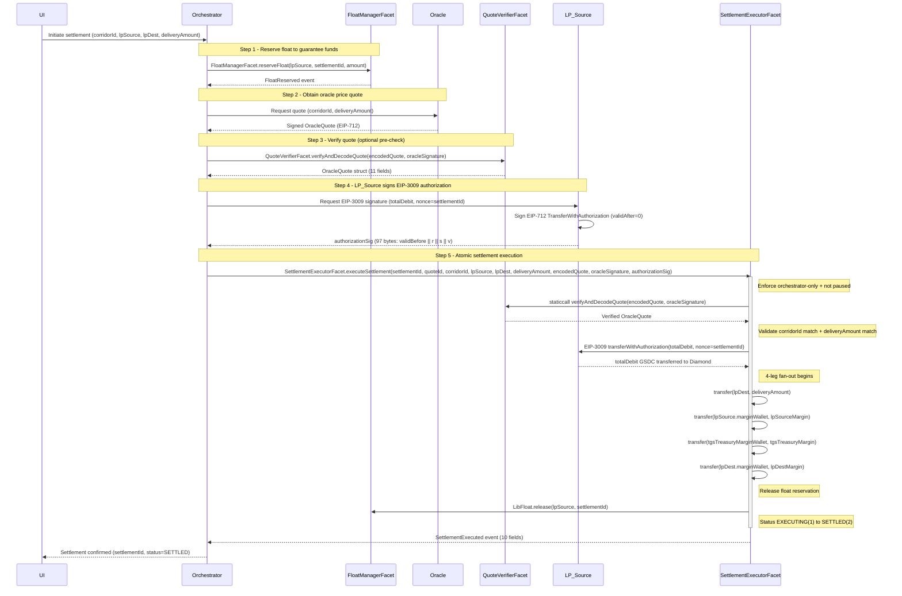
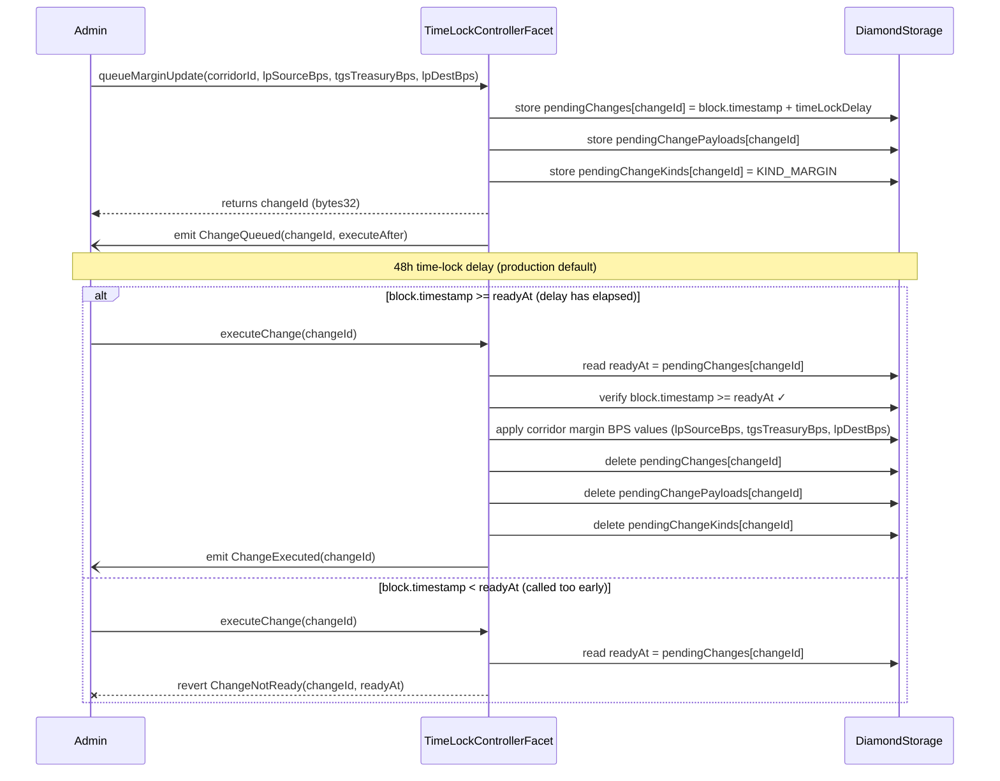
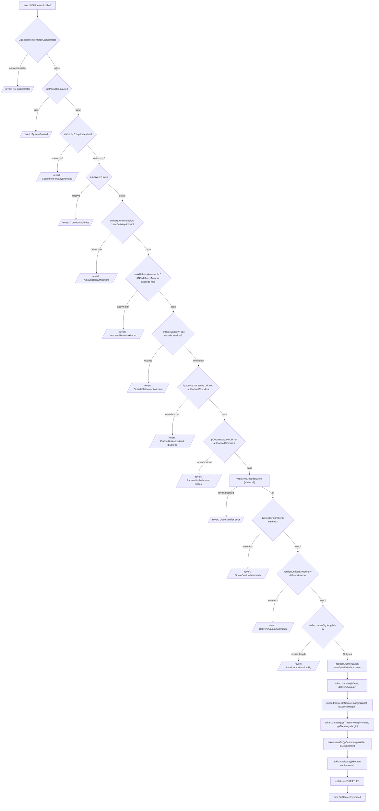
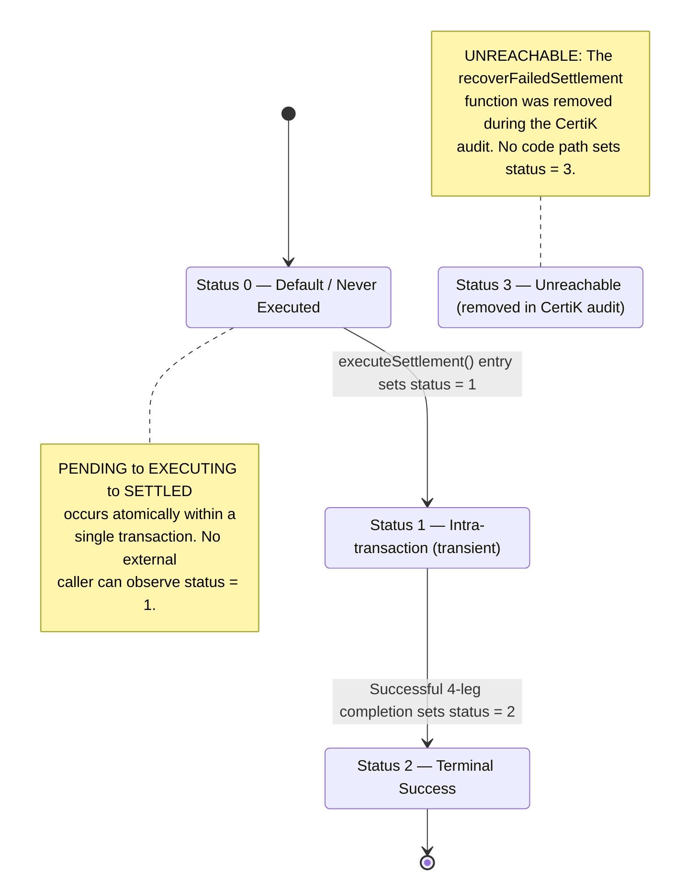

# GSDC Settlement Diamond — UI Developer Guide

## Table of Contents

1. [Table of Contents](#table-of-contents)
2. [Glossary](#glossary)
3. [Diamond Architecture Overview](#diamond-architecture-overview)
4. [Settlement Lifecycle (end-to-end)](#settlement-lifecycle-end-to-end)
5. [Settlement State Machine](#settlement-state-machine)
6. [Corridor & Window Configuration](#corridor--window-configuration)
7. [Function Reference — SettlementExecutorFacet](#function-reference--settlementexecutorfacet)
8. [Function Reference — QuoteVerifierFacet](#function-reference--quoteverifierfacet)
9. [Function Reference — FloatManagerFacet](#function-reference--floatmanagerfacet)
10. [Function Reference — ComplianceGateFacet](#function-reference--compliancegatefacet)
11. [Function Reference — TimeLockControllerFacet](#function-reference--timelockcontrollerfacet)
12. [Function Reference — MarginSplitterFacet](#function-reference--marginsplitterfacet)
13. [Function Reference — DisputeResolverFacet](#function-reference--disputeresolverfacet)
14. [Function Reference — MintBurnAuthorityFacet](#function-reference--mintburnauthorityfacet)
15. [Function Reference — EventEmitterFacet](#function-reference--eventemitterfacet)
16. [Function Reference — OracleGovernanceFacet](#function-reference--oraclegovernancefacet)
17. [Function Reference — PausableFacet](#function-reference--pausablefacet)
18. [Function Reference — DiamondLoupeFacet](#function-reference--diamondloupefacet)
19. [EIP-3009 Authorization Signing Guide](#eip-3009-authorization-signing-guide)
20. [EIP-712 Oracle Quote Signing Guide](#eip-712-oracle-quote-signing-guide)
21. [GSDCToken Reference](#gsdctoken-reference)
22. [MarginWallet Interaction Guide](#marginwallet-interaction-guide)
23. [Access Control Matrix](#access-control-matrix)
24. [Event Subscription Reference](#event-subscription-reference)
25. [Error Reference & Handling Guide](#error-reference--handling-guide)
26. [Code Flow Diagrams](#code-flow-diagrams)
27. [Integration Code Examples](#integration-code-examples)
28. [Security Considerations](#security-considerations)

---

## Glossary

| Term | Definition |
|------|------------|
| **Diamond** | The EIP-2535 Diamond proxy contract that delegates calls to 13 facets sharing a single storage layout via `LibSettlement` |
| **Facet** | A Solidity contract whose functions are exposed through the Diamond proxy via `delegatecall` |
| **Settlement_Diamond** | The deployed Diamond proxy address through which all settlement operations are invoked |
| **GSDC_Token** | The ERC-20 token contract with EIP-3009 `transferWithAuthorization` extension used as the settlement currency |
| **Orchestrator** | The backend service (Settlement State Machine) authorized to call settlement execution, float reservation, and event emission functions |
| **Admin** | The privileged address that manages corridors, partners, margins, oracle signers, and emergency pause — distinct from Orchestrator |
| **LP_Source** | The liquidity provider funding a settlement (e.g., LP-BR collecting BRL and holding GSDC float) |
| **LP_Dest** | The liquidity provider receiving the delivery leg of a settlement (e.g., LP-HK delivering CNH) |
| **Corridor** | A configured settlement route identified by a `bytes32` corridorId (e.g., `keccak256("BRL_CNH")`) with min/max bounds, margin rates, and UTC time windows |
| **MarginWallet** | A per-partner contract that accumulates GSDC margin fees; only the registered owner can withdraw |
| **EIP_3009_Authorization** | A signed `transferWithAuthorization` message from LP_Source granting the Diamond permission to debit `totalDebit` GSDC in a single atomic transaction |
| **Oracle_Quote** | An EIP-712 signed price quote from the DON oracle containing corridor, delivery amount, margin bps, and validity window |
| **TimeLock** | A 48-hour (production) delay mechanism protecting admin parameter changes from immediate effect |
| **Settlement_State** | One of four states — PENDING(0), EXECUTING(1), SETTLED(2), FAILED(3) |
| **Float_Reservation** | A pre-settlement hold on a partner's GSDC balance ensuring sufficient funds exist before execution |
| **UI_Developer** | A frontend or full-stack developer building interfaces that interact with the Settlement Diamond contract |

---

## Diamond Architecture Overview

The GSDC Settlement Diamond implements [EIP-2535 (Diamond Standard)](https://eips.ethereum.org/EIPS/eip-2535) — a single-proxy pattern where one deployed contract address serves as the entry point for all settlement system functionality. Rather than deploying 13 separate contracts, the Diamond consolidates all facet functions behind a single address, simplifying integration for UI developers.

### Single-Proxy Architecture

The `Diamond.sol` contract contains no business logic. Its `fallback()` function performs the following routing on every call:

1. Reads the 4-byte function selector from `msg.sig`
2. Looks up the facet address registered for that selector in `LibDiamond.DiamondStorage.selectorToFacetAndPosition`
3. Executes `delegatecall` to the resolved facet address, forwarding the full calldata
4. Returns the result (or reverts with the facet's revert data)

```solidity
fallback() external payable {
    LibDiamond.DiamondStorage storage ds;
    bytes32 position = LibDiamond.DIAMOND_STORAGE_POSITION;
    assembly { ds.slot := position }
    address facet = ds.selectorToFacetAndPosition[msg.sig].facetAddress;
    require(facet != address(0), "Diamond: function does not exist");
    assembly {
        calldatacopy(0, 0, calldatasize())
        let result := delegatecall(gas(), facet, 0, calldatasize(), 0, 0)
        returndatacopy(0, 0, returndatasize())
        switch result
            case 0 { revert(0, returndatasize()) }
            default { return(0, returndatasize()) }
    }
}
```

Because facets execute via `delegatecall`, they share the Diamond's storage and `address(this)` always resolves to the Diamond proxy address — not the facet's deployment address.

### The 13 Facets

All functionality is accessed through the single Diamond proxy address. The 13 facets are:

| # | Facet | Responsibility |
|---|-------|----------------|
| 1 | DiamondCutFacet | Add/replace/remove function selectors |
| 2 | DiamondLoupeFacet | EIP-2535 introspection and ERC-165 |
| 3 | SettlementExecutorFacet | Atomic 4-leg settlement execution |
| 4 | QuoteVerifierFacet | EIP-712 oracle quote verification |
| 5 | FloatManagerFacet | Float reservation and release |
| 6 | ComplianceGateFacet | Partner registration and compliance checks |
| 7 | TimeLockControllerFacet | Time-locked governance operations |
| 8 | MarginSplitterFacet | Margin fee calculation |
| 9 | DisputeResolverFacet | Settlement dispute submission |
| 10 | MintBurnAuthorityFacet | GSDC mint/burn authority |
| 11 | EventEmitterFacet | Orchestrator-emitted audit events |
| 12 | OracleGovernanceFacet | DON signer whitelist management |
| 13 | PausableFacet | Emergency pause/unpause |

### The Aggregated `ISettlementDiamond` ABI

For UI and backend integration, the `ISettlementDiamond` interface aggregates the external function signatures of all facets into a single Solidity interface. This serves as a convenience ABI — you instantiate one `ethers.Contract` with the Diamond address and the `ISettlementDiamond` ABI to access all settlement system functions:

```typescript
import { ethers } from "ethers";
import ISettlementDiamondABI from "./abis/ISettlementDiamond.json";

const diamond = new ethers.Contract(DIAMOND_ADDRESS, ISettlementDiamondABI, signerOrProvider);

// All facet functions accessible through one contract instance:
await diamond.getAvailableFloat(partnerAddress);    // FloatManagerFacet
await diamond.checkCompliance(partner, corridorId); // ComplianceGateFacet
await diamond.isPaused();                           // PausableFacet
```

The Diamond proxy routes each call to the correct facet based on the function selector — no manual facet address resolution is needed.

### DiamondLoupe Introspection

The `DiamondLoupeFacet` implements the `IDiamondLoupe` interface, providing on-chain introspection into the Diamond's facet structure. These are public view functions any caller can invoke:

#### `facetAddresses`

```solidity
function facetAddresses() external view returns (address[] memory facetAddresses_)
```

**Access:** Public  
**Mutability:** view

Returns the list of all facet addresses currently registered in the Diamond. Use this to enumerate which facets are deployed.

#### `facetFunctionSelectors`

```solidity
function facetFunctionSelectors(address _facet) external view returns (bytes4[] memory)
```

**Access:** Public  
**Mutability:** view

| Parameter | Type | Description |
|-----------|------|-------------|
| _facet | address | The facet address to query |

Returns all 4-byte function selectors registered to the given facet address.

#### `facetAddress`

```solidity
function facetAddress(bytes4 _functionSelector) external view returns (address facetAddress_)
```

**Access:** Public  
**Mutability:** view

| Parameter | Type | Description |
|-----------|------|-------------|
| _functionSelector | bytes4 | The 4-byte selector to look up |

Returns the facet address that handles the given function selector. Returns `address(0)` if the selector is not registered.

#### `facets`

```solidity
function facets() external view returns (Facet[] memory facets_)
```

**Access:** Public  
**Mutability:** view

Returns the complete facet-to-selectors mapping as an array of `Facet` structs:

```solidity
struct Facet {
    address facetAddress;
    bytes4[] functionSelectors;
}
```

#### `supportsInterface`

```solidity
function supportsInterface(bytes4 interfaceId) external view returns (bool)
```

**Access:** Public  
**Mutability:** view

| Parameter | Type | Description |
|-----------|------|-------------|
| interfaceId | bytes4 | The ERC-165 interface identifier to check |

Returns `true` if the interface ID was registered during initialization. The Diamond registers the following interfaces at deploy time:

| Interface ID | Interface |
|-------------|-----------|
| `0x1f931c1c` | IDiamondCut |
| `0x48e2b093` | IDiamondLoupe |

### DiamondInit Parameters

The `DiamondInit` contract is called via `delegatecall` during the initial `diamondCut` operation. It performs one-shot storage initialization with the following parameters:

```solidity
struct InitArgs {
    address admin;                  // Privileged admin address (corridor config, partner mgmt, pause)
    address orchestrator;           // Backend service address for settlement execution
    address oracleSigner;           // Initial oracle signer public key
    address gsdcToken;              // Deployed GSDCToken contract address
    address tgsTreasuryWallet;      // TGS treasury delivery-leg wallet
    address tgsTreasuryMarginWallet; // TGS treasury margin-fee wallet
    uint32  maxQuoteTTL;            // Maximum quote validity window (seconds), e.g. 300
    uint32  timeLockDelay;          // Governance time-lock delay (seconds), e.g. 172800 (48h)
}
```

| Field | Type | Description |
|-------|------|-------------|
| admin | address | Controls governance functions (corridors, partners, margins, pause). Distinct from `orchestrator`. |
| orchestrator | address | Authorized caller for `executeSettlement`, `reserveFloat`, and event emissions. If `address(0)` is passed, defaults to `admin`. |
| oracleSigner | address | Initial single-signer oracle key for quote verification. Rotatable via time-locked governance. |
| gsdcToken | address | The deployed ERC-20 GSDC token with EIP-3009 extension. |
| tgsTreasuryWallet | address | Receives the delivery leg of settlements destined for the TGS treasury. |
| tgsTreasuryMarginWallet | address | Receives TGS treasury margin fees from each settlement. |
| maxQuoteTTL | uint32 | Maximum allowed `validBefore - validAfter` for oracle quotes (in seconds). Set to 0 to disable TTL enforcement. |
| timeLockDelay | uint32 | Minimum seconds that must elapse between queuing and executing a governance change. Production default: 172800 (48 hours). |

DiamondInit also registers ERC-165 interface support for `IDiamondCut` (`0x1f931c1c`) and `IDiamondLoupe` (`0x48e2b093`), enabling `supportsInterface` queries immediately after deployment.

> **Note:** `DiamondInit` can only be called once — subsequent calls revert with `AlreadyInitialised()`. All parameters are immutable after initialization except those governed by the TimeLockControllerFacet (orchestrator, oracle signer, margins, time-lock delay).

---

## Settlement Lifecycle (end-to-end)

A settlement flows through six sequential steps. Each step must complete successfully before the next can proceed. The first two steps are one-time setup operations; steps 3–6 repeat for every individual settlement.

### Step 1 — Corridor Configuration

| | |
|---|---|
| **Facet** | `TimeLockControllerFacet` |
| **Function** | `configureCorridor(bytes32 corridorId, bool active, uint256 minAmount, uint256 maxAmount, uint32 windowStart, uint32 windowEnd)` |
| **Caller** | Admin |
| **Effect** | Immediate (no time-lock) |

The Admin creates or updates a corridor route (e.g. `keccak256("BRL_CNH")`). This defines the min/max delivery bounds, margin bps rates, and the UTC settlement window. A corridor must be `active = true` before any settlement can execute on it.

### Step 2 — Partner Registration

| | |
|---|---|
| **Facet** | `ComplianceGateFacet` |
| **Function** | `registerPartner(address partner, address floatWallet, address marginWallet, bytes32 kycHash, bytes32[] calldata corridorIds)` |
| **Caller** | Admin |
| **Effect** | Immediate |

The Admin registers both the LP_Source and LP_Dest addresses as partners, assigning their float wallets, margin wallets, KYC hashes, and authorised corridors. Both partners must be registered and authorised for the corridor before a settlement can execute.

### Step 3 — Float Reservation

| | |
|---|---|
| **Facet** | `FloatManagerFacet` |
| **Function** | `reserveFloat(address partner, bytes32 settlementId, uint256 amount)` |
| **Caller** | Orchestrator |
| **Effect** | State-changing |

The Orchestrator reserves GSDC float on behalf of LP_Source, ensuring sufficient balance exists before execution. This pre-settlement hold prevents double-spending across concurrent settlements. Reverts with `InsufficientFloat` if `balanceOf(partner) - existingReservations < amount`.

### Step 4 — Oracle Quote Verification

| | |
|---|---|
| **Facet** | `QuoteVerifierFacet` |
| **Function** | `verifyAndDecodeQuote(bytes calldata encodedQuote, bytes calldata signature) external view returns (OracleQuote memory)` |
| **Caller** | Called internally by `executeSettlement` (or off-chain for pre-validation) |
| **Effect** | View (read-only) |

The Oracle DON signs an EIP-712 `OracleQuote` containing the corridor, delivery amount, margin bps values, and a validity window. The quote is verified on-chain during settlement execution. For the multi-signer path, `verifyAndDecodeAggregatedQuote` requires ≥ `oracleThreshold` distinct signatures.

### Step 5 — EIP-3009 Authorization Signing (off-chain)

| | |
|---|---|
| **Facet** | N/A (off-chain signing by LP_Source) |
| **Function** | LP_Source signs an EIP-712 `TransferWithAuthorization` message |
| **Caller** | LP_Source (off-chain wallet) |
| **Effect** | Produces a 97-byte `authorizationSig` |

LP_Source signs a `transferWithAuthorization` approval granting the Diamond permission to debit `totalDebit` GSDC. The `nonce` field is set to the `settlementId`, binding this authorization to a single settlement. The resulting signature is packed as: `abi.encodePacked(uint256(validBefore), bytes32(r), bytes32(s), uint8(v))` — exactly 97 bytes.

### Step 6 — Settlement Execution

| | |
|---|---|
| **Facet** | `SettlementExecutorFacet` |
| **Function** | `executeSettlement(bytes32 settlementId, bytes32 quoteId, bytes32 corridorId, address lpSource, address lpDest, uint256 deliveryAmount, bytes calldata encodedQuote, bytes calldata oracleSignature, bytes calldata authorizationSig)` |
| **Caller** | Orchestrator |
| **Effect** | State-changing, atomic |

The Orchestrator submits all parameters in a single transaction. `executeSettlement` atomically performs:

1. **Quote verification** — calls `QuoteVerifierFacet.verifyAndDecodeQuote` via `staticcall`, confirms `quoteId`, `corridorId`, and `deliveryAmount` match the signed quote
2. **EIP-3009 redemption** — calls `transferWithAuthorization` on GSDCToken to pull `totalDebit` from `lpSource` to the Diamond
3. **Delivery transfer** — transfers `deliveryAmount` GSDC to `lpDest`
4. **LP_Source margin transfer** — transfers `lpSourceMargin` to LP_Source's `marginWallet`
5. **TGS treasury margin transfer** — transfers `tgsTreasuryMargin` to `tgsTreasuryMarginWallet`
6. **LP_Dest margin transfer** — transfers `lpDestMargin` to LP_Dest's `marginWallet`
7. **Float release** — releases the float reservation for `lpSource` / `settlementId`

If any step fails, the entire transaction reverts — no partial state is possible.

### Settlement States

The `Settlement.status` field is a `uint8` enum with four values:

| Value | Name | Description |
|-------|------|-------------|
| 0 | **PENDING** | Default — settlement has never been executed (no record exists or status is zero) |
| 1 | **EXECUTING** | Set at the start of `executeSettlement`, before the transfer fan-out begins |
| 2 | **SETTLED** | Set after all transfers succeed and float is released |
| 3 | **FAILED** | Defined in the enum but **unreachable** — the `recoverFailedSettlement` function that could set this state was removed during the CertiK audit |

### Valid State Transitions

```
PENDING (0) ──→ EXECUTING (1) ──→ SETTLED (2)
```

- **PENDING → EXECUTING**: Set when `executeSettlement` writes the pre-execution snapshot to storage (`s.status = 1`)
- **EXECUTING → SETTLED**: Set atomically within the same transaction after all four transfer legs succeed (`s.status = 2`)
- **FAILED (3)**: No valid transition path exists in production code. If any transfer leg fails, the entire transaction reverts and the status remains PENDING (0)

> **Note:** The PENDING → EXECUTING → SETTLED transition is **atomic** — it completes within a single transaction. There is no observable EXECUTING state between blocks. If the transaction reverts at any point, the settlement remains in PENDING state (status 0) as if it was never attempted.

---

## Settlement State Machine

Every settlement stored in Diamond storage carries a `status` field (`uint8`) representing its position in the state machine. The four possible values are:

| Value | Name | Description |
|-------|------|-------------|
| 0 | **PENDING** | Default zero-value. The settlement has never been executed — no record exists in storage, or storage was initialized but execution has not begun. |
| 1 | **EXECUTING** | The settlement is mid-flight — `executeSettlement` has begun the atomic 4-leg fan-out but has not yet completed all transfers. |
| 2 | **SETTLED** | Terminal success state. All four GSDC transfers completed, float reservation released, and `SettlementExecuted` event emitted. |
| 3 | **FAILED** | **Unreachable.** This state existed in earlier contract revisions but the `recoverFailedSettlement` admin function (the only code path that could set `status = 3`) was removed during the CertiK audit as a HIGH-severity bypass of the atomic settlement guarantee. The enum value is retained for ABI compatibility with off-chain indexers, but no on-chain code path can produce it. |

### State Transitions

```
PENDING (0) ──→ EXECUTING (1) ──→ SETTLED (2)
                                    ▲
                                    │  atomic within a single transaction
```

The only valid transition path is **PENDING → EXECUTING → SETTLED**, and it is **atomic within a single transaction**:

1. **PENDING → EXECUTING** — `_executeSettlementInner` (or its aggregated equivalent `_executeAggFanout`) sets `s.status = 1` immediately before the EIP-3009 redemption and the four GSDC transfer legs begin.
2. **EXECUTING → SETTLED** — After all transfers succeed and the float reservation is released, `s.status = 2` is written and `SettlementExecuted` is emitted.

Because both transitions occur within the same function call (protected by `LibReentrancyGuard`), no external observer can ever read `status == 1` (EXECUTING) from `getSettlement` — the intermediate state is only visible within the transaction's execution context. If any transfer reverts, the entire transaction reverts and the settlement remains at `status == 0` (PENDING) on-chain.

> **Key implication for UI developers:** When you call `getSettlement(settlementId)`, the returned `status` field will only ever be `0` (never executed) or `2` (successfully settled). You will never observe `1` or `3` in practice.

### Querying Settlement Status

Use the `getSettlement` view function to read the current state:

```solidity
function getSettlement(bytes32 settlementId) external view returns (Settlement memory)
```

The returned `Settlement` struct includes a `status` field (among 13 total fields). A `status` of `0` with all other fields zeroed indicates the settlement ID has never been used. A `status` of `2` indicates successful completion — check `settledAt` for the block timestamp of finalization.

### Duplicate Prevention

The contract enforces single-execution semantics: if `ds.settlements[settlementId].status != 0`, the call reverts with `SettlementAlreadyExecuted(settlementId)`. This check runs before any state mutation, ensuring each `settlementId` can only produce one successful settlement.

---

## Corridor & Window Configuration

A **corridor** represents a configured settlement route (e.g. BRL→CNH) identified by a `bytes32 corridorId` — typically `keccak256("BRL_CNH")`. Each corridor carries operational bounds, margin rates, and a UTC settlement window that gates when settlements can execute.

### CorridorConfig Struct

The on-chain representation lives in `LibSettlement.CorridorConfig`:

```solidity
struct CorridorConfig {
    bool    active;                  // corridor enabled/disabled
    uint256 minDeliveryAmount;       // minimum delivery amount (wei); reverts with AmountBelowMinimum if violated
    uint256 maxDeliveryAmount;       // maximum delivery amount (wei); 0 = unbounded (no upper limit enforced)
    uint16  lpSourceMarginBps;       // LP source margin in basis points
    uint16  tgsTreasuryMarginBps;    // TGS treasury margin in basis points
    uint16  lpDestMarginBps;         // LP destination margin in basis points
    uint32  settlementWindowStart;   // UTC seconds from midnight (0–86399)
    uint32  settlementWindowEnd;     // UTC seconds from midnight (0–86399)
}
```

| Field | Type | Description |
|-------|------|-------------|
| `active` | `bool` | Whether the corridor accepts settlements. Inactive corridors revert with `CorridorNotActive(corridorId)`. |
| `minDeliveryAmount` | `uint256` | Floor for `deliveryAmount`. Reverts with `AmountBelowMinimum(deliveryAmount, minDeliveryAmount)` if below. |
| `maxDeliveryAmount` | `uint256` | Ceiling for `deliveryAmount`. **A value of 0 means unbounded** (no maximum enforced). Reverts with `AmountAboveMaximum(deliveryAmount, maxDeliveryAmount)` if exceeded. |
| `lpSourceMarginBps` | `uint16` | Margin charged to LP source, in basis points. |
| `tgsTreasuryMarginBps` | `uint16` | Margin allocated to the TGS treasury, in basis points. |
| `lpDestMarginBps` | `uint16` | Margin charged to LP destination, in basis points. |
| `settlementWindowStart` | `uint32` | Window opening time as UTC seconds from midnight (range 0–86399). |
| `settlementWindowEnd` | `uint32` | Window closing time as UTC seconds from midnight (range 0–86399). |

### Margin Basis Points (BPS) Semantics

All margin fields use **basis points** where:

- `10000 bps = 100%`
- `100 bps = 1%`
- `50 bps = 0.5%`
- `1 bps = 0.01%`

The margin for a given leg is calculated as:

```
margin = (deliveryAmount * marginBps) / 10_000
```

The total debit charged to LP source is:

```
totalDebit = deliveryAmount + lpSourceMargin + tgsTreasuryMargin + lpDestMargin
```

The sum of all three margin bps values (`lpSourceBps + tgsTreasuryBps + lpDestBps`) must not exceed `10000` (100%). The contract enforces this when executing a queued margin update — if the sum exceeds 10,000, it reverts with `MarginBpsSumExceedsMax(sum)`.

### UTC Seconds-From-Midnight Window Format

The settlement window defines when a corridor is open for execution. Both `settlementWindowStart` and `settlementWindowEnd` are expressed as **UTC seconds from midnight** in the range `0–86399` (since there are 86,400 seconds in a day).

| Time (UTC) | Seconds from midnight |
|------------|----------------------|
| 00:00 | `0` |
| 06:00 | `21600` |
| 09:00 | `32400` |
| 17:00 | `61200` |
| 22:00 | `79200` |
| 23:59:59 | `86399` |

At execution time, the contract computes the current second-of-day as:

```solidity
uint256 sec = block.timestamp % 86400;
```

### Wrap-Around Window Formula

The window supports both normal ranges and **wrap-around windows** that span midnight. The logic is:

```solidity
if (settlementWindowStart <= settlementWindowEnd) {
    // Normal window: e.g. 09:00 (32400) → 17:00 (61200)
    inWindow = (sec >= settlementWindowStart && sec <= settlementWindowEnd);
} else {
    // Wrap-around window: e.g. 22:00 (79200) → 04:00 (14400)
    inWindow = (sec >= settlementWindowStart || sec <= settlementWindowEnd);
}
```

**Examples:**

| `windowStart` | `windowEnd` | Human-readable | Behaviour |
|---------------|-------------|----------------|-----------|
| `32400` | `61200` | 09:00–17:00 UTC | Normal — open during daytime |
| `79200` | `14400` | 22:00–04:00 UTC | Wrap-around — open overnight across midnight |
| `0` | `86399` | 00:00–23:59:59 UTC | Always open (full 24h) |

If the current block time falls outside the window, the transaction reverts with `OutsideSettlementWindow(corridorId)`.

> **UI Guidance:** The UI must communicate window availability to the operator. Display the corridor's settlement window in local time, and indicate whether the corridor is currently open or closed. For wrap-around windows, clearly show that the window spans midnight UTC.

### Immediate vs Time-Locked Parameter Changes

Corridor parameters are divided into two governance categories:

| Change Type | Function | Effect | Rationale |
|-------------|----------|--------|-----------|
| **Immediate** | `configureCorridor(corridorId, active, minAmount, maxAmount, windowStart, windowEnd)` | Takes effect in the same transaction | Corridor activation, bounds, and window are operational controls that may need emergency adjustment. |
| **Time-locked** | `queueMarginUpdate(corridorId, lpSourceBps, tgsTreasuryBps, lpDestBps)` → wait `timeLockDelay` → `executeChange(changeId)` | Takes effect only after the time-lock delay elapses (default 48 hours in production) | Margin rates affect fee distribution and must be observable by partners before taking effect. |

**Immediate — `configureCorridor`:**

```solidity
function configureCorridor(
    bytes32 corridorId,
    bool active,
    uint256 minAmount,
    uint256 maxAmount,
    uint32 windowStart,
    uint32 windowEnd
) external; // Admin-only, immediate effect
```

This sets `active`, `minDeliveryAmount`, `maxDeliveryAmount`, `settlementWindowStart`, and `settlementWindowEnd` in a single transaction. Emits `CorridorConfigured(corridorId, active)`.

**Time-locked — margin updates:**

```solidity
function queueMarginUpdate(
    bytes32 corridorId,
    uint16 lpSourceBps,
    uint16 tgsTreasuryBps,
    uint16 lpDestBps
) external returns (bytes32 changeId); // Admin-only, queues change
```

This queues the margin update and emits `ChangeQueued(changeId, executeAfter)` where `executeAfter = block.timestamp + timeLockDelay`. The change only applies when `executeChange(changeId)` is called after the delay elapses. If called early, it reverts with `ChangeNotReady(changeId, readyAt)`.

> **Key takeaway for UI developers:** When an admin updates margins, the new rates do not apply immediately. The UI should display the pending change, the `readyAt` timestamp, and provide an action to call `executeChange` once the delay has passed.

---

## Function Reference — SettlementExecutorFacet

The `SettlementExecutorFacet` is the atomic heart of the GSDC Settlement Diamond. It orchestrates the complete 4-leg settlement fan-out — debiting LP_Source via EIP-3009, crediting LP_Dest with the delivery amount, and routing three margin slices to the respective margin wallets — all within a single atomic transaction protected by `ReentrancyGuard`.

### Access Control

**Orchestrator-only.** Both `executeSettlement` and `executeSettlementAggregated` are restricted to the configured Orchestrator address (the Settlement State Machine backend). Calls from any other address — including the Admin — revert with:

```
"LibSettlement: not orchestrator"
```

The Orchestrator address is distinct from the Admin address and is set during `DiamondInit`. It can be rotated via `TimeLockControllerFacet.queueOrchestratorChange` followed by `executeChange` after the time-lock delay elapses.

### `executeSettlement`

```solidity
function executeSettlement(
    bytes32 settlementId,
    bytes32 quoteId,
    bytes32 corridorId,
    address lpSource,
    address lpDest,
    uint256 deliveryAmount,
    bytes calldata encodedQuote,
    bytes calldata oracleSignature,
    bytes calldata authorizationSig
) external
```

**Access:** Orchestrator-only  
**Mutability:** State-changing  
**Reentrancy:** Protected by `LibReentrancyGuard`

Atomically executes a settlement: verifies the oracle quote, redeems the EIP-3009 authorization from LP_Source, performs the 4-leg GSDC transfer fan-out, releases the float reservation, and emits `SettlementExecuted`.

| Parameter | Type | Description |
|-----------|------|-------------|
| `settlementId` | `bytes32` | Globally unique settlement identifier. Doubles as the EIP-3009 nonce to bind the authorization to this specific settlement and prevent cross-settlement replay. |
| `quoteId` | `bytes32` | Oracle quote identifier. Must match the `quoteId` inside the verified `encodedQuote`. |
| `corridorId` | `bytes32` | Settlement corridor key (e.g. `keccak256("BRL_CNH")`). Must match the verified quote and be active in Diamond storage. |
| `lpSource` | `address` | Liquidity provider funding the settlement. Must be a registered, active partner authorized for this corridor. The EIP-3009 authorization must be signed by this address. |
| `lpDest` | `address` | Liquidity provider receiving the delivery leg. Must be a registered, active partner authorized for this corridor. |
| `deliveryAmount` | `uint256` | GSDC amount (in token units) delivered to `lpDest`. Margin slices are derived as basis-point fractions of this amount. Must match the `deliveryAmount` signed in the oracle quote. |
| `encodedQuote` | `bytes` | ABI-encoded `OracleQuote` struct signed by the oracle. Passed to `QuoteVerifierFacet.verifyAndDecodeQuote` for signature verification and field extraction. |
| `oracleSignature` | `bytes` | 65-byte ECDSA signature from the single oracle signer over the EIP-712 quote digest. |
| `authorizationSig` | `bytes` | 97-byte EIP-3009 authorization signed by `lpSource`. Layout: `validBefore(32) ‖ r(32) ‖ s(32) ‖ v(1)`. Grants the Diamond permission to debit `totalDebit` GSDC from `lpSource`. |

**Returns:** None (transaction reverts on failure).

---

### `executeSettlementAggregated`

```solidity
function executeSettlementAggregated(
    bytes32 settlementId,
    bytes32 quoteId,
    bytes32 corridorId,
    address lpSource,
    address lpDest,
    uint256 deliveryAmount,
    bytes calldata encodedQuote,
    bytes[] calldata oracleSignatures,
    bytes32 reportsRoot,
    bytes calldata authorizationSig
) external
```

**Access:** Orchestrator-only  
**Mutability:** State-changing  
**Reentrancy:** Protected by `LibReentrancyGuard`

Multi-signer companion to `executeSettlement`. Behaviour is byte-identical to `executeSettlement` **except** for the on-chain quote verification path: this variant calls `QuoteVerifierFacet.verifyAndDecodeAggregatedQuote(bytes, bytes[], bytes32)` instead of the single-signature `verifyAndDecodeQuote(bytes, bytes)`.

All other gates — corridor active check, min/max bounds, window enforcement, partner authorization, EIP-3009 redemption, and the atomic 4-leg fan-out — are unchanged.

| Parameter | Type | Description |
|-----------|------|-------------|
| `settlementId` | `bytes32` | Same as `executeSettlement`. |
| `quoteId` | `bytes32` | Same as `executeSettlement`. |
| `corridorId` | `bytes32` | Same as `executeSettlement`. |
| `lpSource` | `address` | Same as `executeSettlement`. |
| `lpDest` | `address` | Same as `executeSettlement`. |
| `deliveryAmount` | `uint256` | Same as `executeSettlement`. |
| `encodedQuote` | `bytes` | ABI-encoded `OracleQuote` struct (uses the aggregated typehash including `reportsRoot`). |
| `oracleSignatures` | `bytes[]` | Array of ECDSA signatures from DON signers. Must contain at least `oracleThreshold` distinct signatures, each recovering to a unique whitelisted address in `oracleSigners[]`. |
| `reportsRoot` | `bytes32` | Merkle root over per-signer DON report hashes. Included in the aggregated typehash so future Phase 2 bundles don't require a typehash bump. |
| `authorizationSig` | `bytes` | Same 97-byte EIP-3009 authorization as `executeSettlement`. |

**Returns:** None (transaction reverts on failure).

---

### `getSettlement`

```solidity
function getSettlement(bytes32 settlementId) external view returns (Settlement memory)
```

**Access:** Public (no access restriction)  
**Mutability:** view

Returns the persisted snapshot of a settlement. If the `settlementId` has never been used, all fields are zero-initialized (including `status == 0`).

| Parameter | Type | Description |
|-----------|------|-------------|
| `settlementId` | `bytes32` | The settlement identifier to query. |

**Returns:** A `Settlement` struct with 13 fields:

#### Settlement Struct

```solidity
struct Settlement {
    bytes32 settlementId;
    bytes32 quoteId;
    bytes32 corridorId;
    address lpSource;
    address lpDest;
    uint256 deliveryAmount;
    uint256 totalDebit;
    uint256 lpSourceMargin;
    uint256 tgsTreasuryMargin;
    uint256 lpDestMargin;
    uint8   status;
    uint256 createdAt;
    uint256 settledAt;
}
```

| Field | Type | Description |
|-------|------|-------------|
| `settlementId` | `bytes32` | Echo of the settlement identifier. |
| `quoteId` | `bytes32` | Oracle quote ID that was verified during execution. |
| `corridorId` | `bytes32` | Corridor the settlement executed on. |
| `lpSource` | `address` | LP that funded the settlement (debited `totalDebit`). |
| `lpDest` | `address` | LP that received the `deliveryAmount`. |
| `deliveryAmount` | `uint256` | GSDC amount delivered to `lpDest`. |
| `totalDebit` | `uint256` | Total GSDC debited from `lpSource` = `deliveryAmount + lpSourceMargin + tgsTreasuryMargin + lpDestMargin`. |
| `lpSourceMargin` | `uint256` | Margin fee sent to LP_Source's margin wallet. |
| `tgsTreasuryMargin` | `uint256` | Margin fee sent to the TGS treasury margin wallet. |
| `lpDestMargin` | `uint256` | Margin fee sent to LP_Dest's margin wallet. |
| `status` | `uint8` | Settlement state enum (see below). |
| `createdAt` | `uint256` | `block.timestamp` when `executeSettlement` began (status set to EXECUTING). |
| `settledAt` | `uint256` | `block.timestamp` when all transfers completed (status set to SETTLED). Zero if not yet settled. |

---

### Status Enum

The `status` field is a `uint8` with the following values:

| Value | Name | Description |
|-------|------|-------------|
| `0` | **PENDING** | Default zero-value. The settlement has never been executed — no record exists or `getSettlement` returns an all-zero struct. |
| `1` | **EXECUTING** | In-progress. Set when `executeSettlement` writes the pre-execution snapshot to storage, before the transfer fan-out begins. |
| `2` | **SETTLED** | Terminal success state. All four GSDC transfer legs completed, float reservation released, event emitted. |
| `3` | **FAILED** | **Unreachable in production.** The `recoverFailedSettlement` function that could set this state was removed during the CertiK audit. The enum value is retained for ABI compatibility only. |

> **Practical note:** When querying `getSettlement`, you will only observe `status == 0` (never executed) or `status == 2` (successfully settled). The EXECUTING state (1) is ephemeral within a single transaction and never observable between blocks.

---

### `settlementId`-as-Nonce Binding

The `settlementId` parameter serves a dual purpose:

1. **Settlement identifier** — uniquely identifies the settlement in Diamond storage and prevents duplicate execution (the contract reverts with `SettlementAlreadyExecuted` if `status != 0`)
2. **EIP-3009 nonce** — passed as the `nonce` parameter to `GSDCToken.transferWithAuthorization`, binding the LP_Source's signed authorization to this specific settlement

This binding prevents cross-settlement replay attacks: an authorization signed for settlement A cannot be reused for settlement B because the nonce (= settlementId) would not match. The EIP-3009 token marks the nonce as used after successful redemption, making it permanently single-use.

---

### 97-Byte `authorizationSig` Layout

The `authorizationSig` parameter must be exactly **97 bytes**. The contract reverts with `InvalidAuthorizationSig` if the length is not exactly 97.

```
Byte offset  | Size     | Field         | Description
─────────────┼──────────┼───────────────┼───────────────────────────────────────────
0–31         | 32 bytes | validBefore   | uint256 — Unix timestamp after which the authorization expires
32–63        | 32 bytes | r             | bytes32 — ECDSA signature component r
64–95        | 32 bytes | s             | bytes32 — ECDSA signature component s
96           | 1 byte   | v             | uint8 — ECDSA recovery identifier (27 or 28)
```

**Packing format:**

```solidity
bytes memory authorizationSig = abi.encodePacked(
    uint256(validBefore),  // 32 bytes
    bytes32(r),            // 32 bytes
    bytes32(s),            // 32 bytes
    uint8(v)              // 1 byte
);
// Total: 97 bytes
```

The contract unpacks these fields using assembly and passes them to `IEIP3009.transferWithAuthorization`:

- `from` = `lpSource`
- `to` = `address(this)` (the Diamond proxy)
- `value` = `totalDebit`
- `validAfter` = `0` (hardcoded — the authorization is valid immediately)
- `validBefore` = extracted from bytes 0–31
- `nonce` = `settlementId`
- `v`, `r`, `s` = extracted from bytes 32–96

> **Important:** Because `validAfter` is hardcoded to `0` in the contract, the LP_Source must sign the EIP-712 struct with `validAfter = 0` for the digest to match. The `validBefore` value in the signature payload must be a Unix timestamp strictly greater than the expected `block.timestamp` at execution time.

---

### Revert Errors

All custom errors that `executeSettlement` and `executeSettlementAggregated` can produce, listed in the order they are checked:

| Error | Signature | Condition |
|-------|-----------|-----------|
| `SystemPaused` | `SystemPaused()` | The system is paused via `PausableFacet.pause()`. Checked immediately after orchestrator enforcement. |
| `SettlementAlreadyExecuted` | `SettlementAlreadyExecuted(bytes32 settlementId)` | A settlement with this `settlementId` already exists in storage with `status != 0`. Prevents duplicate execution. |
| `CorridorNotActive` | `CorridorNotActive(bytes32 corridorId)` | The referenced corridor has `active == false`. Settlements on disabled corridors are blocked even if the quote was signed while the corridor was still active. |
| `AmountBelowMinimum` | `AmountBelowMinimum(uint256 amount, uint256 minimum)` | `deliveryAmount` is less than the corridor's `minDeliveryAmount`. |
| `AmountAboveMaximum` | `AmountAboveMaximum(uint256 amount, uint256 maximum)` | `deliveryAmount` exceeds the corridor's `maxDeliveryAmount`. Only enforced when `maxDeliveryAmount != 0`. |
| `OutsideSettlementWindow` | `OutsideSettlementWindow(bytes32 corridorId)` | `block.timestamp % 86400` falls outside the corridor's configured UTC settlement window. |
| `PartnerNotAuthorised` | `PartnerNotAuthorised(address partner, bytes32 corridorId)` | Either `lpSource` or `lpDest` is not registered, not active, or not authorized for this corridor. Checked for both partners independently. |
| `QuoteCorridorMismatch` | `QuoteCorridorMismatch()` | The `quoteId` or `corridorId` extracted from the verified quote does not match the parameters passed by the caller. Protects against quote-substitution attacks. |
| `DeliveryAmountMismatch` | `DeliveryAmountMismatch(uint256 supplied, uint256 signed)` | The `deliveryAmount` parameter does not match the `deliveryAmount` signed in the oracle quote. Protects against bait-and-switch attacks. |
| `InvalidAuthorizationSig` | `InvalidAuthorizationSig()` | The `authorizationSig` byte length is not exactly 97. Reverts before reaching `transferWithAuthorization` to avoid consuming the LP's nonce on a malformed payload. |

Additionally, errors from cross-facet calls may bubble up:

- **QuoteVerifierFacet errors:** `InvalidOracleSignature`, `QuoteExpired`, `QuoteNotYetValid`, `QuoteTTLExceeded`, `BelowThreshold`, `DuplicateSigner` — if the oracle quote verification fails, the verifier's revert reason is propagated unchanged.
- **EIP-3009 token errors:** `AuthorizationAlreadyUsed`, `AuthorizationExpired`, `AuthorizationNotYetValid`, `SignerMismatch`, `InvalidSignature` — if the GSDCToken rejects the authorization.
- **ERC-20 transfer failures:** If any of the four `token.transfer()` legs fails, the transaction reverts with the respective `require` error string (`"transfer to dest failed"`, `"src margin failed"`, `"tgs margin failed"`, `"dest margin failed"`).

---

### Check Order

The `executeSettlement` function validates inputs in the following strict order. This is important for UI error handling — earlier checks mask later ones:

1. **Orchestrator enforcement** — `LibSettlement.enforceOrchestrator()`
2. **Pause check** — `LibPausable.paused()` → `SystemPaused`
3. **Duplicate check** — `status != 0` → `SettlementAlreadyExecuted`
4. **Corridor active** — `!c.active` → `CorridorNotActive`
5. **Minimum amount** — `deliveryAmount < minDeliveryAmount` → `AmountBelowMinimum`
6. **Maximum amount** — `maxDeliveryAmount != 0 && deliveryAmount > maxDeliveryAmount` → `AmountAboveMaximum`
7. **Settlement window** — time-of-day check → `OutsideSettlementWindow`
8. **LP_Source partner auth** — active + corridor authorized → `PartnerNotAuthorised`
9. **LP_Dest partner auth** — active + corridor authorized → `PartnerNotAuthorised`
10. **Quote verification** — cross-facet `staticcall` to `QuoteVerifierFacet`
11. **Quote field matching** — quoteId, corridorId, deliveryAmount → `QuoteCorridorMismatch` / `DeliveryAmountMismatch`
12. **Authorization sig length** — `sig.length != 97` → `InvalidAuthorizationSig`
13. **EIP-3009 redemption** — `transferWithAuthorization` call
14. **4-leg transfer fan-out** — four `token.transfer()` calls
15. **Float release** — `LibFloat.release(lpSource, settlementId)`

---

### `SettlementExecuted` Event

```solidity
event SettlementExecuted(
    bytes32 indexed settlementId,
    bytes32 indexed corridorId,
    address indexed lpSource,
    address lpDest,
    uint256 deliveryAmount,
    uint256 totalDebit,
    uint256 lpSourceMargin,
    uint256 tgsTreasuryMargin,
    uint256 lpDestMargin,
    uint256 settledAt
);
```

Emitted once per successful settlement, after all transfers complete and `status` is set to `SETTLED`.

| Field | Type | Indexed | Description |
|-------|------|---------|-------------|
| `settlementId` | `bytes32` | ✅ | The unique settlement identifier. Filter by this to track a specific settlement. |
| `corridorId` | `bytes32` | ✅ | The corridor the settlement executed on. Filter to monitor a specific route. |
| `lpSource` | `address` | ✅ | The LP that funded the settlement. Filter by partner to build per-LP dashboards. |
| `lpDest` | `address` | ❌ | The LP that received the delivery amount. |
| `deliveryAmount` | `uint256` | ❌ | GSDC delivered to `lpDest`. |
| `totalDebit` | `uint256` | ❌ | Total GSDC debited from `lpSource`. |
| `lpSourceMargin` | `uint256` | ❌ | Margin fee routed to LP_Source's margin wallet. |
| `tgsTreasuryMargin` | `uint256` | ❌ | Margin fee routed to the TGS treasury margin wallet. |
| `lpDestMargin` | `uint256` | ❌ | Margin fee routed to LP_Dest's margin wallet. |
| `settledAt` | `uint256` | ❌ | `block.timestamp` at settlement completion. |

**Subscription example:**

```typescript
diamond.on("SettlementExecuted", (settlementId, corridorId, lpSource, lpDest, deliveryAmount, totalDebit, lpSourceMargin, tgsTreasuryMargin, lpDestMargin, settledAt) => {
    console.log(`Settlement ${settlementId} completed on corridor ${corridorId}`);
});

// Filter by specific LP source:
const filter = diamond.filters.SettlementExecuted(null, null, LP_SOURCE_ADDRESS);
diamond.on(filter, (event) => { /* handle */ });
```

---

### `SettlementFailed` Event (ABI-only)

```solidity
event SettlementFailed(bytes32 indexed settlementId, string reason);
```

> **Note:** This event signature is retained for ABI compatibility with off-chain indexers, but it is **never emitted** in production. The `recoverFailedSettlement` function that previously emitted this event was removed during the CertiK audit. UI developers should not expect to receive this event.

---

## Function Reference — QuoteVerifierFacet

The QuoteVerifierFacet validates EIP-712 signed oracle price quotes before settlement execution. It supports two verification paths: a single-signer path (legacy oracle) and an aggregated multi-signer path (DON quorum). Both paths decode the quote, enforce validity windows and TTL constraints, and verify cryptographic signatures against the whitelisted oracle signer(s).

### `OracleQuote` Struct

The quote payload is ABI-encoded as the following struct (11 fields, in order):

```solidity
struct OracleQuote {
    bytes32 quoteId;              // Unique identifier for this quote
    bytes32 corridorId;           // Settlement corridor this quote applies to
    uint256 deliveryAmount;       // Base delivery amount in GSDC wei
    uint256 totalDebit;           // Total amount debited from lpSource (delivery + all margins)
    uint256 lpSourceMarginBps;    // LP source margin in basis points
    uint256 tgsTreasuryMarginBps; // TGS treasury margin in basis points
    uint256 lpDestMarginBps;      // LP destination margin in basis points
    uint256 validAfter;           // Quote becomes valid after this Unix timestamp
    uint256 validBefore;          // Quote expires at this Unix timestamp
    string  midRate;              // Mid-market rate as a string (e.g. "7.1234")
    bool    isOverridden;         // Whether the orchestrator applied a manual override
}
```

| Field | Type | Description |
|-------|------|-------------|
| `quoteId` | `bytes32` | Unique quote identifier; used in revert messages and event correlation. |
| `corridorId` | `bytes32` | Must match the `corridorId` parameter in `executeSettlement`; mismatch reverts with `QuoteCorridorMismatch`. |
| `deliveryAmount` | `uint256` | Base delivery amount in GSDC wei; must match `executeSettlement`'s `deliveryAmount` parameter. |
| `totalDebit` | `uint256` | `deliveryAmount + lpSourceMargin + tgsTreasuryMargin + lpDestMargin` — the full amount debited from LP source. |
| `lpSourceMarginBps` | `uint256` | LP source margin rate in basis points. |
| `tgsTreasuryMarginBps` | `uint256` | TGS treasury margin rate in basis points. |
| `lpDestMarginBps` | `uint256` | LP destination margin rate in basis points. |
| `validAfter` | `uint256` | Unix timestamp; the quote is not valid until `block.timestamp > validAfter`. |
| `validBefore` | `uint256` | Unix timestamp; the quote expires when `block.timestamp >= validBefore`. |
| `midRate` | `string` | Mid-market exchange rate as a human-readable string. Hashed as `keccak256(bytes(midRate))` when computing the EIP-712 struct hash (see [midRate Hashing](#midrate-hashing) below). |
| `isOverridden` | `bool` | Indicates whether the orchestrator applied a manual override to the quote parameters. Bound into the EIP-712 signature. |

### `verifyAndDecodeQuote`

```solidity
function verifyAndDecodeQuote(
    bytes calldata encodedQuote,
    bytes calldata signature
) external view returns (OracleQuote memory quote)
```

**Access:** Public (view)
**Mutability:** view

| Parameter | Type | Description |
|-----------|------|-------------|
| `encodedQuote` | `bytes` | ABI-encoded `OracleQuote` struct. |
| `signature` | `bytes` | Single ECDSA signature (65 bytes: r ‖ s ‖ v) from the singleton `oracleSigner`. |

**Returns:**

| Field | Type | Description |
|-------|------|-------------|
| `quote` | `OracleQuote` | The decoded and verified quote struct (11 fields as documented above). |

**Behaviour:**

1. ABI-decodes `encodedQuote` into an `OracleQuote` struct.
2. Validates the time window: reverts if the quote is not yet valid or already expired.
3. Enforces `maxQuoteTTL`: if configured (`> 0`), reverts if `(validBefore - validAfter) > maxQuoteTTL`.
4. Computes the EIP-712 struct hash using `ORACLE_QUOTE_TYPEHASH`.
5. Recovers the signer from the digest and verifies it matches the singleton `oracleSigner` stored in Diamond storage.

**Reverts:**

| Error | Condition |
|-------|-----------|
| `QuoteNotYetValid(quoteId, validAfter)` | `block.timestamp <= quote.validAfter` |
| `QuoteExpired(quoteId, validBefore)` | `block.timestamp >= quote.validBefore` |
| `QuoteTTLExceeded(quoteId, ttl, maxTTL)` | `maxQuoteTTL > 0` and `(validBefore - validAfter) > maxQuoteTTL` |
| `InvalidOracleSignature()` | Recovered address is zero or does not match the stored `oracleSigner`. |

---

### `verifyAndDecodeAggregatedQuote`

```solidity
function verifyAndDecodeAggregatedQuote(
    bytes calldata encodedQuote,
    bytes[] calldata signatures,
    bytes32 reportsRoot
) external view returns (OracleQuote memory quote)
```

**Access:** Public (view)
**Mutability:** view

| Parameter | Type | Description |
|-----------|------|-------------|
| `encodedQuote` | `bytes` | ABI-encoded `OracleQuote` struct. |
| `signatures` | `bytes[]` | Array of ECDSA signatures — one per DON signer. Must contain at least `oracleThreshold` entries. |
| `reportsRoot` | `bytes32` | Merkle root over per-signer DON report hashes; bound into the aggregated typehash. |

**Returns:**

| Field | Type | Description |
|-------|------|-------------|
| `quote` | `OracleQuote` | The decoded and verified quote struct (11 fields). |

**Behaviour:**

1. ABI-decodes `encodedQuote` into an `OracleQuote` struct.
2. Validates the time window: reverts if the quote is not yet valid or already expired.
3. Enforces `maxQuoteTTL`: if configured (`> 0`), reverts if `(validBefore - validAfter) > maxQuoteTTL`.
4. Checks that `signatures.length >= oracleThreshold`.
5. Computes the EIP-712 struct hash using `ORACLE_QUOTE_AGGREGATED_TYPEHASH` (which includes `reportsRoot`).
6. For each signature: recovers the signer, verifies it is in the `oracleSigners[]` whitelist, and checks for duplicate signers.

**Reverts:**

| Error | Condition |
|-------|-----------|
| `QuoteNotYetValid(quoteId, validAfter)` | `block.timestamp <= quote.validAfter` |
| `QuoteExpired(quoteId, validBefore)` | `block.timestamp >= quote.validBefore` |
| `QuoteTTLExceeded(quoteId, ttl, maxTTL)` | `maxQuoteTTL > 0` and `(validBefore - validAfter) > maxQuoteTTL` |
| `BelowThreshold(provided, required)` | `signatures.length < oracleThreshold` |
| `InvalidOracleSignature()` | A recovered signer is `address(0)` or not in the `oracleSigners[]` whitelist. |
| `DuplicateSigner(signer)` | Two signatures recover to the same whitelisted address. |

---

### EIP-712 Domain Separator

The QuoteVerifierFacet uses an EIP-712 domain separator with the following parameters:

| Parameter | Value |
|-----------|-------|
| `name` | `"GSDCOracle"` |
| `version` | `"1"` |
| `chainId` | `block.chainid` (read dynamically at call time) |
| `verifyingContract` | `address(this)` — the Diamond proxy address, since the facet executes via `delegatecall` |

The domain separator is computed as:

```solidity
keccak256(abi.encode(
    keccak256("EIP712Domain(string name,string version,uint256 chainId,address verifyingContract)"),
    keccak256(bytes("GSDCOracle")),
    keccak256(bytes("1")),
    block.chainid,
    address(this)
))
```

> **Important for off-chain signing:** When constructing EIP-712 signatures off-chain, use `chainId` matching the network where the Diamond is deployed, and `verifyingContract` set to the Diamond proxy address (not the facet implementation address).

---

### `quoteDomainSeparator`

```solidity
function quoteDomainSeparator() external view returns (bytes32)
```

**Access:** Public (view)
**Mutability:** view

**Returns:**

| Field | Type | Description |
|-------|------|-------------|
| (unnamed) | `bytes32` | The computed EIP-712 domain separator for the current chain and Diamond address. |

This helper exposes the domain separator for off-chain callers to use when constructing or verifying oracle quote signatures without having to replicate the domain hash computation locally.

---

### Typehashes

Both typehashes are declared as `public constant` state variables and encode the full EIP-712 type string:

#### `ORACLE_QUOTE_TYPEHASH`

```solidity
bytes32 public constant ORACLE_QUOTE_TYPEHASH = keccak256(
    "OracleQuote(bytes32 quoteId,bytes32 corridorId,uint256 deliveryAmount,"
    "uint256 totalDebit,uint256 lpSourceMarginBps,uint256 tgsTreasuryMarginBps,"
    "uint256 lpDestMarginBps,uint256 validAfter,uint256 validBefore,string midRate,"
    "bool isOverridden)"
);
```

Full encoding string (single line):
```
OracleQuote(bytes32 quoteId,bytes32 corridorId,uint256 deliveryAmount,uint256 totalDebit,uint256 lpSourceMarginBps,uint256 tgsTreasuryMarginBps,uint256 lpDestMarginBps,uint256 validAfter,uint256 validBefore,string midRate,bool isOverridden)
```

Used by `verifyAndDecodeQuote` for single-signer verification.

#### `ORACLE_QUOTE_AGGREGATED_TYPEHASH`

```solidity
bytes32 public constant ORACLE_QUOTE_AGGREGATED_TYPEHASH = keccak256(
    "OracleQuoteAggregated(bytes32 quoteId,bytes32 corridorId,uint256 deliveryAmount,"
    "uint256 totalDebit,uint256 lpSourceMarginBps,uint256 tgsTreasuryMarginBps,"
    "uint256 lpDestMarginBps,uint256 validAfter,uint256 validBefore,string midRate,"
    "bytes32 reportsRoot,bool isOverridden)"
);
```

Full encoding string (single line):
```
OracleQuoteAggregated(bytes32 quoteId,bytes32 corridorId,uint256 deliveryAmount,uint256 totalDebit,uint256 lpSourceMarginBps,uint256 tgsTreasuryMarginBps,uint256 lpDestMarginBps,uint256 validAfter,uint256 validBefore,string midRate,bytes32 reportsRoot,bool isOverridden)
```

Used by `verifyAndDecodeAggregatedQuote` for multi-signer DON verification. Note that `reportsRoot` is inserted **before** `isOverridden` compared to the single-signer typehash.

---

### midRate Hashing

The `midRate` field is a Solidity `string` — a dynamic type. Per EIP-712, dynamic types are encoded as their `keccak256` hash in the struct hash computation. The contract hashes it as:

```solidity
keccak256(bytes(quote.midRate))
```

When constructing the struct hash off-chain (e.g., in ethers.js), you must hash the `midRate` string the same way:

```typescript
import { keccak256, toUtf8Bytes } from "ethers";

const midRateHash = keccak256(toUtf8Bytes(midRate));
```

This hashed value is placed in the `midRate` position when computing:

```solidity
bytes32 structHash = keccak256(abi.encode(
    ORACLE_QUOTE_TYPEHASH,
    quote.quoteId,
    quote.corridorId,
    quote.deliveryAmount,
    quote.totalDebit,
    quote.lpSourceMarginBps,
    quote.tgsTreasuryMarginBps,
    quote.lpDestMarginBps,
    quote.validAfter,
    quote.validBefore,
    keccak256(bytes(quote.midRate)),  // ← dynamic type hashed
    quote.isOverridden
));
```

---

### `queueOracleSignerChange`

```solidity
function queueOracleSignerChange(address newSigner) external returns (bytes32 changeId)
```

**Access:** Admin-only
**Mutability:** state-changing

| Parameter | Type | Description |
|-----------|------|-------------|
| `newSigner` | `address` | The new oracle signer address to rotate to. |

**Returns:**

| Field | Type | Description |
|-------|------|-------------|
| `changeId` | `bytes32` | Unique identifier for the queued change, computed as `keccak256(abi.encode("oracleSigner", payload, block.timestamp, block.number))`. |

**Behaviour:**

1. Enforces the caller is the admin (`LibSettlement.enforceAdmin()`).
2. Encodes the `newSigner` as the change payload.
3. Computes a unique `changeId` from the payload, current timestamp, and block number.
4. Stores the pending change with `readyAt = block.timestamp + timeLockDelay`.
5. Emits `ChangeQueued(changeId, readyAt)`.

The rotation is **not applied immediately**. The new signer only takes effect when `TimeLockControllerFacet.executeChange(changeId)` is called after the time-lock delay elapses (default 48 hours in production).

**Events emitted:**
- `ChangeQueued(bytes32 indexed changeId, uint256 executeAfter)` — emitted when the change is successfully queued.

---

### Revert Errors Summary

All custom errors declared by the QuoteVerifierFacet:

| Error | Signature | Condition |
|-------|-----------|-----------|
| `InvalidOracleSignature` | `InvalidOracleSignature()` | Recovered signer is `address(0)` or not a whitelisted oracle signer. |
| `QuoteExpired` | `QuoteExpired(bytes32 quoteId, uint256 expiredAt)` | `block.timestamp >= quote.validBefore` — the quote has passed its expiration timestamp. |
| `QuoteNotYetValid` | `QuoteNotYetValid(bytes32 quoteId, uint256 validAfter)` | `block.timestamp <= quote.validAfter` — the quote's validity window has not started. |
| `BelowThreshold` | `BelowThreshold(uint256 provided, uint256 required)` | Fewer than `oracleThreshold` signatures provided in the aggregated path. |
| `DuplicateSigner` | `DuplicateSigner(address signer)` | Two signatures in the aggregated path recover to the same whitelisted address. |
| `QuoteTTLExceeded` | `QuoteTTLExceeded(bytes32 quoteId, uint256 ttl, uint256 maxTTL)` | Quote validity window `(validBefore - validAfter)` exceeds the configured `maxQuoteTTL`. |

---

## Function Reference — FloatManagerFacet

The FloatManagerFacet handles pre-settlement float reservations — ensuring a partner has sufficient GSDC balance locked before the Orchestrator proceeds to settlement execution. It exposes functions to query available float, create reservations, release them, and look up per-settlement reserved amounts.

All state-changing functions (`reserveFloat`, `releaseFloatReservation`) are **Orchestrator-only**. View functions (`getAvailableFloat`, `getSettlementReservation`) are public.

### `getAvailableFloat`

```solidity
function getAvailableFloat(address partner) external view returns (uint256 available, uint256 reserved)
```

**Access:** Public  
**Mutability:** view

| Parameter | Type | Description |
|-----------|------|-------------|
| `partner` | `address` | The partner address whose float availability to query |

**Returns:**

| Field | Type | Description |
|-------|------|-------------|
| `available` | `uint256` | The partner's unreserved GSDC balance available for new reservations |
| `reserved` | `uint256` | The total GSDC amount currently held in active reservations for this partner |

**Balance Calculation Logic:**

```
uint256 bal = IERC20(gsdcToken).balanceOf(partner);
reserved = floatReservations[partner];
available = bal >= reserved ? bal - reserved : 0;
```

The function reads the partner's **live ERC-20 token balance** from the GSDC token contract and subtracts any existing reservations. If the token balance has dropped below the reserved amount (e.g. due to an external transfer), `available` is clamped to `0` rather than underflowing.

> **UI Guidance:** Display both `available` and `reserved` to the operator. The `available` value indicates how much additional float can be reserved for new settlements. If `available == 0` but `reserved > 0`, the partner has fully committed their float to pending settlements.

**Reverts:** None — this is a view function that always returns.

---

### `reserveFloat`

```solidity
function reserveFloat(address partner, bytes32 settlementId, uint256 amount) external
```

**Access:** Orchestrator-only  
**Mutability:** state-changing

| Parameter | Type | Description |
|-----------|------|-------------|
| `partner` | `address` | The partner whose float to reserve (typically the LP source) |
| `settlementId` | `bytes32` | The unique settlement identifier that this reservation is bound to |
| `amount` | `uint256` | The GSDC amount to reserve (typically `totalDebit`) |

**Returns:** None

**Reverts:**

| Error | Condition |
|-------|-----------|
| `SystemPaused()` | The system is currently paused via `PausableFacet.pause()` |
| `ReservationAlreadyExists(bytes32 settlementId)` | A non-zero reservation already exists for this `settlementId` |
| `InsufficientFloat(address partner, uint256 available, uint256 required)` | The requested `amount` exceeds the partner's available float (`balanceOf(partner) - existingReservations`) |

**Check Order:**

1. Orchestrator enforcement (reverts with `"LibSettlement: not orchestrator"` if caller is not the Orchestrator)
2. Pause check (reverts with `SystemPaused()`)
3. Duplicate reservation check (reverts with `ReservationAlreadyExists(settlementId)`)
4. Balance sufficiency check — reads `balanceOf(partner)` at call time, computes available float as `balanceOf(partner) - floatReservations[partner]`, and reverts with `InsufficientFloat(partner, available, amount)` if `available < amount`

**State Changes on Success:**

- `floatReservations[partner]` is incremented by `amount`
- `settlementReservations[settlementId]` is set to `amount`

**Events emitted:**

- `FloatReserved(address indexed partner, bytes32 indexed settlementId, uint256 amount)` — emitted on successful reservation

> **Important:** The balance check uses the partner's **live token balance** at the moment `reserveFloat` is called. If the partner transfers GSDC tokens between the UI's `getAvailableFloat` check and the Orchestrator's `reserveFloat` call, the reservation may revert with `InsufficientFloat`.

---

### `releaseFloatReservation`

```solidity
function releaseFloatReservation(address partner, bytes32 settlementId) external
```

**Access:** Orchestrator-only  
**Mutability:** state-changing

| Parameter | Type | Description |
|-----------|------|-------------|
| `partner` | `address` | The partner whose reservation to release |
| `settlementId` | `bytes32` | The settlement identifier whose reservation to release |

**Returns:** None

**Behaviour:**

This function is **idempotent** — calling it on an already-released or non-existent reservation does **not** revert. It performs no state change and emits `FloatReleased` with `amount = 0`.

When a valid reservation exists:
- `floatReservations[partner]` is decremented by the reserved amount
- `settlementReservations[settlementId]` is deleted (set to 0)

**Reverts:**

| Error | Condition |
|-------|-----------|
| (none specific) | This function does not revert on already-released reservations |

The only revert condition is the Orchestrator enforcement check (`"LibSettlement: not orchestrator"` if caller is not the Orchestrator).

**Events emitted:**

- `FloatReleased(address indexed partner, bytes32 indexed settlementId, uint256 amount)` — emitted on every call. When the reservation was already released, `amount` is `0`.

> **Note:** The `executeSettlement` function in `SettlementExecutorFacet` internally calls float release as part of the atomic settlement flow. The Orchestrator may also call `releaseFloatReservation` directly to cancel a reservation that will not proceed to settlement (e.g. if the quote expired or the EIP-3009 authorization was cancelled).

---

### `getSettlementReservation`

```solidity
function getSettlementReservation(bytes32 settlementId) external view returns (uint256)
```

**Access:** Public  
**Mutability:** view

| Parameter | Type | Description |
|-----------|------|-------------|
| `settlementId` | `bytes32` | The settlement identifier to query |

**Returns:**

| Field | Type | Description |
|-------|------|-------------|
| (unnamed) | `uint256` | The reserved amount for this settlement. Returns `0` if no reservation exists or if it has been released. |

**Reverts:** None — this is a view function that always returns.

> **UI Guidance:** Use this function to confirm a reservation is in place before displaying settlement-ready status. A return value of `0` means either no reservation was ever made, or it has already been released (either via explicit release or as part of settlement execution).

---

### Events

#### `FloatReserved`

```solidity
event FloatReserved(address indexed partner, bytes32 indexed settlementId, uint256 amount);
```

| Parameter | Indexed | Type | Description |
|-----------|---------|------|-------------|
| `partner` | ✓ | `address` | The partner whose float was reserved |
| `settlementId` | ✓ | `bytes32` | The settlement this reservation is bound to |
| `amount` | ✗ | `uint256` | The GSDC amount reserved |

**Emitted by:** `reserveFloat` on successful reservation.

**Filtering:** Subscribe with `partner` or `settlementId` topic filters to track reservations for a specific partner or settlement.

#### `FloatReleased`

```solidity
event FloatReleased(address indexed partner, bytes32 indexed settlementId, uint256 amount);
```

| Parameter | Indexed | Type | Description |
|-----------|---------|------|-------------|
| `partner` | ✓ | `address` | The partner whose float was released |
| `settlementId` | ✓ | `bytes32` | The settlement whose reservation was released |
| `amount` | ✗ | `uint256` | The GSDC amount released (0 if already released / no reservation existed) |

**Emitted by:** `releaseFloatReservation` on every call (including idempotent no-op calls where `amount == 0`).

**Filtering:** Subscribe with `partner` or `settlementId` topic filters to track release activity.

---

### Errors (Summary)

| Error | Selector | Parameters | Source |
|-------|----------|------------|--------|
| `ReservationAlreadyExists(bytes32)` | `0x...` | `settlementId` — the duplicate settlement ID | `FloatManagerFacet` |
| `SystemPaused()` | `0x...` | (none) | `FloatManagerFacet` |
| `InsufficientFloat(address, uint256, uint256)` | `0x...` | `partner`, `available`, `required` | `LibFloat` |

> **Note on error origin:** `InsufficientFloat` is declared in `LibFloat` (a library called by the facet). Because libraries execute via `delegatecall`, the error surfaces to the caller as if emitted by the Diamond proxy — no special handling is needed for decoding.

---

## Function Reference — ComplianceGateFacet

The `ComplianceGateFacet` manages partner lifecycle and compliance enforcement within the GSDC Settlement Diamond. It controls partner registration, suspension/reactivation, corridor authorization, and provides the compliance check that `SettlementExecutorFacet` calls internally before executing any settlement.

### Access Control

All state-changing functions (`registerPartner`, `suspendPartner`, `reactivatePartner`, `addPartnerCorridor`) are **Admin-only**. Calls from any other address revert with:

```
"LibSettlement: not admin"
```

The `checkCompliance` function is a public **view** function — any caller can invoke it to verify a partner's compliance status off-chain.

---

### `checkCompliance`

```solidity
function checkCompliance(address partner, bytes32 corridorId) external view returns (bool)
```

**Access:** Public  
**Mutability:** view

| Parameter | Type | Description |
|-----------|------|-------------|
| `partner` | `address` | The partner address to check compliance for |
| `corridorId` | `bytes32` | The corridor the partner is being checked against |

**Returns:**

| Field | Type | Description |
|-------|------|-------------|
| (unnamed) | `bool` | Returns `true` if all compliance checks pass |

**Check Order:**

The function applies three checks in strict sequential order. The first failing check determines which error is thrown:

1. **Suspended check** — If the partner's `active` flag is `false`, reverts with `PartnerSuspended_(partner)`
2. **KYC check** — If the partner's `kycHash` is `bytes32(0)` (unregistered or cleared), reverts with `PartnerNotAuthorised(partner, corridorId)`
3. **Corridor check** — If `corridorId` is not in the partner's authorised corridor set, reverts with `PartnerNotAuthorised(partner, corridorId)`

If all three checks pass, the function returns `true`.

**Reverts:**

| Error | Condition |
|-------|-----------|
| `PartnerSuspended_(address partner)` | Partner's `active` flag is `false` (checked first) |
| `PartnerNotAuthorised(address partner, bytes32 corridorId)` | Partner's `kycHash == bytes32(0)` (no KYC on record), OR the corridor is not in the partner's authorised set |

> **UI Guidance:** Call `checkCompliance` off-chain before submitting a settlement to provide early feedback to the operator. The check order means a suspended partner will always see the `PartnerSuspended_` error regardless of their KYC or corridor status — the UI should surface suspension state prominently.

---

### `registerPartner`

```solidity
function registerPartner(
    address partner,
    address floatWallet,
    address marginWallet,
    bytes32 kycHash,
    bytes32[] calldata corridorIds
) external
```

**Access:** Admin-only  
**Mutability:** State-changing

| Parameter | Type | Description |
|-----------|------|-------------|
| `partner` | `address` | The partner address to register |
| `floatWallet` | `address` | The address designated as the partner's float wallet |
| `marginWallet` | `address` | The address of the partner's `MarginWallet` contract for margin fee accumulation |
| `kycHash` | `bytes32` | Hash of the partner's KYC documentation (must be non-zero) |
| `corridorIds` | `bytes32[]` | Array of corridor IDs to authorize for this partner |

**Behaviour:**

1. Checks the partner has not been previously registered (i.e. `kycHash` in storage is `bytes32(0)`)
2. Sets `floatWallet`, `marginWallet`, `kycHash`, and `active = true`
3. Iterates over `corridorIds` and authorizes each corridor — **corridor assignment is idempotent**: if a corridor is already in the partner's authorised set, it is silently skipped (no revert, no duplicate entry, no event for that corridor)
4. Emits `PartnerRegistered(partner, kycHash)`

**Reverts:**

| Error | Condition |
|-------|-----------|
| `PartnerAlreadyRegistered(address partner)` | The partner's `kycHash` is already non-zero (partner was previously registered) |

> **Note:** The idempotent corridor assignment during registration means passing the same corridorId multiple times in the `corridorIds` array is harmless — it does not revert or emit duplicate events. The `PartnerCorridorAdded` event is **not** emitted during registration; only `PartnerRegistered` fires.

**Events emitted:**

- `PartnerRegistered(address indexed partner, bytes32 kycHash)` — emitted once on successful registration.

---

### `suspendPartner`

```solidity
function suspendPartner(address partner) external
```

**Access:** Admin-only  
**Mutability:** State-changing

| Parameter | Type | Description |
|-----------|------|-------------|
| `partner` | `address` | The partner address to suspend |

**Behaviour:**

Sets the partner's `active` flag to `false`. A suspended partner will fail `checkCompliance` with `PartnerSuspended_` and cannot participate in settlements until reactivated.

**Reverts:**

| Error | Condition |
|-------|-----------|
| (none specific) | Only the Admin enforcement check (`"LibSettlement: not admin"`) can cause a revert |

**Events emitted:**

- `PartnerSuspended(address indexed partner)` — emitted on every call, even if the partner was already suspended.

---

### `reactivatePartner`

```solidity
function reactivatePartner(address partner) external
```

**Access:** Admin-only  
**Mutability:** State-changing

| Parameter | Type | Description |
|-----------|------|-------------|
| `partner` | `address` | The partner address to reactivate |

**Behaviour:**

Sets the partner's `active` flag to `true`, restoring the partner's ability to pass `checkCompliance` and participate in settlements.

**Reverts:**

| Error | Condition |
|-------|-----------|
| (none specific) | Only the Admin enforcement check (`"LibSettlement: not admin"`) can cause a revert |

**Events emitted:**

- `PartnerReactivated(address indexed partner)` — emitted on every call, even if the partner was already active.

---

### `addPartnerCorridor`

```solidity
function addPartnerCorridor(address partner, bytes32 corridorId) external
```

**Access:** Admin-only  
**Mutability:** State-changing

| Parameter | Type | Description |
|-----------|------|-------------|
| `partner` | `address` | The partner address to authorize for the corridor |
| `corridorId` | `bytes32` | The corridor identifier to add to the partner's authorised set |

**Behaviour:**

Adds `corridorId` to the partner's set of authorised corridors. This is **idempotent** — if the corridor is already in the partner's authorised set, the function executes without reverting and without emitting any event. The event is only emitted when the corridor is newly added.

**Reverts:**

| Error | Condition |
|-------|-----------|
| (none specific) | Only the Admin enforcement check (`"LibSettlement: not admin"`) can cause a revert |

> **Idempotency note:** Unlike most admin operations, `addPartnerCorridor` will **not** revert if the corridor is already authorized. This makes it safe to call repeatedly — for example, during batch operations or retries — without checking the current authorization state first.

**Events emitted:**

- `PartnerCorridorAdded(address indexed partner, bytes32 indexed corridorId)` — emitted **only** when the corridor was not previously authorized for the partner. If the corridor was already in the authorised set, no event is emitted.

---

### Events

#### `PartnerRegistered`

```solidity
event PartnerRegistered(address indexed partner, bytes32 kycHash);
```

| Parameter | Indexed | Type | Description |
|-----------|---------|------|-------------|
| `partner` | ✓ | `address` | The newly registered partner address |
| `kycHash` | ✗ | `bytes32` | The KYC documentation hash assigned to the partner |

**Emitted by:** `registerPartner` on successful registration.

**Filtering:** Subscribe with the `partner` topic filter to track registrations for a specific address.

#### `PartnerSuspended`

```solidity
event PartnerSuspended(address indexed partner);
```

| Parameter | Indexed | Type | Description |
|-----------|---------|------|-------------|
| `partner` | ✓ | `address` | The suspended partner address |

**Emitted by:** `suspendPartner` on every call.

**Filtering:** Subscribe with the `partner` topic filter to receive suspension notifications for a specific partner.

#### `PartnerReactivated`

```solidity
event PartnerReactivated(address indexed partner);
```

| Parameter | Indexed | Type | Description |
|-----------|---------|------|-------------|
| `partner` | ✓ | `address` | The reactivated partner address |

**Emitted by:** `reactivatePartner` on every call.

**Filtering:** Subscribe with the `partner` topic filter to receive reactivation notifications for a specific partner.

#### `PartnerCorridorAdded`

```solidity
event PartnerCorridorAdded(address indexed partner, bytes32 indexed corridorId);
```

| Parameter | Indexed | Type | Description |
|-----------|---------|------|-------------|
| `partner` | ✓ | `address` | The partner granted corridor access |
| `corridorId` | ✓ | `bytes32` | The corridor added to the partner's authorised set |

**Emitted by:** `addPartnerCorridor` when a corridor is newly authorized (not emitted on idempotent no-op calls). Also **not** emitted during `registerPartner` — corridor assignment during registration is silent.

**Filtering:** Subscribe with `partner` and/or `corridorId` topic filters to track corridor authorization changes.

---

### Errors (Summary)

| Error | Selector | Parameters | Trigger |
|-------|----------|------------|---------|
| `PartnerAlreadyRegistered(address)` | `0x0186c88c` | `partner` — the already-registered address | `registerPartner` when `kycHash` is already non-zero |
| `PartnerNotAuthorised(address,bytes32)` | `0xe8ab7db2` | `partner`, `corridorId` — the failing combination | `checkCompliance` when KYC is missing or corridor is not authorised |
| `PartnerSuspended_(address)` | `0xc00d3e02` | `partner` — the suspended address | `checkCompliance` when partner's `active` flag is `false` |

> **Note:** The error `PartnerSuspended_` uses a trailing underscore to avoid collision with the `PartnerSuspended` event name. When decoding revert data, match against selector `0xc00d3e02`.

---

## Function Reference — TimeLockControllerFacet

The `TimeLockControllerFacet` implements a **queue-execute pattern** for sensitive admin parameter changes. Instead of applying changes immediately, the admin queues a change, waits for a configurable delay (default 48 hours in production), and then executes it. This gives partners and operators visibility into upcoming parameter changes before they take effect.

### Queue-Execute Pattern

The time-lock system supports four change kinds, identified by `bytes32` discriminators:

| Kind | Discriminator | Queue Function | Description |
|------|---------------|----------------|-------------|
| `margin` | `keccak256("margin")` | `queueMarginUpdate` | Corridor margin bps update |
| `orchestrator` | `keccak256("orchestrator")` | `queueOrchestratorChange` | Orchestrator address rotation |
| `oracleSigner` | `keccak256("oracleSigner")` | `queueOracleSignerChange` (on QuoteVerifierFacet) | Single oracle signer rotation |
| `oracleSigners` | `keccak256("oracleSigners")` | `queueOracleSignersChange` (on OracleGovernanceFacet) | Multi-signer whitelist rotation |

**Flow:**

1. Admin calls a `queue*` function → receives a `bytes32 changeId` → emits `ChangeQueued(changeId, executeAfter)`
2. Wait for `timeLockDelay` seconds (default 172800 = 48 hours) to elapse
3. Admin calls `executeChange(changeId)` → dispatches based on the stored `kind` discriminator → emits `ChangeExecuted(changeId)`

Both queue functions and `executeChange` are **Admin-only**. If the delay has not elapsed, `executeChange` reverts with `ChangeNotReady(changeId, readyAt)`.

Additionally, a **meta-time-lock pair** (`queueTimeLockDelayChange` / `executeTimeLockDelayChange`) exists for rotating the delay value itself, gated by the current delay.

---

### `queueMarginUpdate`

```solidity
function queueMarginUpdate(
    bytes32 corridorId,
    uint16 lpSourceBps,
    uint16 tgsTreasuryBps,
    uint16 lpDestBps
) external returns (bytes32 changeId)
```

**Access:** Admin-only  
**Mutability:** State-changing

Queues a margin basis-points update for a corridor. The new rates do not apply until `executeChange(changeId)` is called after the time-lock delay elapses.

| Parameter | Type | Description |
|-----------|------|-------------|
| `corridorId` | `bytes32` | The corridor whose margin rates will be updated. |
| `lpSourceBps` | `uint16` | New LP source margin in basis points (0–10000). |
| `tgsTreasuryBps` | `uint16` | New TGS treasury margin in basis points (0–10000). |
| `lpDestBps` | `uint16` | New LP destination margin in basis points (0–10000). |

**Returns:** `bytes32 changeId` — a unique identifier for this pending change, derived from `keccak256(abi.encode("margin", payload, block.timestamp, block.number))`.

**Emits:** `ChangeQueued(changeId, executeAfter)` where `executeAfter = block.timestamp + timeLockDelay`.

> **Note:** The sum `lpSourceBps + tgsTreasuryBps + lpDestBps` is not validated at queue time — it is enforced only when `executeChange` applies the update. If the sum exceeds 10,000, `executeChange` will revert with `MarginBpsSumExceedsMax(sum)`.

---

### `configureCorridor`

```solidity
function configureCorridor(
    bytes32 corridorId,
    bool active,
    uint256 minAmount,
    uint256 maxAmount,
    uint32 windowStart,
    uint32 windowEnd
) external
```

**Access:** Admin-only  
**Mutability:** State-changing  
**Effect:** Immediate (no time-lock)

Configures or updates a corridor's operational parameters. Unlike margin updates, corridor configuration takes effect in the same transaction — no queuing or delay.

| Parameter | Type | Description |
|-----------|------|-------------|
| `corridorId` | `bytes32` | The corridor to configure (e.g. `keccak256("BRL_CNH")`). |
| `active` | `bool` | Whether the corridor accepts settlements. Set to `false` to disable. |
| `minAmount` | `uint256` | Minimum delivery amount (GSDC wei). Settlements below this revert with `AmountBelowMinimum`. |
| `maxAmount` | `uint256` | Maximum delivery amount (GSDC wei). Set to `0` for unbounded (no maximum enforced). |
| `windowStart` | `uint32` | Settlement window opening time as UTC seconds from midnight (0–86399). |
| `windowEnd` | `uint32` | Settlement window closing time as UTC seconds from midnight (0–86399). Supports wrap-around (e.g. 79200→14400 for 22:00–04:00 UTC). |

**Returns:** None.

**Emits:** `CorridorConfigured(bytes32 indexed corridorId, bool active)`

> **UI Guidance:** This is an immediate operation. The admin can enable/disable a corridor or adjust bounds/windows without waiting for a time-lock. Use this for emergency corridor suspension or operational window adjustments.

---

### `queueOrchestratorChange`

```solidity
function queueOrchestratorChange(address newOrchestrator) external returns (bytes32 changeId)
```

**Access:** Admin-only  
**Mutability:** State-changing

Queues a rotation of the Orchestrator role (the backend Settlement State Machine address). The new orchestrator does not take effect until `executeChange(changeId)` is called after the time-lock delay.

| Parameter | Type | Description |
|-----------|------|-------------|
| `newOrchestrator` | `address` | The new orchestrator address. Must not be `address(0)`. |

**Returns:** `bytes32 changeId` — unique identifier for the pending orchestrator change.

**Emits:** `ChangeQueued(changeId, executeAfter)` where `executeAfter = block.timestamp + timeLockDelay`.

**Reverts:**

| Error | Signature | Condition |
|-------|-----------|-----------|
| `ZeroOrchestrator` | `ZeroOrchestrator()` | `newOrchestrator == address(0)`. |

---

### `queueTimeLockDelayChange`

```solidity
function queueTimeLockDelayChange(uint32 newDelay) external
```

**Access:** Admin-only  
**Mutability:** State-changing

Queues a rotation of the `timeLockDelay` value itself. This is a **meta-time-lock**: changing the delay is gated by the **current** delay, so lowering the delay still requires the old (longer) delay to elapse first. This prevents an admin from immediately lowering the delay and then rushing through other changes.

| Parameter | Type | Description |
|-----------|------|-------------|
| `newDelay` | `uint32` | The new time-lock delay in seconds. |

**Returns:** None.

**Emits:** `TimeLockDelayQueued(uint32 newDelay, uint256 executeAfter)` where `executeAfter = block.timestamp + currentTimeLockDelay`.

> **Note:** Unlike other queued changes, the delay change does not use `changeId` and is not dispatched via `executeChange`. It has its own dedicated execution function: `executeTimeLockDelayChange`.

---

### `executeTimeLockDelayChange`

```solidity
function executeTimeLockDelayChange() external
```

**Access:** Admin-only  
**Mutability:** State-changing

Applies a previously queued `timeLockDelay` rotation. After execution, all future queued changes will use the new delay value.

**Returns:** None.

**Emits:** `TimeLockDelayExecuted(uint32 newDelay)`.

**Reverts:**

| Error | Signature | Condition |
|-------|-----------|-----------|
| `DelayChangeNotFound` | `DelayChangeNotFound()` | No delay change is currently pending (`pendingTimeLockDelayReadyAt == 0`). |
| `DelayChangeNotReady` | `DelayChangeNotReady(uint256 readyAt)` | The current delay has not yet elapsed (`block.timestamp < readyAt`). |

---

### Two-Step Admin Transfer

The admin role uses a two-step transfer pattern to prevent accidental lock-out. The current admin nominates a successor, and the nominee must actively claim the role.

#### `transferAdmin`

```solidity
function transferAdmin(address newAdmin) external
```

**Access:** Admin-only (current admin)  
**Mutability:** State-changing

Step 1 — nominates a successor admin. The current admin retains full privileges until the nominee calls `acceptAdmin`.

| Parameter | Type | Description |
|-----------|------|-------------|
| `newAdmin` | `address` | The address nominated as the new admin. Must not be `address(0)`. |

**Returns:** None.

**Emits:** `AdminTransferInitiated(address indexed currentAdmin, address indexed pendingAdmin)`

**Reverts:**

| Error | Signature | Condition |
|-------|-----------|-----------|
| `ZeroAdmin` | `ZeroAdmin()` | `newAdmin == address(0)`. |

#### `acceptAdmin`

```solidity
function acceptAdmin() external
```

**Access:** Pending admin only (the nominated address)  
**Mutability:** State-changing

Step 2 — the nominee claims the admin role. After this call, the previous admin loses all admin privileges and the caller becomes the new admin.

**Returns:** None.

**Emits:** `AdminTransferred(address indexed previousAdmin, address indexed newAdmin)`

**Reverts:**

| Error | Signature | Condition |
|-------|-----------|-----------|
| `NotPendingAdmin` | `NotPendingAdmin()` | `msg.sender != pendingAdmin`. Only the nominated address can accept. |

> **UI Guidance:** Build a two-step flow in the admin dashboard. After calling `transferAdmin`, display a pending state showing the nominee. The nominee must connect their wallet and call `acceptAdmin` to finalize. If the wrong address was nominated, the current admin can call `transferAdmin` again with a different address (overwriting the pending nominee).

---

### `cancelChange`

```solidity
function cancelChange(bytes32 changeId) external
```

**Access:** Admin-only  
**Mutability:** State-changing

Cancels a previously queued change before it is executed. This permanently removes the pending change from storage — it cannot be re-executed after cancellation.

| Parameter | Type | Description |
|-----------|------|-------------|
| `changeId` | `bytes32` | The identifier of the pending change to cancel (returned by the original `queue*` function). |

**Returns:** None.

**Emits:** `ChangeCancelled(bytes32 indexed changeId)`

**Reverts:**

| Error | Signature | Condition |
|-------|-----------|-----------|
| `ChangeNotFound` | `ChangeNotFound(bytes32 changeId)` | No pending change exists for the given `changeId` (either never queued or already executed/cancelled). |

---

### `getPendingChange`

```solidity
function getPendingChange(bytes32 changeId) external view returns (uint256 readyAt)
```

**Access:** Public (no access restriction)  
**Mutability:** view

Inspects when a queued change becomes executable.

| Parameter | Type | Description |
|-----------|------|-------------|
| `changeId` | `bytes32` | The identifier of the pending change to query. |

**Returns:** `uint256 readyAt` — the Unix timestamp at which `executeChange(changeId)` will succeed. Returns `0` if no pending change exists for the given `changeId`.

> **UI Guidance:** Use this to display a countdown timer or "ready" badge in the governance dashboard. Compare `readyAt` against the current `block.timestamp`: if `block.timestamp >= readyAt` and `readyAt != 0`, the change is executable.

---

### `executeChange`

```solidity
function executeChange(bytes32 changeId) external
```

**Access:** Admin-only  
**Mutability:** State-changing

Applies a queued change once its delay has elapsed. Reads the `kind` discriminator stored at queue time and dispatches to the matching execution branch.

| Parameter | Type | Description |
|-----------|------|-------------|
| `changeId` | `bytes32` | The identifier of the pending change to execute. |

**Returns:** None.

**Emits:** `ChangeExecuted(bytes32 indexed changeId)` (always, on success).

Additionally, depending on the change kind:
- **orchestrator**: emits `OrchestratorChanged(address indexed newOrchestrator)`
- **oracleSigner** / **oracleSigners**: emits `OracleSignersUpdated(address indexed actor, address[] oldSigners, address[] newSigners, uint256 oldThreshold, uint256 newThreshold, bytes32 indexed eventId)`

**Reverts:**

| Error | Signature | Condition |
|-------|-----------|-----------|
| `ChangeNotFound` | `ChangeNotFound(bytes32 changeId)` | No pending change exists for the given `changeId`. |
| `ChangeNotReady` | `ChangeNotReady(bytes32 changeId, uint256 readyAt)` | The time-lock delay has not yet elapsed (`block.timestamp < readyAt`). |
| `MarginBpsSumExceedsMax` | `MarginBpsSumExceedsMax(uint256 sum)` | For margin-kind changes: `lpSourceBps + tgsTreasuryBps + lpDestBps > 10000`. |
| `UnknownKind` | `UnknownKind(bytes32 kind)` | The stored `kind` discriminator does not match any supported kind. Should not occur in practice. |

---

### Errors Reference

All custom errors declared by the `TimeLockControllerFacet`:

| Error | Signature | Trigger |
|-------|-----------|---------|
| `ChangeNotReady` | `ChangeNotReady(bytes32 changeId, uint256 readyAt)` | `executeChange` called before the time-lock delay has elapsed. |
| `ChangeNotFound` | `ChangeNotFound(bytes32 changeId)` | `executeChange` or `cancelChange` called with an unknown or already-consumed `changeId`. |
| `ZeroOrchestrator` | `ZeroOrchestrator()` | `queueOrchestratorChange` called with `address(0)`. |
| `MarginBpsSumExceedsMax` | `MarginBpsSumExceedsMax(uint256 sum)` | `executeChange` for a margin-kind change where the three bps values sum to > 10,000. |
| `UnknownKind` | `UnknownKind(bytes32 kind)` | `executeChange` encounters an unrecognized kind discriminator in storage. |
| `DelayChangeNotReady` | `DelayChangeNotReady(uint256 readyAt)` | `executeTimeLockDelayChange` called before the current delay elapses. |
| `DelayChangeNotFound` | `DelayChangeNotFound()` | `executeTimeLockDelayChange` called when no delay change is pending. |
| `ZeroAdmin` | `ZeroAdmin()` | `transferAdmin` called with `address(0)`. |
| `NotPendingAdmin` | `NotPendingAdmin()` | `acceptAdmin` called by an address that is not the nominated pending admin. |

---

### Events

All events emitted by the `TimeLockControllerFacet`:

#### `ChangeQueued`

```solidity
event ChangeQueued(bytes32 indexed changeId, uint256 executeAfter);
```

Emitted when any change is queued via `queueMarginUpdate` or `queueOrchestratorChange`.

| Field | Type | Indexed | Description |
|-------|------|---------|-------------|
| `changeId` | `bytes32` | ✅ | Unique identifier for the pending change. Use to call `executeChange` or `cancelChange` later. |
| `executeAfter` | `uint256` | ❌ | Unix timestamp after which `executeChange(changeId)` will succeed. |

#### `ChangeExecuted`

```solidity
event ChangeExecuted(bytes32 indexed changeId);
```

Emitted when a queued change is successfully applied via `executeChange`.

| Field | Type | Indexed | Description |
|-------|------|---------|-------------|
| `changeId` | `bytes32` | ✅ | The change that was executed. |

#### `ChangeCancelled`

```solidity
event ChangeCancelled(bytes32 indexed changeId);
```

Emitted when a queued change is cancelled via `cancelChange`.

| Field | Type | Indexed | Description |
|-------|------|---------|-------------|
| `changeId` | `bytes32` | ✅ | The change that was cancelled. |

#### `TimeLockDelayQueued`

```solidity
event TimeLockDelayQueued(uint32 newDelay, uint256 executeAfter);
```

Emitted when a time-lock delay rotation is queued via `queueTimeLockDelayChange`.

| Field | Type | Indexed | Description |
|-------|------|---------|-------------|
| `newDelay` | `uint32` | ❌ | The proposed new delay value in seconds. |
| `executeAfter` | `uint256` | ❌ | Unix timestamp after which `executeTimeLockDelayChange` will succeed. |

#### `TimeLockDelayExecuted`

```solidity
event TimeLockDelayExecuted(uint32 newDelay);
```

Emitted when a queued delay rotation is applied via `executeTimeLockDelayChange`.

| Field | Type | Indexed | Description |
|-------|------|---------|-------------|
| `newDelay` | `uint32` | ❌ | The new active delay value in seconds. |

#### `CorridorConfigured`

```solidity
event CorridorConfigured(bytes32 indexed corridorId, bool active);
```

Emitted when a corridor is configured or updated via `configureCorridor`.

| Field | Type | Indexed | Description |
|-------|------|---------|-------------|
| `corridorId` | `bytes32` | ✅ | The corridor that was configured. |
| `active` | `bool` | ❌ | Whether the corridor is now active (`true`) or disabled (`false`). |

#### `OrchestratorChanged`

```solidity
event OrchestratorChanged(address indexed newOrchestrator);
```

Emitted when `executeChange` applies an orchestrator-kind change.

| Field | Type | Indexed | Description |
|-------|------|---------|-------------|
| `newOrchestrator` | `address` | ✅ | The new orchestrator address now active in Diamond storage. |

#### `OracleSignersUpdated`

```solidity
event OracleSignersUpdated(
    address indexed actor,
    address[] oldSigners,
    address[] newSigners,
    uint256 oldThreshold,
    uint256 newThreshold,
    bytes32 indexed eventId
);
```

Emitted when `executeChange` applies an `oracleSigner` or `oracleSigners` kind change. This event has the same topic hash across `TimeLockControllerFacet`, `QuoteVerifierFacet`, and `OracleGovernanceFacet` so that off-chain indexers see a single canonical signature regardless of which rotation path was used.

| Field | Type | Indexed | Description |
|-------|------|---------|-------------|
| `actor` | `address` | ✅ | The address that triggered the execution (`msg.sender` — typically the admin). |
| `oldSigners` | `address[]` | ❌ | The previous signer(s) before rotation. |
| `newSigners` | `address[]` | ❌ | The new signer(s) after rotation. |
| `oldThreshold` | `uint256` | ❌ | The previous quorum threshold. |
| `newThreshold` | `uint256` | ❌ | The new quorum threshold (unchanged for single-signer rotations). |
| `eventId` | `bytes32` | ✅ | Set to the `changeId` for traceability back to the queued change. |

#### `AdminTransferInitiated`

```solidity
event AdminTransferInitiated(address indexed currentAdmin, address indexed pendingAdmin);
```

Emitted when the current admin nominates a successor via `transferAdmin`.

| Field | Type | Indexed | Description |
|-------|------|---------|-------------|
| `currentAdmin` | `address` | ✅ | The current admin who initiated the transfer. |
| `pendingAdmin` | `address` | ✅ | The nominated successor who must call `acceptAdmin`. |

#### `AdminTransferred`

```solidity
event AdminTransferred(address indexed previousAdmin, address indexed newAdmin);
```

Emitted when the nominee claims the admin role via `acceptAdmin`.

| Field | Type | Indexed | Description |
|-------|------|---------|-------------|
| `previousAdmin` | `address` | ✅ | The outgoing admin who lost privileges. |
| `newAdmin` | `address` | ✅ | The new admin who is now active. |

---

## Function Reference — MarginSplitterFacet

The MarginSplitterFacet exposes a pure margin calculation helper used internally by `SettlementExecutorFacet` during the 4-leg fan-out. UI developers call this function **before** settlement execution to display a fee breakdown to the operator, showing exactly how much each margin leg will cost.

Margin withdrawals do **not** happen through this facet — partners withdraw accumulated margins directly from their per-partner `MarginWallet` contract using `MarginWallet.withdraw()`.

### `calculateMargins`

```solidity
function calculateMargins(bytes32 corridorId, uint256 deliveryAmount)
    external view returns (uint256 lpSourceMargin, uint256 tgsTreasuryMargin, uint256 lpDestMargin)
```

**Access:** Public (no access restriction)  
**Mutability:** view

| Parameter | Type | Description |
|-----------|------|-------------|
| `corridorId` | `bytes32` | The corridor identifier (e.g. `keccak256("BRL_CNH")`) whose configured margin bps rates are used for the calculation |
| `deliveryAmount` | `uint256` | The settlement delivery amount in GSDC token base units (wei). This is the principal amount being transferred to `lpDest`. |

**Returns:**

| Field | Type | Description |
|-------|------|-------------|
| `lpSourceMargin` | `uint256` | The margin fee debited from `lpSource` and sent to `lpSource`'s MarginWallet |
| `tgsTreasuryMargin` | `uint256` | The margin fee debited from `lpSource` and sent to the TGS treasury MarginWallet |
| `lpDestMargin` | `uint256` | The margin fee debited from `lpSource` and sent to `lpDest`'s MarginWallet |

**Calculation Formula:**

Each margin is computed using basis-points (bps) division over 10,000:

```
lpSourceMargin     = (deliveryAmount * lpSourceMarginBps)     / 10_000
tgsTreasuryMargin  = (deliveryAmount * tgsTreasuryMarginBps)  / 10_000
lpDestMargin       = (deliveryAmount * lpDestMarginBps)       / 10_000
```

Where `lpSourceMarginBps`, `tgsTreasuryMarginBps`, and `lpDestMarginBps` are the `uint16` values stored in the corridor's `CorridorConfig`.

> **Integer division:** Solidity integer division truncates (rounds toward zero). For example, if `deliveryAmount = 999` and `bps = 50`, the margin is `(999 * 50) / 10_000 = 4` (not 4.995).

**Total Debit Formula:**

The total amount debited from `lpSource` during settlement execution is:

```
totalDebit = deliveryAmount + lpSourceMargin + tgsTreasuryMargin + lpDestMargin
```

This is the value that the EIP-3009 authorization must cover — the `value` field in the `TransferWithAuthorization` signed message MUST equal `totalDebit`.

**Reverts:**

| Error | Condition |
|-------|-----------|
| `CorridorNotConfigured(bytes32 corridorId)` | The corridor identified by `corridorId` is not active (`active == false` in storage). This covers both unconfigured corridors (never set up) and explicitly deactivated corridors. |

> **UI Guidance:** Always call `calculateMargins` before presenting the settlement confirmation screen. If the call reverts with `CorridorNotConfigured`, display a message indicating the corridor is unavailable and prevent the operator from proceeding.

---

### Errors

#### `CorridorNotConfigured`

```solidity
error CorridorNotConfigured(bytes32 corridorId);
```

| Parameter | Type | Description |
|-----------|------|-------------|
| `corridorId` | `bytes32` | The corridor that was queried but is not active |

**4-byte selector:** `0x` + first 4 bytes of `keccak256("CorridorNotConfigured(bytes32)")`

**Trigger:** The corridor's `active` flag is `false` in Diamond storage. This occurs when:
- The corridor has never been configured via `TimeLockControllerFacet.configureCorridor`
- The corridor was explicitly deactivated by setting `active = false`

**Suggested UI message:** "This corridor is not currently available. Please contact an administrator to verify corridor configuration."

---

### Usage Example

```typescript
import { ethers } from "ethers";

const provider = new ethers.JsonRpcProvider(RPC_URL);
const diamond = new ethers.Contract(DIAMOND_ADDRESS, ISettlementDiamondABI, provider);

const corridorId = ethers.keccak256(ethers.toUtf8Bytes("BRL_CNH"));
const deliveryAmount = ethers.parseUnits("10000", 18); // 10,000 GSDC

const [lpSourceMargin, tgsTreasuryMargin, lpDestMargin] = await diamond.calculateMargins(
  corridorId,
  deliveryAmount
);

const totalDebit = deliveryAmount + lpSourceMargin + tgsTreasuryMargin + lpDestMargin;

console.log("Delivery:", ethers.formatUnits(deliveryAmount, 18));
console.log("LP Source Margin:", ethers.formatUnits(lpSourceMargin, 18));
console.log("TGS Treasury Margin:", ethers.formatUnits(tgsTreasuryMargin, 18));
console.log("LP Dest Margin:", ethers.formatUnits(lpDestMargin, 18));
console.log("Total Debit:", ethers.formatUnits(totalDebit, 18));
```

---

## Function Reference — DisputeResolverFacet

The DisputeResolverFacet provides a recovery path for settlements that require human review. It allows authorized parties to flag a settlement for off-chain dispute resolution. This is a minimal scaffolding for the B-4 milestone — the full refund and re-route workflow lands in B-13 alongside the operator dispute UI.

**Authorization model:** Only the settlement's `lpSource`, `lpDest`, or the system `Orchestrator` may dispute a given settlement. Any other caller is rejected.

### `disputeSettlement`

```solidity
function disputeSettlement(bytes32 settlementId, string calldata reason) external
```

**Access:** LP_Source, LP_Dest, or Orchestrator (per-settlement authorization)  
**Mutability:** state-changing

| Parameter | Type | Description |
|-----------|------|-------------|
| `settlementId` | `bytes32` | The unique identifier of the settlement to dispute |
| `reason` | `string` | A free-text explanation of the dispute. No on-chain length enforcement. |

**Returns:** None

**`reason` Parameter Guidance:**

The `reason` string has **no on-chain length enforcement** — the contract will accept any length without reverting. However, the UI should limit input to **1024 characters** to:
- Bound gas costs (long strings increase calldata gas linearly at 16 gas/byte for non-zero bytes)
- Keep off-chain indexing payload sizes manageable for event log consumers
- Prevent accidental or malicious submission of excessively large strings

> **UI Guidance:** Implement a client-side character counter with a 1024-character soft limit. Display a warning if the user approaches the limit. Do not rely on the contract to reject oversized reasons.

**Check Order:**

The contract validates in this specific order:

1. **Settlement existence check** — reverts with `SettlementNotFound(settlementId)` if `status == 0` (settlement was never executed)
2. **Authorization check** — reverts with `UnauthorisedDisputant(msg.sender)` if the caller is not `lpSource`, `lpDest`, or the Orchestrator

> **Important:** `SettlementNotFound` always surfaces **before** `UnauthorisedDisputant`. This means an unauthorized caller querying a non-existent settlement will see `SettlementNotFound`, not `UnauthorisedDisputant`. The UI should handle this gracefully — a `SettlementNotFound` error does not confirm whether the caller would have been authorized.

**Dispute on Any Non-Zero Status:**

The function works on **any settlement with a non-zero status** without reverting:
- Status `1` (EXECUTING) — settlement is in-progress
- Status `2` (SETTLED) — settlement completed successfully
- Status `3` (FAILED) — settlement failed

All three statuses are valid dispute targets. The contract does not restrict disputes to only settled or only failed settlements. This enables LPs to flag issues at any stage after execution begins.

**Reverts:**

| Error | Selector | Condition |
|-------|----------|-----------|
| `SettlementNotFound(bytes32 settlementId)` | `0x84668490` | The settlement's `status` is `0` (never executed / does not exist in storage) |
| `UnauthorisedDisputant(address caller)` | `0xcf46ef60` | The caller is not the settlement's `lpSource`, `lpDest`, or the system Orchestrator |

**Events emitted:**

- `SettlementDisputed(bytes32 indexed settlementId, address indexed disputant, string reason)` — emitted on successful dispute submission

---

### Events

#### `SettlementDisputed`

```solidity
event SettlementDisputed(bytes32 indexed settlementId, address indexed disputant, string reason);
```

**Topic 0:** `0xfaf378cd...` (keccak256 of full event signature)

| Parameter | Indexed | Type | Description |
|-----------|---------|------|-------------|
| `settlementId` | ✓ | `bytes32` | The settlement being disputed — enables filtering by settlement |
| `disputant` | ✓ | `address` | The address that submitted the dispute (lpSource, lpDest, or Orchestrator) |
| `reason` | ✗ | `string` | The free-text dispute reason (ABI-encoded in the event data, not indexed) |

**Emitted by:** `disputeSettlement` on successful execution.

**Filtering:**

- Filter by `settlementId` (topic 1) to track all disputes against a specific settlement
- Filter by `disputant` (topic 2) to track all disputes submitted by a specific address
- Combine both topic filters to find a specific party's dispute on a specific settlement

> **Indexer Note:** Since `reason` is not indexed, it is ABI-encoded in the event's `data` field. Off-chain indexers must decode the data bytes to extract the string content. The `reason` field is dynamic-length, so standard ABI decoding with an offset pointer is required.

---

### Errors (Summary)

| Error | Selector | Parameters | Trigger |
|-------|----------|------------|---------|
| `SettlementNotFound(bytes32)` | `0x84668490` | `settlementId` (`bytes32`) — the queried settlement ID | Settlement status is `0` (never executed) |
| `UnauthorisedDisputant(address)` | `0xcf46ef60` | `caller` (`address`) — the unauthorized `msg.sender` | Caller is not `lpSource`, `lpDest`, or Orchestrator for this settlement |

**ABI Decoding `UnauthorisedDisputant`:**

When decoding revert data for `UnauthorisedDisputant`:
- Bytes 0–3: selector `0xcf46ef60`
- Bytes 4–35: ABI-encoded `address` (left-padded to 32 bytes)

```typescript
// Decoding example (ethers.js v6)
const iface = new ethers.Interface(["error UnauthorisedDisputant(address caller)"]);
const decoded = iface.parseError(revertData);
// decoded.args.caller → the rejected address
```

> **UI Guidance:** When the UI receives `UnauthorisedDisputant`, display a message such as: "You are not authorized to dispute this settlement. Only the source LP, destination LP, or Orchestrator may submit disputes."

---

## Function Reference — MintBurnAuthorityFacet

The MintBurnAuthorityFacet provides controlled GSDC token minting and burning for float top-up and recovery operations. Both functions are **Admin-only** and delegate to the underlying `GSDCToken` contract's privileged `mint`/`burn` functions. The facet records each operation in an auditable event trail.

Because the Diamond proxy must be the **owner** of the GSDCToken contract (via OZ `Ownable`), any ownership misconfiguration will surface as an OpenZeppelin `OwnableUnauthorizedAccount` revert propagated from the token contract.

### `mintFloat`

```solidity
function mintFloat(address to, uint256 amount) external
```

**Access:** Admin-only  
**Mutability:** state-changing

| Parameter | Type | Description |
|-----------|------|-------------|
| `to` | `address` | The recipient address to mint GSDC tokens to (typically a partner's float wallet) |
| `amount` | `uint256` | The number of GSDC tokens to mint (in token base units, i.e. wei). No minimum or maximum is enforced at the facet level — `amount == 0` is accepted without revert. |

**Returns:** None

**Behaviour:**

1. Enforces the caller is the Admin (`LibSettlement.enforceAdmin()`)
2. Reads the configured `gsdcToken` address from Diamond storage
3. Calls `GSDCToken.mint(to, amount)` on the token contract
4. Emits `FloatMinted(to, amount, msg.sender)`

**Reverts:**

| Error | Source | Condition |
|-------|--------|-----------|
| `"LibSettlement: not admin"` | Diamond (LibSettlement) | Caller is not the Admin address |
| `OwnableUnauthorizedAccount(address)` | GSDCToken (OZ Ownable) | The Diamond proxy is not the current owner of the GSDCToken contract. The `address` parameter will be the Diamond's address. |
| `ERC20InvalidReceiver(address(0))` | GSDCToken (OZ ERC20) | `to` is the zero address (`address(0)`) |

> **Note on zero-amount:** Calling `mintFloat` with `amount == 0` does **not** revert. The token contract mints zero tokens (a no-op on balances), and the `FloatMinted` event is still emitted with `amount = 0`.

**Events emitted:**

- `FloatMinted(address indexed to, uint256 amount, address indexed actor)` — emitted on successful mint

---

### `burnFloat`

```solidity
function burnFloat(address from, uint256 amount) external
```

**Access:** Admin-only  
**Mutability:** state-changing

| Parameter | Type | Description |
|-----------|------|-------------|
| `from` | `address` | The address whose GSDC tokens to burn (typically a partner's float wallet) |
| `amount` | `uint256` | The number of GSDC tokens to burn (in token base units, i.e. wei). No minimum or maximum is enforced at the facet level — `amount == 0` is accepted without revert. |

**Returns:** None

**Behaviour:**

1. Enforces the caller is the Admin (`LibSettlement.enforceAdmin()`)
2. Reads the configured `gsdcToken` address from Diamond storage
3. Calls `GSDCToken.burn(from, amount)` on the token contract
4. Emits `FloatBurned(from, amount, msg.sender)`

**Reverts:**

| Error | Source | Condition |
|-------|--------|-----------|
| `"LibSettlement: not admin"` | Diamond (LibSettlement) | Caller is not the Admin address |
| `OwnableUnauthorizedAccount(address)` | GSDCToken (OZ Ownable) | The Diamond proxy is not the current owner of the GSDCToken contract. The `address` parameter will be the Diamond's address. |
| `ERC20InvalidSender(address(0))` | GSDCToken (OZ ERC20) | `from` is the zero address (`address(0)`) |
| `ERC20InsufficientBalance(address, uint256, uint256)` | GSDCToken (OZ ERC20) | `from` does not hold enough tokens. Parameters: `(from, balance, amount)`. |

> **Note on zero-amount:** Calling `burnFloat` with `amount == 0` does **not** revert. The token contract burns zero tokens (a no-op on balances), and the `FloatBurned` event is still emitted with `amount = 0`.

---

### GSDCToken Interaction Model

Both `mintFloat` and `burnFloat` delegate to the `GSDCToken` contract via the `IGSDCMintBurn` interface:

```solidity
interface IGSDCMintBurn {
    function mint(address to, uint256 amount) external;
    function burn(address from, uint256 amount) external;
}
```

The token's `mint` and `burn` are protected by OZ `onlyOwner`. Because facet code executes via `delegatecall` within the Diamond, calls to the external token contract originate from the **Diamond proxy address**. This means:

- The Diamond proxy must be set as the GSDCToken's owner (via `transferOwnership`)
- If ownership is revoked or transferred away, both `mintFloat` and `burnFloat` will revert with `OwnableUnauthorizedAccount(diamondAddress)`

---

### Events

#### `FloatMinted`

```solidity
event FloatMinted(address indexed to, uint256 amount, address indexed actor);
```

| Parameter | Indexed | Type | Description |
|-----------|---------|------|-------------|
| `to` | ✓ | `address` | The address that received the minted tokens |
| `amount` | ✗ | `uint256` | The number of tokens minted |
| `actor` | ✓ | `address` | The Admin address that initiated the mint |

**Emitted by:** `mintFloat` on successful execution.

**Filtering:** Subscribe with `to` to track mints to a specific partner, or with `actor` to track a specific admin's operations.

#### `FloatBurned`

```solidity
event FloatBurned(address indexed from, uint256 amount, address indexed actor);
```

| Parameter | Indexed | Type | Description |
|-----------|---------|------|-------------|
| `from` | ✓ | `address` | The address whose tokens were burned |
| `amount` | ✗ | `uint256` | The number of tokens burned |
| `actor` | ✓ | `address` | The Admin address that initiated the burn |

**Emitted by:** `burnFloat` on successful execution.

**Filtering:** Subscribe with `from` to track burns from a specific partner, or with `actor` to track a specific admin's operations.

---

### Error Propagation from OpenZeppelin

Because `mintFloat` and `burnFloat` call into the external GSDCToken contract, errors from OpenZeppelin's `ERC20` and `Ownable` implementations propagate directly to the caller. These are **custom errors** (not string reverts) in OZ v5:

| Error | Selector | Parameters | Trigger |
|-------|----------|------------|---------|
| `OwnableUnauthorizedAccount(address)` | `0x118cdaa7` | `account` — the unauthorized caller (Diamond address) | Diamond is not the token owner |
| `ERC20InvalidReceiver(address)` | `0xec442f05` | `receiver` — always `address(0)` | `mintFloat` called with `to == address(0)` |
| `ERC20InvalidSender(address)` | `0x96c6fd1e` | `sender` — always `address(0)` | `burnFloat` called with `from == address(0)` |
| `ERC20InsufficientBalance(address, uint256, uint256)` | `0xe450d38c` | `from`, `balance`, `needed` | `burnFloat` amount exceeds the `from` address balance |

> **UI Guidance:** When decoding revert data from `mintFloat`/`burnFloat` calls, check for both the facet-level revert string (`"LibSettlement: not admin"`) and the OZ custom error selectors listed above. Use the contract's ABI or `ethers.Interface.parseError()` for structured decoding.

---

## Function Reference — EventEmitterFacet

The **EventEmitterFacet** provides a centralised event emission surface for the Orchestrator to push audit-trail data, compliance-check outcomes, and settlement broadcast payloads on-chain. External indexers (TheGraph, Dune) subscribe to this single facet's ABI rather than parsing events scattered across multiple facets.

All three functions are **Orchestrator-only** — calls from any other address revert with `"LibSettlement: not orchestrator"`.

---

### `emitSettlementBroadcast`

```solidity
function emitSettlementBroadcast(
    bytes32 settlementId,
    bytes32 corridorId,
    bytes calldata payload
) external
```

**Access:** Orchestrator-only  
**Mutability:** State-changing (emits event)

| Parameter | Type | Description |
|-----------|------|-------------|
| `settlementId` | `bytes32` | The settlement this broadcast is attached to |
| `corridorId` | `bytes32` | The corridor identifier for the settlement |
| `payload` | `bytes` | Opaque data blob containing extended context (e.g., full quote envelope, partner metadata) that does not fit in the `SettlementExecuted` event |

**Returns:** None.

**Reverts:**

| Error | Condition |
|-------|-----------|
| `"LibSettlement: not orchestrator"` | Caller is not the registered Orchestrator address |

**Events emitted:**
- `SettlementBroadcast(bytes32 indexed settlementId, bytes32 indexed corridorId, bytes payload)` — emitted on every successful call.

**Usage:** The Orchestrator calls this to re-broadcast settlement context for indexer re-sync or to push supplementary data that downstream dashboards consume.

---

### `emitComplianceCheck`

```solidity
function emitComplianceCheck(
    bytes32 settlementId,
    string calldata checkName,
    bool passed,
    bool requiresReview
) external
```

**Access:** Orchestrator-only  
**Mutability:** State-changing (emits event)

| Parameter | Type | Description |
|-----------|------|-------------|
| `settlementId` | `bytes32` | The settlement this compliance check is attached to |
| `checkName` | `string` | Short identifier of the check (e.g., `"OFAC"`, `"SANCTIONS"`, `"KYC_REFRESH"`) |
| `passed` | `bool` | `true` if the check passed, `false` if it failed |
| `requiresReview` | `bool` | `true` if a human compliance officer must triage (even on pass) |

**Returns:** None.

**Reverts:**

| Error | Condition |
|-------|-----------|
| `"LibSettlement: not orchestrator"` | Caller is not the registered Orchestrator address |

**Events emitted:**
- `ComplianceCheckEmitted(bytes32 indexed settlementId, string indexed checkName, bool passed, bool requiresReview)` — emitted on every successful call.

**Usage:** The Orchestrator appends compliance-check outcomes to the on-chain audit stream. The operator console and compliance dashboards subscribe to these events. The `requiresReview` flag signals a soft fail that the compliance team must triage manually.

---

### `emitAuditTrail`

```solidity
function emitAuditTrail(
    bytes32 settlementId,
    string calldata eventType,
    bytes calldata payload
) external
```

**Access:** Orchestrator-only  
**Mutability:** State-changing (emits event)

| Parameter | Type | Description |
|-----------|------|-------------|
| `settlementId` | `bytes32` | The settlement this audit entry is attached to |
| `eventType` | `string` | Human-readable category label (e.g., `"QUOTE_REQUESTED"`, `"PARTNER_NOTIFIED"`, `"FLOAT_LOCKED"`) |
| `payload` | `bytes` | Opaque serialised body for off-chain consumers (JSON-encoded metadata, protobuf, etc.) |

**Returns:** None.

**Reverts:**

| Error | Condition |
|-------|-----------|
| `"LibSettlement: not orchestrator"` | Caller is not the registered Orchestrator address |

**Events emitted:**
- `AuditTrailEmitted(bytes32 indexed settlementId, string indexed eventType, bytes payload)` — emitted on every successful call.

**Usage:** A generic audit-trail append for any settlement lifecycle event. The `eventType` parameter is indexed, enabling efficient off-chain filtering by category.

---

### Events

#### `SettlementBroadcast`

```solidity
event SettlementBroadcast(
    bytes32 indexed settlementId,
    bytes32 indexed corridorId,
    bytes payload
);
```

| Parameter | Indexed | Type | Description |
|-----------|---------|------|-------------|
| `settlementId` | ✓ | `bytes32` | Filter by specific settlement |
| `corridorId` | ✓ | `bytes32` | Filter by corridor (e.g., `keccak256("BRL_CNH")`) |
| `payload` | ✗ | `bytes` | Extended settlement context blob |

**Filtering:** Subscribe with `settlementId` to track broadcasts for a single settlement, or with `corridorId` to monitor all broadcasts on a corridor.

#### `ComplianceCheckEmitted`

```solidity
event ComplianceCheckEmitted(
    bytes32 indexed settlementId,
    string  indexed checkName,
    bool    passed,
    bool    requiresReview
);
```

| Parameter | Indexed | Type | Description |
|-----------|---------|------|-------------|
| `settlementId` | ✓ | `bytes32` | Filter by specific settlement |
| `checkName` | ✓ | `string` | Filter by check type (note: indexed strings are stored as `keccak256` topic hashes — use `ethers.id("OFAC")` to match) |
| `passed` | ✗ | `bool` | Whether the compliance check passed |
| `requiresReview` | ✗ | `bool` | Whether manual triage is required |

**Filtering:** Subscribe with `settlementId` to see all checks for a settlement. To filter by check name, compute `keccak256(checkName)` for the topic filter since indexed `string` values are hashed.

#### `AuditTrailEmitted`

```solidity
event AuditTrailEmitted(
    bytes32 indexed settlementId,
    string  indexed eventType,
    bytes payload
);
```

| Parameter | Indexed | Type | Description |
|-----------|---------|------|-------------|
| `settlementId` | ✓ | `bytes32` | Filter by specific settlement |
| `eventType` | ✓ | `string` | Filter by audit category (indexed as `keccak256` hash — use `ethers.id("QUOTE_REQUESTED")` to match) |
| `payload` | ✗ | `bytes` | Serialised audit entry body |

**Filtering:** Subscribe with `settlementId` to get the full audit trail for a settlement. To filter by event type, compute `keccak256(eventType)` for the topic filter since indexed `string` values are hashed.

> **Note on indexed `string` parameters:** When a `string` or `bytes` parameter is declared `indexed` in an event, Solidity stores the `keccak256` hash as the topic rather than the raw value. This means you cannot decode the original string from the log — you can only filter by its hash. To filter for `checkName == "OFAC"`, use `ethers.id("OFAC")` as the topic value in your event filter.

---

## Function Reference — OracleGovernanceFacet

**Source:** `contracts/facets/OracleGovernanceFacet.sol`

The OracleGovernanceFacet manages the DON (Decentralized Oracle Network) signer whitelist and threshold. It provides Admin-only queue operations for rotating the oracle signer set, and public view functions for querying the current signer configuration.

> **Cross-facet note:** The `OracleSignersUpdated` event is declared in this facet but is actually emitted by `TimeLockControllerFacet.executeChange` when the queued signer rotation is applied after the time-lock delay.

---

### `queueOracleSignersChange`

```solidity
function queueOracleSignersChange(address[] memory signers, uint256 threshold)
    external returns (bytes32 changeId)
```

**Access:** Admin-only  
**Mutability:** state-changing

| Parameter | Type | Description |
|-----------|------|-------------|
| `signers` | `address[]` | The new oracle signer whitelist to replace the current set |
| `threshold` | `uint256` | The minimum number of unique signer signatures required for quote verification |

**Returns:** `bytes32 changeId` — a unique identifier for the queued change, derived from `keccak256(abi.encode("oracleSigners", payload, block.timestamp, block.number))`

**Validation Rules:**

All validation is performed at **queue time** so an invalid signer list cannot sit in the pending map until execution:

| Rule | Condition | Revert Error |
|------|-----------|--------------|
| Threshold minimum | `threshold < 1` | `ThresholdBelowOne()` |
| Signer count maximum | `signers.length > 10` | `TooManySigners()` |
| Threshold feasibility | `signers.length < threshold` | `SignersBelowThreshold()` |
| No zero addresses | Any `signers[i] == address(0)` | `ZeroSigner()` |
| No duplicates | Any `signers[j] == signers[i]` where `j < i` | `DuplicateSignerInList(address signer)` |

**Behaviour:**

1. Enforces the caller is the Admin (`LibSettlement.enforceAdmin()`)
2. Validates threshold ≥ 1
3. Validates signers array length ≤ 10 (the `MAX_SIGNERS` constant)
4. Validates signers array length ≥ threshold
5. Iterates all signers checking for zero addresses and duplicates (O(n²) pairwise check)
6. Encodes the payload as `abi.encode(signers, threshold)`
7. Computes `changeId = keccak256(abi.encode("oracleSigners", payload, block.timestamp, block.number))`
8. Stores the pending change with `readyAt = block.timestamp + timeLockDelay`
9. Emits `ChangeQueued(changeId, readyAt)`

**Execution:** After the time-lock delay elapses, call `TimeLockControllerFacet.executeChange(changeId)` to apply the signer rotation. On execution, the `OracleSignersUpdated` event is emitted with the old and new signer lists and thresholds.

**Reverts:**

| Error | Selector | Parameters | Condition |
|-------|----------|------------|-----------|
| `"LibSettlement: not admin"` | — | — | Caller is not the Admin address |
| `ThresholdBelowOne()` | `0x8bef6333` | — | `threshold` is 0 |
| `TooManySigners()` | `0x1b925da6` | — | `signers.length` exceeds 10 |
| `SignersBelowThreshold()` | `0x9d7070ec` | — | `signers.length` is less than `threshold` |
| `ZeroSigner()` | `0xe5c48ac5` | — | A signer address is `address(0)` |
| `DuplicateSignerInList(address)` | `0xa12ca486` | `signer` — the duplicate address | Two entries in `signers` are identical |

**Events emitted:**

- `ChangeQueued(bytes32 indexed changeId, uint256 executeAfter)` — emitted on successful queue

---

### `getOracleSigners`

```solidity
function getOracleSigners() external view returns (address[] memory)
```

**Access:** Public (view)  
**Mutability:** view (read-only)

**Parameters:** None

**Returns:** `address[]` — the current oracle signer whitelist array. Returns an empty array if no signers have been configured.

**Reverts:** This function does not revert under normal conditions.

---

### `getOracleThreshold`

```solidity
function getOracleThreshold() external view returns (uint256)
```

**Access:** Public (view)  
**Mutability:** view (read-only)

**Parameters:** None

**Returns:** `uint256` — the current quorum threshold, i.e. the minimum number of distinct oracle signer signatures required for quote verification via `verifyAndDecodeAggregatedQuote`. Returns 0 if no threshold has been configured.

**Reverts:** This function does not revert under normal conditions.

---

### `isOracleSigner`

```solidity
function isOracleSigner(address signer) external view returns (bool)
```

**Access:** Public (view)  
**Mutability:** view (read-only)

| Parameter | Type | Description |
|-----------|------|-------------|
| `signer` | `address` | The address to check for membership in the oracle whitelist |

**Returns:** `bool` — `true` if the address is in the current `oracleSigners` array, `false` otherwise.

**Behaviour:** Iterates through the `oracleSigners` array performing a linear search. Returns `true` on the first match, or `false` if no match is found after checking all entries.

**Reverts:** This function does not revert under normal conditions.

---

### Errors

| Error | Selector | Parameters | Description |
|-------|----------|------------|-------------|
| `ThresholdBelowOne()` | `0x8bef6333` | — | The `threshold` argument is 0; must be at least 1 |
| `TooManySigners()` | `0x1b925da6` | — | The `signers` array exceeds the maximum of 10 entries |
| `SignersBelowThreshold()` | `0x9d7070ec` | — | The number of signers is fewer than the required threshold |
| `ZeroSigner()` | `0xe5c48ac5` | — | A signer in the array is `address(0)` |
| `DuplicateSignerInList(address)` | `0xa12ca486` | `signer` — the duplicate address | Two entries in the `signers` array are the same address |

---

### Events

#### `OracleSignersUpdated`

```solidity
event OracleSignersUpdated(
    address indexed actor,
    address[] oldSigners,
    address[] newSigners,
    uint256 oldThreshold,
    uint256 newThreshold,
    bytes32 indexed eventId
);
```

| Parameter | Indexed | Type | Description |
|-----------|---------|------|-------------|
| `actor` | ✓ | `address` | The Admin address that initiated the change |
| `oldSigners` | ✗ | `address[]` | The signer whitelist before the rotation |
| `newSigners` | ✗ | `address[]` | The new signer whitelist after the rotation |
| `oldThreshold` | ✗ | `uint256` | The threshold before the rotation |
| `newThreshold` | ✗ | `uint256` | The threshold after the rotation |
| `eventId` | ✓ | `bytes32` | The `changeId` linking this event to its queued change |

**Emitted by:** `TimeLockControllerFacet.executeChange` when a queued oracle signers rotation is applied (not by this facet directly).

**Filtering:** Subscribe with `actor` to track a specific admin's governance actions, or with `eventId` to correlate execution with the original `ChangeQueued` event.

#### `ChangeQueued`

```solidity
event ChangeQueued(bytes32 indexed changeId, uint256 executeAfter);
```

| Parameter | Indexed | Type | Description |
|-----------|---------|------|-------------|
| `changeId` | ✓ | `bytes32` | Unique identifier for the queued change |
| `executeAfter` | ✗ | `uint256` | Unix timestamp after which `executeChange` can be called |

**Emitted by:** `queueOracleSignersChange` on successful queue.

**Filtering:** Subscribe with `changeId` to track the lifecycle of a specific pending change.

---

## Function Reference — PausableFacet

The PausableFacet provides an emergency pause mechanism that allows an Admin to halt critical state-changing operations across the Diamond. When paused, settlement execution and float reservation are blocked, while view functions and withdrawal operations remain accessible.

The pause state is stored in an isolated Diamond storage slot (`keccak256("gsdc.pausable.storage")`) so that adding or removing the PausableFacet never collides with core settlement state.

### `pause`

```solidity
function pause() external
```

**Access:** Admin-only  
**Mutability:** state-changing

**Parameters:** None

**Returns:** None

**Behaviour:**

1. Enforces the caller is the Admin (`LibSettlement.enforceAdmin()`)
2. Reads the pausable storage slot
3. If already paused, reverts with `AlreadyPaused`
4. Sets `paused = true`, records `pausedBy = msg.sender` and `pausedAt = block.timestamp`
5. Emits `Paused(msg.sender, block.timestamp)`

**Reverts:**

| Error | Condition |
|-------|-----------|
| `"LibSettlement: not admin"` | Caller is not the Admin address |
| `AlreadyPaused()` | The system is already in a paused state |

**Events emitted:**

- `Paused(address indexed actor, uint256 pausedAt)` — emitted on successful pause

---

### `unpause`

```solidity
function unpause() external
```

**Access:** Admin-only  
**Mutability:** state-changing

**Parameters:** None

**Returns:** None

**Behaviour:**

1. Enforces the caller is the Admin (`LibSettlement.enforceAdmin()`)
2. Reads the pausable storage slot
3. If not currently paused, reverts with `NotPaused`
4. Sets `paused = false`, clears `pausedBy = address(0)` and `pausedAt = 0`
5. Emits `Unpaused(msg.sender, block.timestamp)`

**Reverts:**

| Error | Condition |
|-------|-----------|
| `"LibSettlement: not admin"` | Caller is not the Admin address |
| `NotPaused()` | The system is not currently paused |

**Events emitted:**

- `Unpaused(address indexed actor, uint256 unpausedAt)` — emitted on successful unpause

---

### `isPaused`

```solidity
function isPaused() external view returns (bool)
```

**Access:** Public (no restrictions)  
**Mutability:** view

**Parameters:** None

**Returns:**

| Type | Description |
|------|-------------|
| `bool` | `true` if the system is currently paused, `false` otherwise |

**Behaviour:**

Returns the current value of the `paused` flag from the pausable storage slot. This function is always callable regardless of pause state.

> **UI Guidance:** Poll `isPaused()` to display a system status indicator. When `true`, inform the user that settlement execution and float reservations are temporarily blocked and to retry once the system resumes.

---

### Functions Blocked When Paused

When the system is paused (i.e., `isPaused()` returns `true`), the following functions revert with `SystemPaused()`:

| Facet | Function | Error |
|-------|----------|-------|
| SettlementExecutorFacet | `executeSettlement(...)` | `SystemPaused()` |
| SettlementExecutorFacet | `executeSettlementAggregated(...)` | `SystemPaused()` |
| FloatManagerFacet | `reserveFloat(...)` | `SystemPaused()` |

The pause check is performed **after** orchestrator enforcement but **before** any other validation. This means:

- Calls from non-orchestrator addresses still revert with `"LibSettlement: not orchestrator"` even when paused
- Valid orchestrator calls receive the `SystemPaused()` error when the system is paused

**Not affected by pause:**

- All `view` / `pure` functions (e.g., `getSettlement`, `getAvailableFloat`, `isPaused`, `checkCompliance`)
- `releaseFloatReservation` — allows cleanup of existing reservations during pause
- Admin governance operations (`configureCorridor`, `transferAdmin`, `acceptAdmin`, etc.)
- `disputeSettlement` — disputes can still be filed while paused
- MarginWallet `withdraw` — partners can always withdraw their margin funds

---

### Events

#### `Paused`

```solidity
event Paused(address indexed actor, uint256 pausedAt);
```

| Parameter | Indexed | Type | Description |
|-----------|---------|------|-------------|
| `actor` | ✓ | `address` | The Admin address that triggered the pause |
| `pausedAt` | ✗ | `uint256` | The `block.timestamp` at which the system was paused |

**Emitted by:** `pause()` on successful execution.

**Filtering:** Subscribe with `actor` to track which admin initiated the emergency pause.

#### `Unpaused`

```solidity
event Unpaused(address indexed actor, uint256 unpausedAt);
```

| Parameter | Indexed | Type | Description |
|-----------|---------|------|-------------|
| `actor` | ✓ | `address` | The Admin address that lifted the pause |
| `unpausedAt` | ✗ | `uint256` | The `block.timestamp` at which the system was unpaused |

**Emitted by:** `unpause()` on successful execution.

**Filtering:** Subscribe with `actor` to track which admin resumed the system.

---

### Custom Errors

| Error | Selector | Parameters | Trigger |
|-------|----------|------------|---------|
| `AlreadyPaused()` | `0x1785c681` | — | `pause()` called when system is already paused |
| `NotPaused()` | `0x6cd60201` | — | `unpause()` called when system is not paused |

> **UI Guidance:** When building admin pause controls, check `isPaused()` before presenting the pause/unpause action to avoid unnecessary reverts. Display a clear system-wide banner when paused, indicating that no new settlements or float reservations can proceed until an admin calls `unpause()`.

---

## Function Reference — DiamondLoupeFacet

The DiamondLoupeFacet implements the EIP-2535 Diamond Standard introspection interface (`IDiamondLoupe`) plus ERC-165 interface detection. These read-only functions allow UI developers to discover which facets are registered, which function selectors each facet exposes, and which interfaces the Diamond supports — essential for building dynamic contract explorers and verifying deployment integrity.

All functions in this facet are `view` with no access restrictions (publicly callable by any address).

### `facetAddresses`

```solidity
function facetAddresses() external view returns (address[] memory)
```

**Access:** Public (no restrictions)  
**Mutability:** view

**Parameters:** None

**Returns:**

| Type | Description |
|------|-------------|
| `address[] memory` | Array of all facet contract addresses currently registered in the Diamond |

**Behaviour:**

Returns the complete list of facet addresses stored in `LibDiamond.DiamondStorage.facetAddresses`. The array includes every facet that has at least one function selector registered via `diamondCut`. The order reflects the sequence in which facets were added.

> **UI Guidance:** Use `facetAddresses()` to enumerate all facets in the Diamond for a deployment health dashboard. Compare the returned list against expected facet addresses to verify a deployment is complete and no unexpected facets have been added.

---

### `facetFunctionSelectors`

```solidity
function facetFunctionSelectors(address _facet) external view returns (bytes4[] memory)
```

**Access:** Public (no restrictions)  
**Mutability:** view

| Parameter | Type | Description |
|-----------|------|-------------|
| `_facet` | `address` | The facet contract address to query selectors for |

**Returns:**

| Type | Description |
|------|-------------|
| `bytes4[] memory` | Array of all 4-byte function selectors routed to the specified facet |

**Behaviour:**

Returns all function selectors that are delegated to the given facet address. If the address is not a registered facet (or has no selectors), an empty array is returned.

> **UI Guidance:** After calling `facetAddresses()`, iterate over each address with `facetFunctionSelectors(address)` to build a complete selector→facet mapping. This is useful for verifying that expected functions (e.g., `executeSettlement`) are routed to the correct facet implementation.

---

### `facetAddress`

```solidity
function facetAddress(bytes4 _functionSelector) external view returns (address)
```

**Access:** Public (no restrictions)  
**Mutability:** view

| Parameter | Type | Description |
|-----------|------|-------------|
| `_functionSelector` | `bytes4` | The 4-byte function selector to look up |

**Returns:**

| Type | Description |
|------|-------------|
| `address` | The facet address that handles the given selector, or `address(0)` if the selector is not registered |

**Behaviour:**

Performs a direct lookup in `LibDiamond.DiamondStorage.selectorToFacetAndPosition` and returns the facet address associated with the provided selector. Returns `address(0)` if the selector has not been registered via `diamondCut`.

> **UI Guidance:** Use `facetAddress(selector)` to verify that a specific function is available before calling it. For example, compute `bytes4(keccak256("executeSettlement(bytes32,bytes32,bytes32,address,address,uint256,bytes,bytes,bytes)"))` and confirm it resolves to a non-zero address. This is especially useful after upgrades to confirm new functionality is wired correctly.

---

### `supportsInterface`

```solidity
function supportsInterface(bytes4 interfaceId) external view returns (bool)
```

**Access:** Public (no restrictions)  
**Mutability:** view

| Parameter | Type | Description |
|-----------|------|-------------|
| `interfaceId` | `bytes4` | The ERC-165 interface identifier to check |

**Returns:**

| Type | Description |
|------|-------------|
| `bool` | `true` if the Diamond supports the given interface, `false` otherwise |

**Behaviour:**

Checks whether the provided `interfaceId` was registered in `LibDiamond.DiamondStorage.supportedInterfaces` during `DiamondInit.init()`. The Diamond registers `IDiamondCut` and `IDiamondLoupe` interface IDs at initialization.

Standard interface IDs:
- `IDiamondCut`: `0x1f931c1c`
- `IDiamondLoupe`: `0x48e2b093`

> **UI Guidance:** Call `supportsInterface(0x48e2b093)` to confirm the contract is an EIP-2535 Diamond before attempting loupe queries. This provides a lightweight check that the target address implements the expected Diamond pattern.

---

### Summary

| Function | Selector | Description |
|----------|----------|-------------|
| `facetAddresses()` | `0x52ef6b2c` | Returns all registered facet addresses |
| `facetFunctionSelectors(address)` | `0xadfca15e` | Returns all selectors for a given facet |
| `facetAddress(bytes4)` | `0xcdffacc6` | Returns the facet handling a given selector |
| `supportsInterface(bytes4)` | `0x01ffc9a7` | ERC-165 interface support check |

> **Note:** The DiamondLoupeFacet also implements a `facets()` function (selector `0x7a0ed627`) that returns an array of `Facet` structs (each containing a `facetAddress` and its `functionSelectors[]`). This is a convenience method combining `facetAddresses()` and `facetFunctionSelectors()` into a single call, useful for building complete Diamond introspection views in one RPC request.

---

## EIP-3009 Authorization Signing Guide

This section provides a step-by-step guide for constructing EIP-3009 `transferWithAuthorization` messages that the LP_Source wallet signs to authorize the Settlement Diamond to debit GSDC for a settlement.

### Overview

EIP-3009 enables gasless token transfers where the token holder (LP_Source) signs an off-chain authorization, and a third party (the Diamond, via the Orchestrator) submits the transaction. The authorization is bound to a specific settlement via the `nonce = settlementId` binding, preventing cross-settlement replay.

### EIP-712 Domain

The GSDCToken uses the following EIP-712 domain parameters:

| Field | Value |
|-------|-------|
| `name` | `"GSDC"` |
| `version` | `"1"` |
| `chainId` | Network chain ID (e.g., `11155111` for Sepolia) |
| `verifyingContract` | The deployed GSDCToken contract address |

```typescript
const domain = {
  name: "GSDC",
  version: "1",
  chainId: CHAIN_ID,          // e.g. 11155111 for Sepolia
  verifyingContract: GSDC_TOKEN_ADDRESS
};
```

> **Important:** The `verifyingContract` is the **GSDCToken** address, NOT the Diamond proxy address. The EIP-3009 logic lives on the token contract itself.

### TransferWithAuthorization Typehash

The typehash used for `transferWithAuthorization` is:

```solidity
bytes32 constant TRANSFER_WITH_AUTHORIZATION_TYPEHASH = keccak256(
    "TransferWithAuthorization(address from,address to,uint256 value,uint256 validAfter,uint256 validBefore,bytes32 nonce)"
);
```

The EIP-712 types object for off-chain signing:

```typescript
const types = {
  TransferWithAuthorization: [
    { name: "from", type: "address" },
    { name: "to", type: "address" },
    { name: "value", type: "uint256" },
    { name: "validAfter", type: "uint256" },
    { name: "validBefore", type: "uint256" },
    { name: "nonce", type: "bytes32" }
  ]
};
```

### Field Requirements

| Field | Value | Rationale |
|-------|-------|-----------|
| `from` | `lpSource` address | The wallet funding the settlement. ECDSA recovery must match this address. |
| `to` | Diamond proxy address (`address(this)`) | The contract passes `address(this)` as `to` in `_redeemAuthorization`. The Diamond receives `totalDebit` and fans out the 4 transfer legs. |
| `value` | `totalDebit` | `totalDebit = deliveryAmount + lpSourceMargin + tgsTreasuryMargin + lpDestMargin` where each margin = `(deliveryAmount × marginBps) / 10_000` |
| `validAfter` | `0` (exactly zero) | The contract hardcodes `validAfter = 0` when calling `transferWithAuthorization`. The signed struct hash MUST use `0` to match the on-chain digest reconstruction. |
| `validBefore` | Unix timestamp > expected `block.timestamp` at execution | The token reverts with `AuthorizationExpired` when `block.timestamp >= validBefore`. Set this to a future timestamp with sufficient buffer (e.g., current time + 300 seconds). |
| `nonce` | `settlementId` (bytes32) | The `_redeemAuthorization` function passes `settlementId` as the nonce parameter. This binds the authorization to a specific settlement, preventing cross-settlement replay. |

### Nonce = SettlementId Binding

The contract enforces a 1:1 binding between the EIP-3009 authorization nonce and the settlement:

```solidity
// In _redeemAuthorization:
IEIP3009(gsdcToken).transferWithAuthorization(
    from, to, value,
    0,              // validAfter hardcoded to 0
    validBefore,
    settlementId,   // nonce = settlementId
    v, r, ssig
);
```

This means:
- Each `settlementId` can only be used once as a nonce (the token marks it as used after the first successful call)
- If a settlement fails and is retried with a new `settlementId`, a new authorization must be signed
- The LP_Source cannot accidentally authorize funds for a different settlement

### validAfter Requirement

`validAfter` **MUST** be set to exactly `0` in the signed message.

The `_redeemAuthorization` function in `SettlementExecutorFacet` hardcodes `validAfter = 0` when calling `transferWithAuthorization`. If the signer uses any other value for `validAfter`, the EIP-712 digest computed on-chain will not match the signed digest, causing ECDSA recovery to produce a different address and the token to revert with `SignerMismatch`.

### validBefore Constraints

`validBefore` **MUST** be a Unix timestamp strictly greater than the expected `block.timestamp` at execution time.

The GSDCToken reverts with `AuthorizationExpired(validBefore, block.timestamp)` when:
```solidity
block.timestamp >= validBefore
```

**Recommendations:**
- Set `validBefore` to at least `currentTime + 300` seconds (5 minutes) to allow for network latency and block confirmation time
- Do not set `validBefore` excessively far in the future — if a settlement fails, the unused authorization remains valid until `validBefore` passes (or is explicitly cancelled via `cancelAuthorization`)
- Monitor the oracle quote's own `validBefore` field — the authorization should expire no later than the quote's expiry

### totalDebit Calculation

The `value` field must equal the total amount debited from LP_Source:

```typescript
const lpSourceMargin    = (deliveryAmount * lpSourceMarginBps) / 10_000n;
const tgsTreasuryMargin = (deliveryAmount * tgsTreasuryMarginBps) / 10_000n;
const lpDestMargin      = (deliveryAmount * lpDestMarginBps) / 10_000n;

const totalDebit = deliveryAmount + lpSourceMargin + tgsTreasuryMargin + lpDestMargin;
```

> **Note:** Use BigInt arithmetic (`10_000n`) to match Solidity's integer division semantics. JavaScript floating-point division will produce incorrect results.

### 97-Byte Signature Packing Format

The `authorizationSig` parameter passed to `executeSettlement` is **97 bytes** packed as:

```
abi.encodePacked(uint256(validBefore), bytes32(r), bytes32(s), uint8(v))
```

| Byte Offset | Size (bytes) | Field | Description |
|-------------|--------------|-------|-------------|
| 0–31 | 32 | `uint256(validBefore)` | The expiry timestamp (same value signed in the EIP-712 message) |
| 32–63 | 32 | `bytes32(r)` | ECDSA signature component `r` |
| 64–95 | 32 | `bytes32(s)` | ECDSA signature component `s` |
| 96 | 1 | `uint8(v)` | ECDSA recovery id (`27` or `28`) |

The contract unpacks these fields in `_redeemAuthorization`:

```solidity
if (sig.length != 97) revert InvalidAuthorizationSig();
uint256 validBefore;
bytes32 r;
bytes32 ssig;
uint8 v;
assembly ("memory-safe") {
    validBefore := calldataload(sig.offset)
    r := calldataload(add(sig.offset, 32))
    ssig := calldataload(add(sig.offset, 64))
    v := byte(0, calldataload(add(sig.offset, 96)))
}
```

To construct this in ethers.js v6:

```typescript
import { ethers } from "ethers";

const authorizationSig = ethers.solidityPacked(
  ["uint256", "bytes32", "bytes32", "uint8"],
  [validBefore, r, s, v]
);
// Result is exactly 97 bytes (32 + 32 + 32 + 1)
```

### Signer Verification

The GSDCToken performs ECDSA signature recovery and verifies the signer matches the `from` address:

```solidity
bytes32 structHash = keccak256(
    abi.encode(
        TRANSFER_WITH_AUTHORIZATION_TYPEHASH,
        from, to, value, validAfter, validBefore, nonce
    )
);
bytes32 digest = _hashTypedDataV4(structHash);
address recovered = ECDSA.recover(digest, v, r, s);
if (recovered == address(0)) revert InvalidSignature();
if (recovered != from) revert SignerMismatch(recovered, from);
```

**Key implications:**
- The authorization **MUST** be signed by the private key controlling the `from`/`lpSource` address
- If a different key signs, the recovered address will differ and the token reverts with `SignerMismatch(recovered, from)`
- If the signature is malformed (invalid `v`, `r`, or `s`), ECDSA recovery returns `address(0)` and reverts with `InvalidSignature()`
- Hardware wallets and multi-sig wallets must support EIP-712 `signTypedData` to produce valid authorizations

### Step-by-Step Signing Flow

Follow these steps to construct and submit an EIP-3009 authorization for a settlement:

**Step 1: Obtain settlement parameters**

Gather from the Orchestrator or oracle quote:
- `settlementId` (bytes32) — the unique settlement identifier
- `deliveryAmount` — the base delivery amount in GSDC (in token base units / wei)
- `lpSourceMarginBps`, `tgsTreasuryMarginBps`, `lpDestMarginBps` — margin rates from the corridor config

**Step 2: Calculate totalDebit**

```typescript
const totalDebit = deliveryAmount
  + (deliveryAmount * lpSourceMarginBps / 10_000n)
  + (deliveryAmount * tgsTreasuryMarginBps / 10_000n)
  + (deliveryAmount * lpDestMarginBps / 10_000n);
```

**Step 3: Choose validBefore**

```typescript
const validBefore = BigInt(Math.floor(Date.now() / 1000)) + 300n; // 5 minutes from now
```

**Step 4: Construct the EIP-712 signing request**

```typescript
const domain = {
  name: "GSDC",
  version: "1",
  chainId: CHAIN_ID,
  verifyingContract: GSDC_TOKEN_ADDRESS
};

const types = {
  TransferWithAuthorization: [
    { name: "from", type: "address" },
    { name: "to", type: "address" },
    { name: "value", type: "uint256" },
    { name: "validAfter", type: "uint256" },
    { name: "validBefore", type: "uint256" },
    { name: "nonce", type: "bytes32" }
  ]
};

const message = {
  from: LP_SOURCE_ADDRESS,
  to: DIAMOND_ADDRESS,        // The Settlement Diamond proxy address
  value: totalDebit,
  validAfter: 0n,             // MUST be 0
  validBefore: validBefore,
  nonce: settlementId         // bytes32 settlement ID
};
```

**Step 5: Sign with the LP_Source wallet**

```typescript
// Using ethers.js v6 Wallet or Signer
const signature = await lpSourceWallet.signTypedData(domain, types, message);

// Split the 65-byte signature into components
const { r, s, v } = ethers.Signature.from(signature);
```

**Step 6: Pack into 97-byte authorizationSig**

```typescript
const authorizationSig = ethers.solidityPacked(
  ["uint256", "bytes32", "bytes32", "uint8"],
  [validBefore, r, s, v]
);
```

**Step 7: Submit to the Orchestrator**

Pass the `authorizationSig` to the Orchestrator backend, which includes it in the `executeSettlement` call to the Diamond.

### Error Scenarios

| Error | Cause | Resolution |
|-------|-------|------------|
| `InvalidAuthorizationSig` | `authorizationSig` is not exactly 97 bytes | Verify packing format: `uint256 + bytes32 + bytes32 + uint8 = 97 bytes` |
| `AuthorizationAlreadyUsed(from, nonce)` | This `settlementId` was already used as a nonce | A new settlement requires a new `settlementId` and a fresh signature |
| `AuthorizationExpired(validBefore, timestamp)` | `block.timestamp >= validBefore` | Sign a new authorization with a later `validBefore` |
| `AuthorizationNotYetValid(validAfter, timestamp)` | `block.timestamp <= validAfter` | Should never occur if `validAfter = 0` as required |
| `SignerMismatch(recovered, from)` | Signature was not produced by the `from`/`lpSource` private key | Ensure the correct wallet signs; verify `from` matches `lpSource` |
| `InvalidSignature()` | Malformed signature (e.g., invalid `v` value) | Check that `v` is `27` or `28`; verify `r` and `s` are valid |

### Cancelling an Unused Authorization

If an authorization was signed but the settlement will not proceed, LP_Source can cancel it to prevent future use:

```typescript
// The LP_Source signs a CancelAuthorization message
const cancelTypes = {
  CancelAuthorization: [
    { name: "authorizer", type: "address" },
    { name: "nonce", type: "bytes32" }
  ]
};

const cancelMessage = {
  authorizer: LP_SOURCE_ADDRESS,
  nonce: settlementId
};

const cancelSig = await lpSourceWallet.signTypedData(domain, cancelTypes, cancelMessage);
const { r, s, v } = ethers.Signature.from(cancelSig);

// Call cancelAuthorization on the GSDCToken
await gsdcToken.cancelAuthorization(LP_SOURCE_ADDRESS, settlementId, v, r, s);
```

After cancellation, `authorizationState(lpSource, settlementId)` returns `true` and any attempt to use the authorization reverts with `AuthorizationAlreadyUsed`.

---

## EIP-712 Oracle Quote Signing Guide

This section provides a step-by-step guide for constructing and verifying EIP-712 oracle quotes used by the `QuoteVerifierFacet`. Oracle quotes attest to an FX rate and fee breakdown for a specific corridor and delivery amount. The Diamond verifies these quotes on-chain before executing a settlement.

### OracleQuote Struct — ABI Encoding Order

The `OracleQuote` struct contains 11 fields that must be ABI-encoded in this exact order:

```solidity
struct OracleQuote {
    bytes32 quoteId;            // Unique identifier for this quote
    bytes32 corridorId;         // Target corridor (e.g., keccak256("BRL_CNH"))
    uint256 deliveryAmount;     // Amount to deliver to lpDest (base units)
    uint256 totalDebit;         // Total amount debited from lpSource
    uint256 lpSourceMarginBps;  // LP source margin in basis points
    uint256 tgsTreasuryMarginBps; // TGS treasury margin in basis points
    uint256 lpDestMarginBps;    // LP destination margin in basis points
    uint256 validAfter;         // Quote becomes valid after this timestamp
    uint256 validBefore;        // Quote expires at this timestamp
    string  midRate;            // Mid-market FX rate as a string (e.g., "7.2345")
    bool    isOverridden;       // True if orchestrator override flag is set
}
```

To produce `encodedQuote` for on-chain submission, ABI-encode the struct:

```typescript
const encodedQuote = ethers.AbiCoder.defaultAbiCoder().encode(
  [
    "bytes32", "bytes32", "uint256", "uint256",
    "uint256", "uint256", "uint256",
    "uint256", "uint256", "string", "bool"
  ],
  [
    quoteId, corridorId, deliveryAmount, totalDebit,
    lpSourceMarginBps, tgsTreasuryMarginBps, lpDestMarginBps,
    validAfter, validBefore, midRate, isOverridden
  ]
);
```

### EIP-712 Domain Separator

The oracle quote domain is constructed with:

| Parameter | Value |
|-----------|-------|
| name | `"GSDCOracle"` |
| version | `"1"` |
| chainId | `block.chainid` (read dynamically at call time) |
| verifyingContract | `address(this)` (the Diamond proxy address, since the facet executes via `delegatecall`) |

The `quoteDomainSeparator()` view function returns the computed domain separator for off-chain callers:

```solidity
function quoteDomainSeparator() external view returns (bytes32);
```

Use this to retrieve the domain separator at runtime rather than computing it yourself:

```typescript
const domainSeparator = await diamond.quoteDomainSeparator();
```

For ethers.js `signTypedData`, the domain object is:

```typescript
const domain = {
  name: "GSDCOracle",
  version: "1",
  chainId: CHAIN_ID,            // e.g., 11155111 for Sepolia
  verifyingContract: DIAMOND_ADDRESS  // Diamond proxy address
};
```

### EIP-712 Struct Hash Construction

The struct hash for a single-signer quote uses the `ORACLE_QUOTE_TYPEHASH`:

```
ORACLE_QUOTE_TYPEHASH = keccak256(
  "OracleQuote(bytes32 quoteId,bytes32 corridorId,uint256 deliveryAmount,"
  "uint256 totalDebit,uint256 lpSourceMarginBps,uint256 tgsTreasuryMarginBps,"
  "uint256 lpDestMarginBps,uint256 validAfter,uint256 validBefore,string midRate,"
  "bool isOverridden)"
)
```

The struct hash is then computed as:

```solidity
bytes32 structHash = keccak256(abi.encode(
    ORACLE_QUOTE_TYPEHASH,
    quote.quoteId,
    quote.corridorId,
    quote.deliveryAmount,
    quote.totalDebit,
    quote.lpSourceMarginBps,
    quote.tgsTreasuryMarginBps,
    quote.lpDestMarginBps,
    quote.validAfter,
    quote.validBefore,
    keccak256(bytes(quote.midRate)),   // ← string field hashed per EIP-712
    quote.isOverridden
));
```

> **Critical:** The `midRate` field is a dynamic `string` type. Per EIP-712, dynamic types are encoded as `keccak256(bytes(value))` — not as the raw string bytes. The oracle signer must hash `midRate` the same way when producing the signature, otherwise verification fails with `InvalidOracleSignature`.

For the aggregated (multi-signer) path, the typehash includes an additional `bytes32 reportsRoot` field inserted between `midRate` and `isOverridden`:

```
ORACLE_QUOTE_AGGREGATED_TYPEHASH = keccak256(
  "OracleQuoteAggregated(bytes32 quoteId,bytes32 corridorId,uint256 deliveryAmount,"
  "uint256 totalDebit,uint256 lpSourceMarginBps,uint256 tgsTreasuryMarginBps,"
  "uint256 lpDestMarginBps,uint256 validAfter,uint256 validBefore,string midRate,"
  "bytes32 reportsRoot,bool isOverridden)"
)
```

Aggregated struct hash encoding:

```solidity
bytes32 structHash = keccak256(abi.encode(
    ORACLE_QUOTE_AGGREGATED_TYPEHASH,
    quote.quoteId,
    quote.corridorId,
    quote.deliveryAmount,
    quote.totalDebit,
    quote.lpSourceMarginBps,
    quote.tgsTreasuryMarginBps,
    quote.lpDestMarginBps,
    quote.validAfter,
    quote.validBefore,
    keccak256(bytes(quote.midRate)),
    reportsRoot,
    quote.isOverridden
));
```

The final EIP-712 digest signed by oracles is:

```solidity
bytes32 digest = keccak256(abi.encodePacked("\x19\x01", domainSeparator, structHash));
```

### ethers.js v6 Signing Example

For the single-signer path using `signTypedData`:

```typescript
const types = {
  OracleQuote: [
    { name: "quoteId", type: "bytes32" },
    { name: "corridorId", type: "bytes32" },
    { name: "deliveryAmount", type: "uint256" },
    { name: "totalDebit", type: "uint256" },
    { name: "lpSourceMarginBps", type: "uint256" },
    { name: "tgsTreasuryMarginBps", type: "uint256" },
    { name: "lpDestMarginBps", type: "uint256" },
    { name: "validAfter", type: "uint256" },
    { name: "validBefore", type: "uint256" },
    { name: "midRate", type: "string" },
    { name: "isOverridden", type: "bool" }
  ]
};

const value = {
  quoteId,
  corridorId,
  deliveryAmount,
  totalDebit,
  lpSourceMarginBps,
  tgsTreasuryMarginBps,
  lpDestMarginBps,
  validAfter,
  validBefore,
  midRate,
  isOverridden
};

const signature = await oracleWallet.signTypedData(domain, types, value);
```

> **Note:** ethers.js automatically handles the `keccak256(bytes(midRate))` encoding for string fields when using `signTypedData`. You pass the raw string; the library hashes it internally per EIP-712 rules.

### totalDebit Verification

The `totalDebit` field in the quote **must** equal the sum of the delivery amount and all margin fees:

```
totalDebit = deliveryAmount + lpSourceMargin + tgsTreasuryMargin + lpDestMargin
```

Where each margin is computed as:

```
lpSourceMargin     = (deliveryAmount * lpSourceMarginBps) / 10_000
tgsTreasuryMargin  = (deliveryAmount * tgsTreasuryMarginBps) / 10_000
lpDestMargin       = (deliveryAmount * lpDestMarginBps) / 10_000
```

The contract additionally verifies that the `deliveryAmount` in the decoded quote matches the `deliveryAmount` parameter passed to `executeSettlement`. A mismatch reverts with `DeliveryAmountMismatch(quoteAmount, paramAmount)`.

> **UI Guidance:** Before submitting a settlement, compute `totalDebit` locally and compare it against the quote's `totalDebit` value. Display the fee breakdown (delivery + margins = total) to the operator for confirmation.

### maxQuoteTTL Enforcement

The contract enforces a maximum time-to-live (TTL) for quotes to prevent stale pricing:

```
TTL = validBefore - validAfter
```

If `maxQuoteTTL > 0` (configured at Diamond initialization, default **300 seconds** / 5 minutes), any quote where `TTL > maxQuoteTTL` is rejected with:

```solidity
error QuoteTTLExceeded(bytes32 quoteId, uint256 ttl, uint256 maxTTL);
```

The check is:

```solidity
uint32 maxTTL = LibSettlement.diamondStorage().maxQuoteTTL;
if (maxTTL > 0) {
    uint256 ttl = quote.validBefore - quote.validAfter;
    if (ttl > maxTTL) revert QuoteTTLExceeded(quote.quoteId, ttl, maxTTL);
}
```

> **UI Guidance:** When constructing quotes, ensure `validBefore - validAfter <= 300` (or whatever the deployed `maxQuoteTTL` is set to). A common pattern is `validAfter = now` and `validBefore = now + 300`.

### Validity Window Checks

Both verification functions also enforce the quote's temporal validity:

| Check | Condition | Revert |
|-------|-----------|--------|
| Not yet valid | `block.timestamp <= validAfter` | `QuoteNotYetValid(quoteId, validAfter)` |
| Expired | `block.timestamp >= validBefore` | `QuoteExpired(quoteId, validBefore)` |

Note the boundary conditions use `<=` and `>=` (not strict inequalities). The quote is valid only when `validAfter < block.timestamp < validBefore`.

### Multi-Signer Path (Aggregated Quotes)

The `verifyAndDecodeAggregatedQuote` function requires multiple oracle signatures for DON (Decentralized Oracle Network) consensus:

```solidity
function verifyAndDecodeAggregatedQuote(
    bytes calldata encodedQuote,
    bytes[] calldata signatures,
    bytes32 reportsRoot
) external view returns (OracleQuote memory);
```

**Requirements:**

1. **Minimum signature count:** `signatures.length >= oracleThreshold`. If fewer signatures are provided, the call reverts with `BelowThreshold(provided, required)`.

2. **Distinct signers:** Each signature must recover to a **different** address. If two signatures recover to the same address, the call reverts with `DuplicateSigner(signer)`.

3. **Whitelisted signers:** Every recovered address must be present in the `oracleSigners[]` whitelist. If a recovered address is not whitelisted, the call reverts with `InvalidOracleSignature()`.

4. **reportsRoot:** A `bytes32` Merkle root over per-signer DON report hashes, included in the aggregated typehash (between `midRate` and `isOverridden`).

**Verification flow:**

```
1. Decode quote from encodedQuote
2. Check temporal validity (validAfter / validBefore / TTL)
3. Verify signatures.length >= oracleThreshold
4. Compute aggregated structHash (includes reportsRoot)
5. Compute EIP-712 digest
6. For each signature:
   a. Recover signer address via ECDSA.recover(digest, signature)
   b. Verify signer ≠ address(0)
   c. Verify signer ∈ oracleSigners[] whitelist
   d. Verify signer not already seen (no duplicates)
```

**Configuration:**

- `oracleThreshold`: The minimum number of DON signers required. Query with `getOracleThreshold()` on `OracleGovernanceFacet`.
- `oracleSigners[]`: The whitelist of valid DON signer addresses. Query with `getOracleSigners()` on `OracleGovernanceFacet`.

### Single-Signer Path (Legacy)

The `verifyAndDecodeQuote` function verifies a single oracle signature against the stored `oracleSigner` address:

```solidity
function verifyAndDecodeQuote(
    bytes calldata encodedQuote,
    bytes calldata signature
) external view returns (OracleQuote memory);
```

This path recovers a single signer from the signature and compares it against `DiamondStorage.oracleSigner`. If the recovered address is `address(0)` or does not match the stored signer, the call reverts with `InvalidOracleSignature()`.

### Step-by-Step Off-Chain Quote Construction & Verification

Follow these steps to construct, sign, and verify an oracle quote before submitting a settlement:

**Step 1 — Assemble quote fields:**

1. Generate a unique `quoteId` (e.g., `keccak256(abi.encodePacked(corridorId, timestamp, nonce))`)
2. Set `corridorId` to the target corridor hash (e.g., `keccak256("BRL_CNH")`)
3. Set `deliveryAmount` to the amount to deliver to lpDest (in GSDC base units / wei)
4. Compute margins: `margin = (deliveryAmount * marginBps) / 10_000` for each of lpSource, tgsTreasury, and lpDest
5. Compute `totalDebit = deliveryAmount + lpSourceMargin + tgsTreasuryMargin + lpDestMargin`
6. Set `validAfter` and `validBefore` such that `validBefore - validAfter <= maxQuoteTTL` (default 300s)
7. Set `midRate` to the mid-market FX rate string (e.g., `"7.2345"`)
8. Set `isOverridden` to `true` if the orchestrator override flag is active, `false` otherwise

**Step 2 — Sign the quote (oracle signer):**

1. Construct the EIP-712 domain: `{ name: "GSDCOracle", version: "1", chainId, verifyingContract: DIAMOND_ADDRESS }`
2. Use the `OracleQuote` type structure (or `OracleQuoteAggregated` with `reportsRoot` for multi-signer path)
3. Call `wallet.signTypedData(domain, types, value)` — ethers.js handles `keccak256(bytes(midRate))` automatically
4. For the aggregated path, each DON signer produces an independent signature over the same struct (with `reportsRoot` included)

**Step 3 — Verify off-chain before submission:**

1. Call `quoteDomainSeparator()` on the Diamond to confirm your domain hash matches on-chain
2. Verify `totalDebit == deliveryAmount + sum_of_margins` locally
3. Verify `validBefore - validAfter <= maxQuoteTTL` (query `maxQuoteTTL` from Diamond storage if unknown)
4. Verify `block.timestamp > validAfter` and `block.timestamp < validBefore` at expected execution time
5. For aggregated path: confirm you have at least `oracleThreshold` signatures from distinct whitelisted signers (query `getOracleThreshold()` and `getOracleSigners()`)

**Step 4 — Submit to executeSettlement:**

1. ABI-encode the `OracleQuote` struct to produce `encodedQuote`
2. Pass `encodedQuote` + `oracleSignature` (single path) or `oracleSignatures[]` + `reportsRoot` (aggregated path) to `executeSettlement` / `executeSettlementAggregated`
3. Ensure the `deliveryAmount` parameter to `executeSettlement` exactly matches the quote's `deliveryAmount` — any mismatch reverts with `DeliveryAmountMismatch`

> **Tip:** Use `verifyAndDecodeQuote` or `verifyAndDecodeAggregatedQuote` as a dry-run (view call) before submitting the settlement transaction. This lets you catch quote validation errors without spending gas on a reverted transaction.

### Error Summary

| Error | Condition |
|-------|-----------|
| `InvalidOracleSignature()` | Recovered signer is zero, not whitelisted, or doesn't match stored signer |
| `QuoteNotYetValid(bytes32, uint256)` | `block.timestamp <= validAfter` |
| `QuoteExpired(bytes32, uint256)` | `block.timestamp >= validBefore` |
| `QuoteTTLExceeded(bytes32, uint256, uint256)` | `validBefore - validAfter > maxQuoteTTL` (when maxQuoteTTL > 0) |
| `BelowThreshold(uint256, uint256)` | `signatures.length < oracleThreshold` (aggregated path only) |
| `DuplicateSigner(address)` | Two signatures recover to same address (aggregated path only) |

---

## GSDCToken Reference

The `GSDCToken` contract is the ERC-20 settlement currency used throughout the GSDC Settlement Diamond system. It extends the standard OpenZeppelin ERC-20 with an **EIP-3009** (`transferWithAuthorization`) extension, enabling gasless authorized transfers that the Diamond redeems atomically during settlement execution.

### ERC-20 Properties

| Property | Value |
|----------|-------|
| `name()` | `"GSDC"` |
| `symbol()` | `"GSDC"` |
| `decimals()` | `18` (OpenZeppelin default) |

The token inherits the full ERC-20 interface from OpenZeppelin v5 (`balanceOf`, `transfer`, `approve`, `allowance`, `transferFrom`, `totalSupply`).

### EIP-712 Domain

The token's EIP-712 domain (used for structured signing of authorizations) is:

| Field | Value |
|-------|-------|
| `name` | `"GSDC"` |
| `version` | `"1"` |
| `chainId` | Network chain ID (e.g., `11155111` for Sepolia) |
| `verifyingContract` | The deployed `GSDCToken` contract address |

### EIP-3009 Extension

GSDCToken implements [EIP-3009](https://eips.ethereum.org/EIPS/eip-3009) — "Transfer With Authorization" — following the Circle USDC reference implementation. This allows LP_Source to pre-sign a transfer authorization off-chain, which the Diamond then redeems on-chain during `executeSettlement`.

#### Constants

```solidity
bytes32 public constant TRANSFER_WITH_AUTHORIZATION_TYPEHASH =
    keccak256(
        "TransferWithAuthorization(address from,address to,uint256 value,uint256 validAfter,uint256 validBefore,bytes32 nonce)"
    );

bytes32 public constant CANCEL_AUTHORIZATION_TYPEHASH =
    keccak256("CancelAuthorization(address authorizer,bytes32 nonce)");
```

### `transferWithAuthorization`

```solidity
function transferWithAuthorization(
    address from,
    address to,
    uint256 value,
    uint256 validAfter,
    uint256 validBefore,
    bytes32 nonce,
    uint8 v,
    bytes32 r,
    bytes32 s
) external
```

**Access:** Public (anyone can submit, but the signature must be from `from`)
**Mutability:** State-changing

| Parameter | Type | Description |
|-----------|------|-------------|
| `from` | `address` | The token holder authorizing the transfer (must match signature signer) |
| `to` | `address` | Recipient of the transfer (the Diamond proxy address during settlement) |
| `value` | `uint256` | Amount of GSDC to transfer (equals `totalDebit` during settlement) |
| `validAfter` | `uint256` | Unix timestamp after which the authorization becomes valid (must be `0` for settlement use) |
| `validBefore` | `uint256` | Unix timestamp before which the authorization is valid (reverts if `block.timestamp >= validBefore`) |
| `nonce` | `bytes32` | Unique nonce binding this authorization (equals `settlementId` during settlement) |
| `v` | `uint8` | ECDSA recovery parameter |
| `r` | `bytes32` | ECDSA signature component |
| `s` | `bytes32` | ECDSA signature component |

**Execution flow:**

1. Validates `block.timestamp > validAfter` (revert: `AuthorizationNotYetValid`)
2. Validates `block.timestamp < validBefore` (revert: `AuthorizationExpired`)
3. Checks nonce not already used (revert: `AuthorizationAlreadyUsed`)
4. Computes EIP-712 struct hash and recovers signer via ECDSA
5. Verifies recovered address is non-zero (revert: `InvalidSignature`)
6. Verifies recovered address equals `from` (revert: `SignerMismatch`)
7. Marks nonce as used (checks-effects-interactions pattern)
8. Emits `AuthorizationUsed(from, nonce)`
9. Executes `_transfer(from, to, value)`

**Reverts:**

| Error | Condition |
|-------|-----------|
| `AuthorizationNotYetValid(uint256 validAfter, uint256 currentTime)` | `block.timestamp <= validAfter` |
| `AuthorizationExpired(uint256 validBefore, uint256 currentTime)` | `block.timestamp >= validBefore` |
| `AuthorizationAlreadyUsed(address authorizer, bytes32 nonce)` | Nonce already consumed or cancelled |
| `InvalidSignature()` | ECDSA recovery returns `address(0)` |
| `SignerMismatch(address recovered, address expected)` | Recovered signer ≠ `from` |

**Events emitted:**
- `AuthorizationUsed(address indexed authorizer, bytes32 indexed nonce)` — emitted when the authorization is consumed

> **Note:** During settlement, the Diamond calls this function internally via `_redeemAuthorization` in `SettlementExecutorFacet`. The UI does not call it directly — LP_Source only signs the EIP-712 message off-chain.

### `authorizationState`

```solidity
function authorizationState(
    address authorizer,
    bytes32 nonce
) external view returns (bool)
```

**Access:** Public
**Mutability:** View

| Parameter | Type | Description |
|-----------|------|-------------|
| `authorizer` | `address` | The address that signed (or would sign) the authorization |
| `nonce` | `bytes32` | The nonce to check (typically a `settlementId`) |

**Returns:**

| Field | Type | Description |
|-------|------|-------------|
| (unnamed) | `bool` | `true` if the nonce has been used or cancelled, `false` if still available |

**UI usage:** Call this function to check whether a specific EIP-3009 authorization has already been consumed before prompting LP_Source to sign a new one. This prevents the user from signing an authorization for a nonce that would immediately revert on-chain.

```
// Example: check if settlementId nonce is still available
const used = await gsdcToken.authorizationState(lpSourceAddress, settlementId);
if (used) {
  // Do not prompt for signature — nonce already consumed
}
```

### `cancelAuthorization`

```solidity
function cancelAuthorization(
    address authorizer,
    bytes32 nonce,
    uint8 v,
    bytes32 r,
    bytes32 s
) external
```

**Access:** Public (anyone can submit, but the signature must be from `authorizer`)
**Mutability:** State-changing

| Parameter | Type | Description |
|-----------|------|-------------|
| `authorizer` | `address` | The address that originally signed the authorization to cancel |
| `nonce` | `bytes32` | The nonce of the authorization to cancel (typically a `settlementId`) |
| `v` | `uint8` | ECDSA recovery parameter of the cancellation signature |
| `r` | `bytes32` | ECDSA signature component of the cancellation signature |
| `s` | `bytes32` | ECDSA signature component of the cancellation signature |

**Execution flow:**

1. Checks nonce not already used/cancelled (revert: `AuthorizationAlreadyUsed`)
2. Computes EIP-712 struct hash using `CANCEL_AUTHORIZATION_TYPEHASH`
3. Recovers signer via ECDSA
4. Verifies recovered address is non-zero (revert: `InvalidSignature`)
5. Verifies recovered address equals `authorizer` (revert: `SignerMismatch`)
6. Marks nonce as used (preventing future `transferWithAuthorization` with this nonce)
7. Emits `AuthorizationCanceled(authorizer, nonce)`

**Reverts:**

| Error | Condition |
|-------|-----------|
| `AuthorizationAlreadyUsed(address authorizer, bytes32 nonce)` | Nonce already consumed or cancelled |
| `InvalidSignature()` | ECDSA recovery returns `address(0)` |
| `SignerMismatch(address recovered, address expected)` | Recovered signer ≠ `authorizer` |

**Events emitted:**
- `AuthorizationCanceled(address indexed authorizer, bytes32 indexed nonce)` — emitted when the authorization is revoked

**UI usage:** LP_Source can cancel a previously signed authorization that has not yet been executed. This is a safety mechanism — if a settlement is abandoned or the LP wants to revoke permission, they sign a `CancelAuthorization` message and submit it on-chain. Once cancelled, the nonce cannot be used for `transferWithAuthorization`.

### Mint and Burn (Owner-Restricted)

```solidity
function mint(address to, uint256 amount) external onlyOwner
function burn(address from, uint256 amount) external onlyOwner
```

**Access:** Owner-only (the Diamond contract)
**Mutability:** State-changing

| Function | Parameter | Type | Description |
|----------|-----------|------|-------------|
| `mint` | `to` | `address` | Recipient of minted tokens |
| `mint` | `amount` | `uint256` | Amount to mint (no minimum/maximum enforced) |
| `burn` | `from` | `address` | Address whose tokens are burned |
| `burn` | `amount` | `uint256` | Amount to burn (no minimum/maximum enforced) |

**Ownership model:** The `GSDCToken` contract uses OpenZeppelin's `Ownable` pattern. The **owner** is the Diamond proxy contract. This means:

- Only the Diamond can call `mint` and `burn` directly
- UI developers interact with mint/burn **indirectly** via `MintBurnAuthorityFacet.mintFloat` and `MintBurnAuthorityFacet.burnFloat` on the Diamond
- The Admin role on the Diamond triggers these operations; the Diamond then calls the token's `mint`/`burn` functions as the owner

**Reverts (propagated from OpenZeppelin):**

| Error | Condition |
|-------|-----------|
| `OwnableUnauthorizedAccount(address)` | Caller is not the token owner (Diamond) |
| `ERC20InvalidReceiver(address(0))` | `mint` called with `to == address(0)` |
| `ERC20InvalidSender(address(0))` | `burn` called with `from == address(0)` |

> **Important:** `amount == 0` is accepted without revert for both `mint` and `burn`. There is no facet-level minimum or maximum enforcement.

### Events Summary

| Event | Indexed Parameters | Trigger |
|-------|-------------------|---------|
| `AuthorizationUsed(address authorizer, bytes32 nonce)` | `authorizer`, `nonce` | `transferWithAuthorization` succeeds |
| `AuthorizationCanceled(address authorizer, bytes32 nonce)` | `authorizer`, `nonce` | `cancelAuthorization` succeeds |
| `Transfer(address from, address to, uint256 value)` | `from`, `to` | Any token transfer (ERC-20 standard) |
| `Approval(address owner, address spender, uint256 value)` | `owner`, `spender` | `approve` called (ERC-20 standard) |

### Error Summary

| Error | Selector | Condition |
|-------|----------|-----------|
| `AuthorizationAlreadyUsed(address, bytes32)` | `0x...` | Nonce already consumed or cancelled |
| `AuthorizationNotYetValid(uint256, uint256)` | `0x...` | `block.timestamp <= validAfter` |
| `AuthorizationExpired(uint256, uint256)` | `0x...` | `block.timestamp >= validBefore` |
| `InvalidSignature()` | `0x...` | ECDSA recovery returned zero address |
| `SignerMismatch(address, address)` | `0x...` | Recovered signer doesn't match expected |

---

## MarginWallet Interaction Guide

The `MarginWallet` is a **standalone contract** (not a Diamond facet) deployed once per registered partner. Each partner's margin fees accumulate in their dedicated MarginWallet instance. Only the registered owner can withdraw; deposits happen automatically during settlement execution as raw ERC-20 transfers from the Diamond.

### Contract Deployment

Each MarginWallet is constructed with three **immutable** values that cannot be changed after deployment:

| Immutable | Type | Description |
|-----------|------|-------------|
| `gsdc` | `IERC20` | The deployed GSDCToken contract address. Used for `balanceOf` and `transfer` calls. |
| `owner` | `address` | The partner address authorized to withdraw accumulated margin fees. |
| `settlementDiamond` | `address` | The Diamond proxy address. Only this address can call the `deposit` bookkeeping function. |

All three immutables are set in the constructor and revert with `ZeroAddress()` if any value is `address(0)`:

```solidity
constructor(address _gsdc, address _owner, address _settlementDiamond)
```

> **Note:** To rotate the Diamond address (e.g., during a Diamond upgrade), a new MarginWallet must be deployed. The immutables cannot be updated post-deployment.

### How Deposits Work

Margin deposits happen **automatically during settlement execution**. When the `SettlementExecutorFacet` performs the 4-leg fan-out, it transfers GSDC directly to each partner's MarginWallet address using a standard ERC-20 `transfer` call. **There is no `deposit` function that the UI needs to call** — the GSDC tokens arrive in the wallet as raw ERC-20 transfers during the atomic settlement transaction.

The MarginWallet contract does include a `deposit(uint256 amount, bytes32 settlementId)` function restricted to the `settlementDiamond`, but the current settlement flow does not invoke it. The `MarginDeposited` event is emitted only if `deposit` is explicitly called by the Diamond — it is **not** emitted during standard settlement execution where tokens arrive via direct ERC-20 transfer.

> **UI Implication:** To detect margin deposits, subscribe to the GSDCToken `Transfer(from, to, value)` event where `to` equals the partner's MarginWallet address, or monitor the `SettlementExecuted` event and extract the `lpSourceMargin` / `lpDestMargin` fields.

### `withdraw`

```solidity
function withdraw(address to, uint256 amount) external nonReentrant
```

**Access:** Owner-only (the `owner` immutable set at construction)  
**Mutability:** State-changing  
**Reentrancy:** Protected by OpenZeppelin `ReentrancyGuard`

Transfers `amount` GSDC from the MarginWallet to the specified `to` address. Emits `MarginWithdrawn(to, amount)` on success.

| Parameter | Type | Description |
|-----------|------|-------------|
| `to` | `address` | Destination address to receive the withdrawn GSDC tokens |
| `amount` | `uint256` | Amount of GSDC (in wei) to withdraw from the wallet |

#### Revert Conditions

| Error | Condition | UI Handling |
|-------|-----------|-------------|
| `NotOwner()` | `msg.sender != owner` | Only the registered partner wallet can call withdraw. Display "unauthorized" if a non-owner attempts this call. |
| `ZeroAddress()` | `to == address(0)` | Validate the destination address in the UI before submitting. |
| `ZeroAmount()` | `amount == 0` | Validate that the withdrawal amount is greater than zero before submitting. |
| `InsufficientBalance(uint256 available, uint256 requested)` | `amount > gsdc.balanceOf(address(this))` | Display the available balance and prevent the user from entering an amount that exceeds it. The `available` parameter returns the current wallet balance; `requested` returns the attempted withdrawal amount. |
| `TransferFailed()` | The underlying `gsdc.transfer` returns `false` | Indicates a token-level transfer failure. Prompt the user to retry. |

#### Events

```solidity
event MarginWithdrawn(address indexed to, uint256 amount);
```

Emitted after a successful withdrawal. UI can subscribe to this event (filtered by the MarginWallet contract address) to display withdrawal history.

### `balance`

```solidity
function balance() external view returns (uint256)
```

**Access:** Public (any caller)  
**Mutability:** view

Returns the MarginWallet's current GSDC token balance by calling `gsdc.balanceOf(address(this))`. This is the total accumulated margin fees available for withdrawal.

```typescript
// Example: Reading margin balance
const marginWallet = new ethers.Contract(MARGIN_WALLET_ADDRESS, MarginWalletABI, provider);
const currentBalance = await marginWallet.balance();
console.log(`Available margin: ${ethers.formatUnits(currentBalance, 18)} GSDC`);
```

### Custom Errors

The MarginWallet defines the following custom errors:

```solidity
error NotSettlementDiamond();    // deposit() called by non-Diamond address
error NotOwner();                // withdraw() called by non-owner
error InsufficientBalance(uint256 available, uint256 requested);
error ZeroAddress();             // Constructor or withdraw with address(0)
error ZeroAmount();              // deposit or withdraw with 0 amount
error TransferFailed();          // ERC-20 transfer returned false
```

### Integration Summary

| Operation | Who Calls | Function | Notes |
|-----------|-----------|----------|-------|
| Check balance | Anyone (UI) | `balance()` | View function — no gas cost |
| Withdraw margin | Partner (owner) | `withdraw(to, amount)` | Owner-only; validates balance before transfer |
| Deposit margin | Diamond (automatic) | Raw ERC-20 `transfer` | No explicit function call needed by UI — happens atomically during settlement |

---

## Access Control Matrix

The Access Control Matrix maps every external function across all 13 Diamond facets to its required caller role. The Diamond enforces access control at the facet level using two internal guards in `LibSettlement`:

- **`enforceAdmin()`** — reverts with `"LibSettlement: not admin"` if `msg.sender != ds.admin`
- **`enforceOrchestrator()`** — reverts with `"LibSettlement: not orchestrator"` if `msg.sender != ds.orchestrator`

The `DisputeResolverFacet` uses a custom inline authorization check (lpSource, lpDest, or Orchestrator), reverting with `UnauthorisedDisputant(address caller)`. The `DiamondCutFacet` uses `LibDiamond.enforceIsContractOwner()` (the Diamond contract owner, which is distinct from the settlement admin). All `view`/`pure` functions are callable by any address (Public).

### Role Definitions

| Role | Description |
|------|-------------|
| **Admin** | The privileged governance address that manages corridors, partners, margins, oracle signers, pause, and admin transfer. Set during `DiamondInit` and rotatable via two-step transfer. |
| **Orchestrator** | The Settlement State Machine backend that executes settlements, reserves/releases float, and emits audit events. Distinct from Admin; rotatable via time-locked queue. |
| **LP_Source / LP_Dest / Orchestrator** | For `disputeSettlement` only — the settlement's `lpSource`, `lpDest`, or the system `orchestrator` may call. |
| **Pending_Admin** | The nominated successor address that must call `acceptAdmin()` to complete a two-step admin transfer. |
| **Contract Owner** | The Diamond contract owner (LibDiamond level) — used only for `diamondCut`. Typically the same as Admin but enforced separately. |
| **Public** | Any address; no access restriction. All view functions fall into this category. |

### Complete Function-to-Role Mapping

#### SettlementExecutorFacet

| Function | Required Role | Revert on Unauthorized |
|----------|--------------|------------------------|
| `executeSettlement(...)` | Orchestrator | `"LibSettlement: not orchestrator"` |
| `executeSettlementAggregated(...)` | Orchestrator | `"LibSettlement: not orchestrator"` |
| `getSettlement(bytes32)` | Public | — |

#### QuoteVerifierFacet

| Function | Required Role | Revert on Unauthorized |
|----------|--------------|------------------------|
| `verifyAndDecodeQuote(bytes, bytes)` | Public | — |
| `verifyAndDecodeAggregatedQuote(bytes, bytes[], bytes32)` | Public | — |
| `queueOracleSignerChange(address)` | Admin | `"LibSettlement: not admin"` |
| `quoteDomainSeparator()` | Public | — |

#### FloatManagerFacet

| Function | Required Role | Revert on Unauthorized |
|----------|--------------|------------------------|
| `reserveFloat(address, bytes32, uint256)` | Orchestrator | `"LibSettlement: not orchestrator"` |
| `releaseFloatReservation(address, bytes32)` | Orchestrator | `"LibSettlement: not orchestrator"` |
| `getAvailableFloat(address)` | Public | — |
| `getSettlementReservation(bytes32)` | Public | — |

#### ComplianceGateFacet

| Function | Required Role | Revert on Unauthorized |
|----------|--------------|------------------------|
| `registerPartner(address, address, address, bytes32, bytes32[])` | Admin | `"LibSettlement: not admin"` |
| `suspendPartner(address)` | Admin | `"LibSettlement: not admin"` |
| `reactivatePartner(address)` | Admin | `"LibSettlement: not admin"` |
| `addPartnerCorridor(address, bytes32)` | Admin | `"LibSettlement: not admin"` |
| `checkCompliance(address, bytes32)` | Public | — |

#### TimeLockControllerFacet

| Function | Required Role | Revert on Unauthorized |
|----------|--------------|------------------------|
| `queueMarginUpdate(bytes32, uint16, uint16, uint16)` | Admin | `"LibSettlement: not admin"` |
| `queueOrchestratorChange(address)` | Admin | `"LibSettlement: not admin"` |
| `queueTimeLockDelayChange(uint32)` | Admin | `"LibSettlement: not admin"` |
| `executeTimeLockDelayChange()` | Admin | `"LibSettlement: not admin"` |
| `executeChange(bytes32)` | Admin | `"LibSettlement: not admin"` |
| `cancelChange(bytes32)` | Admin | `"LibSettlement: not admin"` |
| `configureCorridor(bytes32, bool, uint256, uint256, uint32, uint32)` | Admin | `"LibSettlement: not admin"` |
| `transferAdmin(address)` | Admin | `"LibSettlement: not admin"` |
| `acceptAdmin()` | Pending_Admin | `NotPendingAdmin` |
| `getPendingChange(bytes32)` | Public | — |

#### DisputeResolverFacet

| Function | Required Role | Revert on Unauthorized |
|----------|--------------|------------------------|
| `disputeSettlement(bytes32, string)` | LP_Source / LP_Dest / Orchestrator | `UnauthorisedDisputant(address caller)` |

#### MintBurnAuthorityFacet

| Function | Required Role | Revert on Unauthorized |
|----------|--------------|------------------------|
| `mintFloat(address, uint256)` | Admin | `"LibSettlement: not admin"` |
| `burnFloat(address, uint256)` | Admin | `"LibSettlement: not admin"` |

#### EventEmitterFacet

| Function | Required Role | Revert on Unauthorized |
|----------|--------------|------------------------|
| `emitSettlementBroadcast(bytes32, bytes32, bytes)` | Orchestrator | `"LibSettlement: not orchestrator"` |
| `emitComplianceCheck(bytes32, string, bool, bool)` | Orchestrator | `"LibSettlement: not orchestrator"` |
| `emitAuditTrail(bytes32, string, bytes)` | Orchestrator | `"LibSettlement: not orchestrator"` |

#### OracleGovernanceFacet

| Function | Required Role | Revert on Unauthorized |
|----------|--------------|------------------------|
| `queueOracleSignersChange(address[], uint256)` | Admin | `"LibSettlement: not admin"` |
| `getOracleSigners()` | Public | — |
| `getOracleThreshold()` | Public | — |
| `isOracleSigner(address)` | Public | — |

#### PausableFacet

| Function | Required Role | Revert on Unauthorized |
|----------|--------------|------------------------|
| `pause()` | Admin | `"LibSettlement: not admin"` |
| `unpause()` | Admin | `"LibSettlement: not admin"` |
| `isPaused()` | Public | — |

#### MarginSplitterFacet

| Function | Required Role | Revert on Unauthorized |
|----------|--------------|------------------------|
| `calculateMargins(bytes32, uint256)` | Public | — |

#### DiamondLoupeFacet

| Function | Required Role | Revert on Unauthorized |
|----------|--------------|------------------------|
| `facets()` | Public | — |
| `facetFunctionSelectors(address)` | Public | — |
| `facetAddresses()` | Public | — |
| `facetAddress(bytes4)` | Public | — |
| `supportsInterface(bytes4)` | Public | — |

#### DiamondCutFacet

| Function | Required Role | Revert on Unauthorized |
|----------|--------------|------------------------|
| `diamondCut(FacetCut[], address, bytes)` | Contract Owner | `"LibDiamond: must be contract owner"` |

### Two-Step Admin Transfer Pattern

The admin role uses a two-step transfer to prevent accidental lock-out:

```
Step 1: Current Admin → transferAdmin(newAdmin)
        • Reverts with ZeroAdmin if newAdmin == address(0)
        • Stores newAdmin in ds.pendingAdmin
        • Emits AdminTransferInitiated(currentAdmin, newAdmin)
        • Admin role does NOT change yet

Step 2: Nominated Address → acceptAdmin()
        • Reverts with NotPendingAdmin if msg.sender != ds.pendingAdmin
        • Sets ds.admin = msg.sender
        • Clears ds.pendingAdmin to address(0)
        • Emits AdminTransferred(previousAdmin, newAdmin)
```

This pattern ensures the new admin actually controls their private key before the transfer completes. If the nominated address is incorrect or compromised, the current admin retains control.

### Orchestrator Time-Locked Rotation

The orchestrator address is rotated through the time-lock mechanism to prevent sudden key-swap attacks:

```
Step 1: Admin → queueOrchestratorChange(newOrchestrator)
        • Reverts with ZeroOrchestrator if newOrchestrator == address(0)
        • Computes changeId and stores payload + readyAt (block.timestamp + timeLockDelay)
        • Emits ChangeQueued(changeId, executeAfter)
        • Orchestrator address does NOT change yet

Step 2: Admin → executeChange(changeId)      [after timeLockDelay elapses]
        • Reverts with ChangeNotFound(changeId) if unknown
        • Reverts with ChangeNotReady(changeId, readyAt) if delay not elapsed
        • Applies ds.orchestrator = newOrchestrator
        • Emits OrchestratorChanged(newOrchestrator)
        • Emits ChangeExecuted(changeId)

Cancel: Admin → cancelChange(changeId)       [before execution]
        • Reverts with ChangeNotFound(changeId) if unknown
        • Removes the pending entry
        • Emits ChangeCancelled(changeId)
```

The default time-lock delay is **48 hours** in production, giving monitoring systems time to detect a compromised admin key and trigger an emergency response before an unauthorized orchestrator rotation takes effect.

### View Function Accessibility

All view and pure functions are **Public** — they impose no access control and can be called by any address (EOA, contract, or off-chain `eth_call`). This includes:

- `getSettlement`, `getAvailableFloat`, `getSettlementReservation` — settlement/float state queries
- `checkCompliance` — partner compliance status (reverts reflect compliance failures, not access control)
- `verifyAndDecodeQuote`, `verifyAndDecodeAggregatedQuote` — oracle quote verification
- `quoteDomainSeparator` — EIP-712 domain separator helper
- `calculateMargins` — fee calculation preview
- `getPendingChange` — governance change readiness
- `getOracleSigners`, `getOracleThreshold`, `isOracleSigner` — oracle whitelist queries
- `isPaused` — system pause status
- All DiamondLoupe introspection functions

### disputeSettlement Special Authorization

The `disputeSettlement` function uses a custom authorization model that is **neither Admin-only nor Orchestrator-only**:

```solidity
// Check order:
// 1. SettlementNotFound(settlementId) — if status == 0 (never executed)
// 2. UnauthorisedDisputant(msg.sender) — if caller is not lpSource, lpDest, or orchestrator
```

Authorized callers:
- The settlement's **lpSource** address (the LP who funded the settlement)
- The settlement's **lpDest** address (the LP who received the delivery)
- The system **Orchestrator** address

Note that the `SettlementNotFound` check executes **before** the authorization check. This means an unauthorized caller attempting to dispute a non-existent settlement will see `SettlementNotFound`, not `UnauthorisedDisputant`.

### Revert Messages Summary

| Error | Source | Trigger |
|-------|--------|---------|
| `"LibSettlement: not admin"` | `LibSettlement.enforceAdmin()` | Any non-admin caller invokes an Admin-only function |
| `"LibSettlement: not orchestrator"` | `LibSettlement.enforceOrchestrator()` | Any non-orchestrator caller invokes an Orchestrator-only function |
| `UnauthorisedDisputant(address caller)` | `DisputeResolverFacet` | Caller is not the settlement's lpSource, lpDest, or the system orchestrator |
| `NotPendingAdmin` | `TimeLockControllerFacet` | `acceptAdmin()` called by an address that is not `ds.pendingAdmin` |
| `ZeroAdmin` | `TimeLockControllerFacet` | `transferAdmin(address(0))` — prevents admin lock-out |
| `ZeroOrchestrator` | `TimeLockControllerFacet` | `queueOrchestratorChange(address(0))` — prevents orchestrator removal |
| `"LibDiamond: must be contract owner"` | `LibDiamond.enforceIsContractOwner()` | Non-owner calls `diamondCut` |

---

## Event Subscription Reference

This section documents every event emitted by the Settlement Diamond, organized by facet. Use these signatures to build real-time dashboards, notification systems, and back-office indexers. Each event lists its full Solidity signature, indexed vs non-indexed parameters, and the condition that triggers emission.

> **Indexing tip:** Indexed parameters (up to 3 per event) become EVM log topics, enabling efficient `eth_getLogs` filtering without full-log scanning. Non-indexed parameters are ABI-encoded in the log `data` field.

---

### SettlementExecutorFacet Events

#### SettlementExecuted

```solidity
event SettlementExecuted(
    bytes32 indexed settlementId,
    bytes32 indexed corridorId,
    address indexed lpSource,
    address lpDest,
    uint256 deliveryAmount,
    uint256 totalDebit,
    uint256 lpSourceMargin,
    uint256 tgsTreasuryMargin,
    uint256 lpDestMargin,
    uint256 settledAt
);
```

| # | Parameter | Type | Indexed | Description |
|---|-----------|------|---------|-------------|
| 1 | `settlementId` | `bytes32` | ✅ | Unique settlement identifier (also the EIP-3009 nonce) |
| 2 | `corridorId` | `bytes32` | ✅ | Corridor the settlement executed against |
| 3 | `lpSource` | `address` | ✅ | Liquidity provider debited |
| 4 | `lpDest` | `address` | ❌ | Liquidity provider credited with delivery amount |
| 5 | `deliveryAmount` | `uint256` | ❌ | Amount delivered to lpDest (in GSDC token units) |
| 6 | `totalDebit` | `uint256` | ❌ | Total amount debited from lpSource (delivery + all margins) |
| 7 | `lpSourceMargin` | `uint256` | ❌ | Margin fee routed to lpSource's MarginWallet |
| 8 | `tgsTreasuryMargin` | `uint256` | ❌ | Margin fee routed to TGS treasury MarginWallet |
| 9 | `lpDestMargin` | `uint256` | ❌ | Margin fee routed to lpDest's MarginWallet |
| 10 | `settledAt` | `uint256` | ❌ | `block.timestamp` when settlement completed |

**Trigger condition:** Emitted at the end of a successful `executeSettlement` or `executeSettlementAggregated` call, after the atomic 4-leg fan-out (delivery + 3 margin transfers) completes and the settlement status transitions to SETTLED(2).

**Filtering examples:**
- All settlements for a specific LP: filter on topic[3] = `lpSource` address (left-padded to 32 bytes)
- All settlements in a corridor: filter on topic[2] = `corridorId`
- Specific settlement: filter on topic[1] = `settlementId`

#### SettlementFailed

```solidity
event SettlementFailed(bytes32 indexed settlementId, string reason);
```

| # | Parameter | Type | Indexed | Description |
|---|-----------|------|---------|-------------|
| 1 | `settlementId` | `bytes32` | ✅ | Settlement that was marked as failed |
| 2 | `reason` | `string` | ❌ | Off-chain RCA reference or failure description |

**Trigger condition:** This event is **never emitted in production**. The `recoverFailedSettlement` function that previously emitted this event was removed during the CertiK audit. The event signature is retained for ABI compatibility with off-chain indexers only.

---

### TimeLockControllerFacet Events

#### ChangeQueued

```solidity
event ChangeQueued(bytes32 indexed changeId, uint256 executeAfter);
```

| # | Parameter | Type | Indexed | Description |
|---|-----------|------|---------|-------------|
| 1 | `changeId` | `bytes32` | ✅ | Unique identifier for the queued change |
| 2 | `executeAfter` | `uint256` | ❌ | Unix timestamp after which `executeChange` will succeed |

**Trigger condition:** Emitted when any time-locked change is queued: `queueMarginUpdate`, `queueOrchestratorChange`, `queueOracleSignerChange`, or `queueOracleSignersChange`.

#### ChangeExecuted

```solidity
event ChangeExecuted(bytes32 indexed changeId);
```

| # | Parameter | Type | Indexed | Description |
|---|-----------|------|---------|-------------|
| 1 | `changeId` | `bytes32` | ✅ | Identifier of the change that was executed |

**Trigger condition:** Emitted when `executeChange(changeId)` is called after the time-lock delay has elapsed and the change is successfully applied.

#### ChangeCancelled

```solidity
event ChangeCancelled(bytes32 indexed changeId);
```

| # | Parameter | Type | Indexed | Description |
|---|-----------|------|---------|-------------|
| 1 | `changeId` | `bytes32` | ✅ | Identifier of the cancelled change |

**Trigger condition:** Emitted when the admin calls `cancelChange(changeId)` to abort a pending time-locked change before execution.

#### TimeLockDelayQueued

```solidity
event TimeLockDelayQueued(uint32 newDelay, uint256 executeAfter);
```

| # | Parameter | Type | Indexed | Description |
|---|-----------|------|---------|-------------|
| 1 | `newDelay` | `uint32` | ❌ | Proposed new time-lock delay in seconds |
| 2 | `executeAfter` | `uint256` | ❌ | Unix timestamp after which delay change becomes executable |

**Trigger condition:** Emitted when `queueTimeLockDelayChange(newDelay)` is called.

#### TimeLockDelayExecuted

```solidity
event TimeLockDelayExecuted(uint32 newDelay);
```

| # | Parameter | Type | Indexed | Description |
|---|-----------|------|---------|-------------|
| 1 | `newDelay` | `uint32` | ❌ | New delay value that is now active |

**Trigger condition:** Emitted when `executeTimeLockDelayChange()` is called after the current delay has elapsed.

#### CorridorConfigured

```solidity
event CorridorConfigured(bytes32 indexed corridorId, bool active);
```

| # | Parameter | Type | Indexed | Description |
|---|-----------|------|---------|-------------|
| 1 | `corridorId` | `bytes32` | ✅ | The corridor that was configured |
| 2 | `active` | `bool` | ❌ | Whether the corridor is now active or deactivated |

**Trigger condition:** Emitted when `configureCorridor` is called (immediate effect, no time-lock).

#### OrchestratorChanged

```solidity
event OrchestratorChanged(address indexed newOrchestrator);
```

| # | Parameter | Type | Indexed | Description |
|---|-----------|------|---------|-------------|
| 1 | `newOrchestrator` | `address` | ✅ | The new orchestrator address |

**Trigger condition:** Emitted when `executeChange` is called for a queued orchestrator rotation (after time-lock delay).

#### OracleSignersUpdated (Cross-Facet)

```solidity
event OracleSignersUpdated(
    address indexed actor,
    address[] oldSigners,
    address[] newSigners,
    uint256 oldThreshold,
    uint256 newThreshold,
    bytes32 indexed eventId
);
```

| # | Parameter | Type | Indexed | Description |
|---|-----------|------|---------|-------------|
| 1 | `actor` | `address` | ✅ | Admin address that triggered the execution |
| 2 | `oldSigners` | `address[]` | ❌ | Previous oracle signer whitelist |
| 3 | `newSigners` | `address[]` | ❌ | New oracle signer whitelist |
| 4 | `oldThreshold` | `uint256` | ❌ | Previous quorum threshold |
| 5 | `newThreshold` | `uint256` | ❌ | New quorum threshold |
| 6 | `eventId` | `bytes32` | ✅ | Unique event identifier for idempotent processing |

**Trigger condition:** Emitted from `TimeLockControllerFacet.executeChange` when a queued oracle signer rotation (singular or multi) is applied after the time-lock delay.

> **⚠️ Cross-facet note:** This event is _declared_ in three facets — `TimeLockControllerFacet`, `QuoteVerifierFacet`, and `OracleGovernanceFacet` — with an identical signature. Because all three declarations share the same `event` name and parameter types, they produce the **same topic hash** (`keccak256("OracleSignersUpdated(address,address[],address[],uint256,uint256,bytes32)")`). The event is **emitted only from `TimeLockControllerFacet.executeChange`**, but the duplicate declarations exist so that indexers using any of the three facet ABIs will correctly decode the log. When subscribing, filter by the topic hash regardless of which facet ABI you loaded.

#### AdminTransferInitiated

```solidity
event AdminTransferInitiated(address indexed currentAdmin, address indexed pendingAdmin);
```

| # | Parameter | Type | Indexed | Description |
|---|-----------|------|---------|-------------|
| 1 | `currentAdmin` | `address` | ✅ | Current admin initiating the transfer |
| 2 | `pendingAdmin` | `address` | ✅ | Nominated successor address |

**Trigger condition:** Emitted when the current admin calls `transferAdmin(newAdmin)`.

#### AdminTransferred

```solidity
event AdminTransferred(address indexed previousAdmin, address indexed newAdmin);
```

| # | Parameter | Type | Indexed | Description |
|---|-----------|------|---------|-------------|
| 1 | `previousAdmin` | `address` | ✅ | Former admin address |
| 2 | `newAdmin` | `address` | ✅ | New admin who accepted the role |

**Trigger condition:** Emitted when the nominated admin calls `acceptAdmin()` to complete the two-step transfer.

---

### ComplianceGateFacet Events

#### PartnerRegistered

```solidity
event PartnerRegistered(address indexed partner, bytes32 kycHash);
```

| # | Parameter | Type | Indexed | Description |
|---|-----------|------|---------|-------------|
| 1 | `partner` | `address` | ✅ | Newly registered partner address |
| 2 | `kycHash` | `bytes32` | ❌ | KYC document hash associated with the partner |

**Trigger condition:** Emitted when the admin calls `registerPartner` and the partner has not been previously registered.

#### PartnerSuspended

```solidity
event PartnerSuspended(address indexed partner);
```

| # | Parameter | Type | Indexed | Description |
|---|-----------|------|---------|-------------|
| 1 | `partner` | `address` | ✅ | Partner address that was suspended |

**Trigger condition:** Emitted when the admin calls `suspendPartner(partner)`, setting the partner's active flag to false.

#### PartnerReactivated

```solidity
event PartnerReactivated(address indexed partner);
```

| # | Parameter | Type | Indexed | Description |
|---|-----------|------|---------|-------------|
| 1 | `partner` | `address` | ✅ | Partner address that was reactivated |

**Trigger condition:** Emitted when the admin calls `reactivatePartner(partner)`, setting the partner's active flag back to true.

#### PartnerCorridorAdded

```solidity
event PartnerCorridorAdded(address indexed partner, bytes32 indexed corridorId);
```

| # | Parameter | Type | Indexed | Description |
|---|-----------|------|---------|-------------|
| 1 | `partner` | `address` | ✅ | Partner receiving the new corridor authorization |
| 2 | `corridorId` | `bytes32` | ✅ | Corridor now authorized for the partner |

**Trigger condition:** Emitted when the admin calls `addPartnerCorridor` and the corridor was **not** previously authorized for that partner. The function is idempotent — calling it for an already-authorized corridor performs no state change and does **not** emit this event.

---

### FloatManagerFacet Events

#### FloatReserved

```solidity
event FloatReserved(address indexed partner, bytes32 indexed settlementId, uint256 amount);
```

| # | Parameter | Type | Indexed | Description |
|---|-----------|------|---------|-------------|
| 1 | `partner` | `address` | ✅ | Partner whose float was reserved |
| 2 | `settlementId` | `bytes32` | ✅ | Settlement the reservation is bound to |
| 3 | `amount` | `uint256` | ❌ | Amount of GSDC reserved |

**Trigger condition:** Emitted when the Orchestrator calls `reserveFloat(partner, settlementId, amount)` and the reservation succeeds (sufficient available float, no existing reservation for this settlementId, system not paused).

#### FloatReleased

```solidity
event FloatReleased(address indexed partner, bytes32 indexed settlementId, uint256 amount);
```

| # | Parameter | Type | Indexed | Description |
|---|-----------|------|---------|-------------|
| 1 | `partner` | `address` | ✅ | Partner whose float reservation was released |
| 2 | `settlementId` | `bytes32` | ✅ | Settlement the reservation was bound to |
| 3 | `amount` | `uint256` | ❌ | Amount of GSDC released |

**Trigger condition:** Emitted when `releaseFloatReservation(partner, settlementId)` releases a non-zero reservation. Not emitted if the reservation was already released or never existed (the function is idempotent and returns 0 without reverting).

---

### DisputeResolverFacet Events

#### SettlementDisputed

```solidity
event SettlementDisputed(bytes32 indexed settlementId, address indexed disputant, string reason);
```

| # | Parameter | Type | Indexed | Description |
|---|-----------|------|---------|-------------|
| 1 | `settlementId` | `bytes32` | ✅ | Settlement being disputed |
| 2 | `disputant` | `address` | ✅ | Address that submitted the dispute (lpSource, lpDest, or Orchestrator) |
| 3 | `reason` | `string` | ❌ | Free-text reason for the dispute |

**Trigger condition:** Emitted when an authorized caller (lpSource, lpDest, or Orchestrator) calls `disputeSettlement` on a settlement with status ≠ 0. Enables off-chain indexers to filter by `settlementId` or `disputant`.

---

### MintBurnAuthorityFacet Events

#### FloatMinted

```solidity
event FloatMinted(address indexed to, uint256 amount, address indexed actor);
```

| # | Parameter | Type | Indexed | Description |
|---|-----------|------|---------|-------------|
| 1 | `to` | `address` | ✅ | Recipient of newly minted GSDC |
| 2 | `amount` | `uint256` | ❌ | Amount of GSDC minted |
| 3 | `actor` | `address` | ✅ | Admin address that triggered the mint |

**Trigger condition:** Emitted when the admin calls `mintFloat(to, amount)`.

#### FloatBurned

```solidity
event FloatBurned(address indexed from, uint256 amount, address indexed actor);
```

| # | Parameter | Type | Indexed | Description |
|---|-----------|------|---------|-------------|
| 1 | `from` | `address` | ✅ | Address whose GSDC was burned |
| 2 | `amount` | `uint256` | ❌ | Amount of GSDC burned |
| 3 | `actor` | `address` | ✅ | Admin address that triggered the burn |

**Trigger condition:** Emitted when the admin calls `burnFloat(from, amount)`.

---

### EventEmitterFacet Events

#### SettlementBroadcast

```solidity
event SettlementBroadcast(
    bytes32 indexed settlementId,
    bytes32 indexed corridorId,
    bytes payload
);
```

| # | Parameter | Type | Indexed | Description |
|---|-----------|------|---------|-------------|
| 1 | `settlementId` | `bytes32` | ✅ | Settlement the broadcast is attached to |
| 2 | `corridorId` | `bytes32` | ✅ | Corridor for filtering |
| 3 | `payload` | `bytes` | ❌ | Opaque payload (e.g., full quote envelope, additional metadata) |

**Trigger condition:** Emitted when the Orchestrator calls `emitSettlementBroadcast`. Used to push extra context that doesn't fit in `SettlementExecuted` (e.g., full oracle quote envelope for indexer re-sync).

#### ComplianceCheckEmitted

```solidity
event ComplianceCheckEmitted(
    bytes32 indexed settlementId,
    string  indexed checkName,
    bool    passed,
    bool    requiresReview
);
```

| # | Parameter | Type | Indexed | Description |
|---|-----------|------|---------|-------------|
| 1 | `settlementId` | `bytes32` | ✅ | Settlement the check is attached to |
| 2 | `checkName` | `string` | ✅ | Short check identifier (e.g., "OFAC"); indexed as `keccak256(bytes(checkName))` topic |
| 3 | `passed` | `bool` | ❌ | Whether the compliance check passed |
| 4 | `requiresReview` | `bool` | ❌ | Whether a human must triage even on pass (soft fail) |

**Trigger condition:** Emitted when the Orchestrator calls `emitComplianceCheck`. Consumed by the operator console and audit log.

> **Note:** Since `checkName` is an indexed `string`, the topic contains `keccak256(bytes(checkName))` — not the raw string. To filter by check name, compute the hash off-chain and use it as the topic filter.

#### AuditTrailEmitted

```solidity
event AuditTrailEmitted(
    bytes32 indexed settlementId,
    string  indexed eventType,
    bytes payload
);
```

| # | Parameter | Type | Indexed | Description |
|---|-----------|------|---------|-------------|
| 1 | `settlementId` | `bytes32` | ✅ | Settlement the audit entry is attached to |
| 2 | `eventType` | `string` | ✅ | Category label (e.g., "QUOTE_REQUESTED", "PARTNER_NOTIFIED"); indexed as keccak256 hash |
| 3 | `payload` | `bytes` | ❌ | Opaque serialized body for off-chain consumers |

**Trigger condition:** Emitted when the Orchestrator calls `emitAuditTrail`. Generic audit-trail entry for categorized settlement activity.

---

### PausableFacet Events

#### Paused

```solidity
event Paused(address indexed actor, uint256 pausedAt);
```

| # | Parameter | Type | Indexed | Description |
|---|-----------|------|---------|-------------|
| 1 | `actor` | `address` | ✅ | Admin address that triggered the pause |
| 2 | `pausedAt` | `uint256` | ❌ | `block.timestamp` when the system was paused |

**Trigger condition:** Emitted when the admin calls `pause()`. Reverts with `AlreadyPaused` if the system is already paused.

#### Unpaused

```solidity
event Unpaused(address indexed actor, uint256 unpausedAt);
```

| # | Parameter | Type | Indexed | Description |
|---|-----------|------|---------|-------------|
| 1 | `actor` | `address` | ✅ | Admin address that triggered the unpause |
| 2 | `unpausedAt` | `uint256` | ❌ | `block.timestamp` when the system was unpaused |

**Trigger condition:** Emitted when the admin calls `unpause()`. Reverts with `NotPaused` if the system is not paused.

---

### OracleGovernanceFacet Events

#### ChangeQueued

```solidity
event ChangeQueued(bytes32 indexed changeId, uint256 executeAfter);
```

This is the same event (same topic hash) as declared on `TimeLockControllerFacet`. It is re-declared on `OracleGovernanceFacet` so that indexers using this facet's ABI can decode the log emitted when `queueOracleSignersChange` is called.

**Trigger condition:** Emitted when `queueOracleSignersChange(signers, threshold)` successfully queues an oracle signer rotation.

#### OracleSignersUpdated

Same event as documented under [TimeLockControllerFacet → OracleSignersUpdated](#oraclesignersupdated-cross-facet). Declared here for ABI compatibility — emitted only from `TimeLockControllerFacet.executeChange`.

---

### QuoteVerifierFacet Events

#### OracleSignerUpdated (Legacy)

```solidity
event OracleSignerUpdated(address indexed oldSigner, address indexed newSigner);
```

| # | Parameter | Type | Indexed | Description |
|---|-----------|------|---------|-------------|
| 1 | `oldSigner` | `address` | ✅ | Previous oracle signer being rotated out |
| 2 | `newSigner` | `address` | ✅ | New oracle signer being rotated in |

**Trigger condition:** Legacy event retained for ABI compatibility. No emitter remains in this facet — singular signer rotations now emit the unified `OracleSignersUpdated` event from `TimeLockControllerFacet`.

#### ChangeQueued / OracleSignersUpdated

Same events as documented under [TimeLockControllerFacet](#timelockcontrollerfacet-events). Declared on `QuoteVerifierFacet` so off-chain code using this facet's ABI can resolve and decode the logs.

---

### Event Subscription Quick-Reference Table

| Event | Facet (emitter) | Indexed Fields | Use Case |
|-------|----------------|----------------|----------|
| `SettlementExecuted` | SettlementExecutorFacet | settlementId, corridorId, lpSource | Real-time settlement confirmations |
| `SettlementFailed` | SettlementExecutorFacet | settlementId | Failed settlement alerts |
| `ChangeQueued` | TimeLockControllerFacet | changeId | Governance queue monitoring |
| `ChangeExecuted` | TimeLockControllerFacet | changeId | Governance execution confirmations |
| `ChangeCancelled` | TimeLockControllerFacet | changeId | Governance cancellation alerts |
| `TimeLockDelayQueued` | TimeLockControllerFacet | — | Delay change monitoring |
| `TimeLockDelayExecuted` | TimeLockControllerFacet | — | Delay change confirmations |
| `CorridorConfigured` | TimeLockControllerFacet | corridorId | Corridor status changes |
| `OrchestratorChanged` | TimeLockControllerFacet | newOrchestrator | Orchestrator rotation alerts |
| `OracleSignersUpdated` | TimeLockControllerFacet | actor, eventId | Oracle signer rotation |
| `AdminTransferInitiated` | TimeLockControllerFacet | currentAdmin, pendingAdmin | Admin transfer start |
| `AdminTransferred` | TimeLockControllerFacet | previousAdmin, newAdmin | Admin transfer completion |
| `PartnerRegistered` | ComplianceGateFacet | partner | New partner onboarding |
| `PartnerSuspended` | ComplianceGateFacet | partner | Partner suspension alerts |
| `PartnerReactivated` | ComplianceGateFacet | partner | Partner reactivation |
| `PartnerCorridorAdded` | ComplianceGateFacet | partner, corridorId | Corridor authorization |
| `FloatReserved` | FloatManagerFacet | partner, settlementId | Float reservation monitoring |
| `FloatReleased` | FloatManagerFacet | partner, settlementId | Float release tracking |
| `SettlementDisputed` | DisputeResolverFacet | settlementId, disputant | Dispute notifications |
| `FloatMinted` | MintBurnAuthorityFacet | to, actor | Mint operations |
| `FloatBurned` | MintBurnAuthorityFacet | from, actor | Burn operations |
| `SettlementBroadcast` | EventEmitterFacet | settlementId, corridorId | Extended settlement data |
| `ComplianceCheckEmitted` | EventEmitterFacet | settlementId, checkName | Compliance stream |
| `AuditTrailEmitted` | EventEmitterFacet | settlementId, eventType | Audit trail |
| `Paused` | PausableFacet | actor | System pause alerts |
| `Unpaused` | PausableFacet | actor | System resume alerts |

---

## Error Reference & Handling Guide

This section aggregates every custom error across all Diamond facets, the GSDCToken (EIP-3009 extension), and the MarginWallet contract. Use this as the single source of truth for building user-facing error messages and recovery flows.

### Error Decoding Overview

When a transaction reverts with a custom error, the revert data is structured as:

```
┌──────────────────────────┬──────────────────────────────────────┐
│ 4-byte selector          │ ABI-encoded parameters               │
│ keccak256(sig)[0:4]      │ abi.encode(param1, param2, ...)      │
└──────────────────────────┴──────────────────────────────────────┘
```

**Steps to decode:**
1. Extract the first 4 bytes of the revert data — this is the error selector
2. Match it against the known selectors in the tables below
3. ABI-decode the remaining bytes according to the parameter types
4. Map to a user-friendly message using the suggested UI messages column

### SettlementExecutorFacet Errors

| Selector | Error Signature | Parameters | Trigger Condition | Suggested UI Message |
|----------|----------------|------------|-------------------|---------------------|
| `0x729e4c40` | `SystemPaused()` | — | System is paused via `PausableFacet.pause()` | "Settlement system is temporarily paused. Please try again later." |
| `0xe40eadd7` | `SettlementAlreadyExecuted(bytes32)` | `settlementId: bytes32` | `settlements[settlementId].status != 0` — settlement already processed | "This settlement has already been executed. Check settlement status." |
| `0x84668490` | `SettlementNotFound(bytes32)` | `settlementId: bytes32` | Settlement record does not exist in storage (status == 0 when queried for recovery) | "Settlement not found. Verify the settlement ID is correct." |
| `0xf3c23d3b` | `CorridorNotActive(bytes32)` | `corridorId: bytes32` | Corridor's `active` flag is `false` | "This corridor is currently disabled. Contact your administrator." |
| `0xe8ab7db2` | `PartnerNotAuthorised(address,bytes32)` | `partner: address, corridorId: bytes32` | Partner is not active OR not authorised for the specified corridor | "Partner {address} is not authorised to settle on this corridor. Verify registration status." |
| `0x1e3c351f` | `OutsideSettlementWindow(bytes32)` | `corridorId: bytes32` | `block.timestamp % 86400` is outside the corridor's configured UTC window | "Settlement is outside the allowed time window for this corridor. Check corridor hours." |
| `0x30196ade` | `AmountBelowMinimum(uint256,uint256)` | `amount: uint256, minimum: uint256` | `deliveryAmount < corridor.minDeliveryAmount` | "Amount {amount} is below the minimum {minimum} for this corridor." |
| `0xa8792b54` | `AmountAboveMaximum(uint256,uint256)` | `amount: uint256, maximum: uint256` | `deliveryAmount > corridor.maxDeliveryAmount` (when max != 0) | "Amount {amount} exceeds the maximum {maximum} for this corridor." |
| `0xda33cbec` | `QuoteCorridorMismatch()` | — | Verified quote's `quoteId` or `corridorId` doesn't match the caller-supplied values | "Oracle quote does not match the settlement parameters. Request a new quote." |
| `0x559edb12` | `DeliveryAmountMismatch(uint256,uint256)` | `supplied: uint256, signed: uint256` | `deliveryAmount` parameter doesn't match the amount in the signed oracle quote | "Delivery amount {supplied} doesn't match the signed quote amount {signed}. Request a new quote." |
| `0x4dd48a75` | `InvalidAuthorizationSig()` | — | EIP-3009 authorization blob is not exactly 97 bytes | "Invalid authorization signature format. Ensure the LP Source signs correctly (97 bytes)." |

### QuoteVerifierFacet Errors

| Selector | Error Signature | Parameters | Trigger Condition | Suggested UI Message |
|----------|----------------|------------|-------------------|---------------------|
| `0x2f58c7cd` | `InvalidOracleSignature()` | — | Recovered signer is not in the `oracleSigners[]` whitelist | "Oracle signature verification failed. The quote may be corrupted or from an unauthorized signer." |
| `0x669eea50` | `QuoteExpired(bytes32,uint256)` | `quoteId: bytes32, expiredAt: uint256` | `block.timestamp >= validBefore` | "Quote {quoteId} has expired (expired at {expiredAt}). Request a fresh quote." |
| `0xbfa7b644` | `QuoteNotYetValid(bytes32,uint256)` | `quoteId: bytes32, validAfter: uint256` | `block.timestamp <= validAfter` | "Quote {quoteId} is not yet valid (valid after {validAfter}). Wait before submitting." |
| `0x8b05c814` | `BelowThreshold(uint256,uint256)` | `provided: uint256, required: uint256` | Fewer than `oracleThreshold` signatures supplied to aggregated verification | "Insufficient oracle signatures: {provided} provided, {required} required." |
| `0xe021c4f2` | `DuplicateSigner(address)` | `signer: address` | Two signatures in the aggregated array recover to the same address | "Duplicate oracle signer detected: {signer}. Each signature must be from a distinct signer." |
| `0xb43f7744` | `QuoteTTLExceeded(bytes32,uint256,uint256)` | `quoteId: bytes32, ttl: uint256, maxTTL: uint256` | `(validBefore - validAfter) > maxQuoteTTL` when `maxQuoteTTL > 0` | "Quote TTL ({ttl}s) exceeds maximum allowed ({maxTTL}s). Request a shorter-lived quote." |

### FloatManagerFacet Errors

| Selector | Error Signature | Parameters | Trigger Condition | Suggested UI Message |
|----------|----------------|------------|-------------------|---------------------|
| `0x729e4c40` | `SystemPaused()` | — | System is paused when `reserveFloat` is called | "Float reservation unavailable — system is paused." |
| `0x0c0348c8` | `ReservationAlreadyExists(bytes32)` | `settlementId: bytes32` | A non-zero reservation already exists for this `settlementId` | "A float reservation already exists for this settlement." |
| `0x93a84fd0` | `InsufficientFloat(address,uint256,uint256)` | `partner: address, available: uint256, required: uint256` | `balanceOf(partner) - existingReservations < amount` | "Insufficient float for {partner}: {available} available, {required} required. Top up GSDC balance." |

### ComplianceGateFacet Errors

| Selector | Error Signature | Parameters | Trigger Condition | Suggested UI Message |
|----------|----------------|------------|-------------------|---------------------|
| `0x0186c88c` | `PartnerAlreadyRegistered(address)` | `partner: address` | Partner's `kycHash` is already non-zero when `registerPartner` is called | "Partner {partner} is already registered." |
| `0xe8ab7db2` | `PartnerNotAuthorised(address,bytes32)` | `partner: address, corridorId: bytes32` | Partner's `kycHash` is zero OR corridor not in partner's authorised set | "Partner {partner} is not authorised for corridor {corridorId}." |
| `0xc00d3e02` | `PartnerSuspended_(address)` | `partner: address` | Partner's `active` flag is `false` | "Partner {partner} is suspended. Contact administrator to reactivate." |

### TimeLockControllerFacet Errors

| Selector | Error Signature | Parameters | Trigger Condition | Suggested UI Message |
|----------|----------------|------------|-------------------|---------------------|
| `0x2b169f55` | `ChangeNotReady(bytes32,uint256)` | `changeId: bytes32, readyAt: uint256` | `executeChange` called before `timeLockDelay` has elapsed | "Change {changeId} is not ready. Executable after {readyAt}." |
| `0xb5e804c7` | `ChangeNotFound(bytes32)` | `changeId: bytes32` | `executeChange` or `cancelChange` called with an unknown `changeId` | "No pending change found for ID {changeId}." |
| `0x36a119fb` | `ZeroOrchestrator()` | — | `queueOrchestratorChange` called with `address(0)` | "Orchestrator address cannot be zero." |
| `0x7399c773` | `MarginBpsSumExceedsMax(uint256)` | `sum: uint256` | `lpSourceBps + tgsTreasuryBps + lpDestBps > 10000` for margin-kind changes | "Total margin basis points ({sum}) exceeds 10,000 (100%). Reduce margin values." |
| `0x6b5214f1` | `UnknownKind(bytes32)` | `kind: bytes32` | `executeChange` encounters an unrecognized change kind | "Unknown change kind. Contact system administrator." |
| `0x002bb6d3` | `DelayChangeNotReady(uint256)` | `readyAt: uint256` | `executeTimeLockDelayChange` called before current delay has elapsed | "Delay change not ready. Executable after {readyAt}." |
| `0x36741698` | `DelayChangeNotFound()` | — | `executeTimeLockDelayChange` called with no pending delay change | "No pending time-lock delay change found." |
| `0x7289db0e` | `ZeroAdmin()` | — | `transferAdmin` called with `address(0)` | "Admin address cannot be zero." |
| `0x058d9a1b` | `NotPendingAdmin()` | — | `acceptAdmin` called by an address that is not the nominated pending admin | "Only the nominated pending admin can accept the admin role." |

### DisputeResolverFacet Errors

| Selector | Error Signature | Parameters | Trigger Condition | Suggested UI Message |
|----------|----------------|------------|-------------------|---------------------|
| `0x84668490` | `SettlementNotFound(bytes32)` | `settlementId: bytes32` | Settlement status is 0 (never executed) — checked before auth | "Cannot dispute: settlement {settlementId} does not exist." |
| `0xcf46ef60` | `UnauthorisedDisputant(address)` | `caller: address` | Caller is not `lpSource`, `lpDest`, or Orchestrator for the settlement | "Address {caller} is not authorised to dispute this settlement." |

### PausableFacet Errors

| Selector | Error Signature | Parameters | Trigger Condition | Suggested UI Message |
|----------|----------------|------------|-------------------|---------------------|
| `0x1785c681` | `AlreadyPaused()` | — | `pause()` called when system is already paused | "System is already paused." |
| `0x6cd60201` | `NotPaused()` | — | `unpause()` called when system is not paused | "System is not currently paused." |

### OracleGovernanceFacet Errors

| Selector | Error Signature | Parameters | Trigger Condition | Suggested UI Message |
|----------|----------------|------------|-------------------|---------------------|
| `0x9d7070ec` | `SignersBelowThreshold()` | — | `signers.length < threshold` in `queueOracleSignersChange` | "Number of signers is below the specified threshold." |
| `0x1b925da6` | `TooManySigners()` | — | `signers.length > 10` | "Maximum 10 oracle signers allowed." |
| `0x8bef6333` | `ThresholdBelowOne()` | — | `threshold < 1` | "Oracle threshold must be at least 1." |
| `0xa12ca486` | `DuplicateSignerInList(address)` | `signer: address` | Duplicate address in the `signers` array | "Duplicate signer address: {signer}." |
| `0xe5c48ac5` | `ZeroSigner()` | — | `address(0)` found in the `signers` array | "Signer address cannot be zero." |

### MarginSplitterFacet Errors

| Selector | Error Signature | Parameters | Trigger Condition | Suggested UI Message |
|----------|----------------|------------|-------------------|---------------------|
| `0x5aef20c8` | `CorridorNotConfigured(bytes32)` | `corridorId: bytes32` | Corridor is not active when `calculateMargins` is called | "Corridor {corridorId} is not configured or inactive." |

### GSDCToken (EIP-3009 Extension) Errors

| Selector | Error Signature | Parameters | Trigger Condition | Suggested UI Message |
|----------|----------------|------------|-------------------|---------------------|
| `0xd309466d` | `AuthorizationAlreadyUsed(address,bytes32)` | `authorizer: address, nonce: bytes32` | The EIP-3009 nonce (settlementId) has already been consumed | "Authorization already used for this settlement. Each authorization is single-use." |
| `0x498ff9a2` | `AuthorizationNotYetValid(uint256,uint256)` | `validAfter: uint256, currentTime: uint256` | `block.timestamp <= validAfter` | "Authorization not yet valid. Valid after {validAfter}, current time {currentTime}." |
| `0xb3fcd33e` | `AuthorizationExpired(uint256,uint256)` | `validBefore: uint256, currentTime: uint256` | `block.timestamp >= validBefore` | "Authorization has expired at {validBefore}. Sign a new authorization with a later expiry." |
| `0x8baa579f` | `InvalidSignature()` | — | ECDSA recovery fails (invalid v/r/s) | "Invalid EIP-3009 signature. Verify the LP Source signed correctly." |
| `0xefe0e686` | `SignerMismatch(address,address)` | `recovered: address, expected: address` | Recovered signer doesn't match the `from` address | "Signature signer {recovered} doesn't match expected LP Source {expected}. Wrong signing key." |

### MarginWallet Errors

| Selector | Error Signature | Parameters | Trigger Condition | Suggested UI Message |
|----------|----------------|------------|-------------------|---------------------|
| `0x30cd7471` | `NotOwner()` | — | `withdraw` called by non-owner address | "Only the wallet owner can withdraw funds." |
| `0xcf479181` | `InsufficientBalance(uint256,uint256)` | `available: uint256, requested: uint256` | Withdrawal amount exceeds wallet's GSDC balance | "Insufficient balance: {available} available, {requested} requested." |
| `0xd92e233d` | `ZeroAddress()` | — | `to` address is `address(0)` in `withdraw` | "Recipient address cannot be zero." |
| `0x1f2a2005` | `ZeroAmount()` | — | `amount` is 0 in `withdraw` or `deposit` | "Amount must be greater than zero." |
| `0x90b8ec18` | `TransferFailed()` | — | ERC-20 `transfer` returns false during withdrawal | "Token transfer failed. Please retry." |
| `0xce0f4491` | `NotSettlementDiamond()` | — | `deposit` called by address other than the Settlement Diamond | "Only the Settlement Diamond can deposit to this wallet." |

### OpenZeppelin Propagated Errors

These errors propagate from OZ contracts through `MintBurnAuthorityFacet` when calling `GSDCToken.mint`/`burn`:

| Error Signature | Trigger Condition | Suggested UI Message |
|----------------|-------------------|---------------------|
| `OwnableUnauthorizedAccount(address)` | Diamond does not hold GSDCToken ownership | "System configuration error: Diamond is not the token owner. Contact administrator." |
| `ERC20InvalidReceiver(address)` | `mintFloat` called with `to == address(0)` | "Cannot mint to the zero address." |
| `ERC20InvalidSender(address)` | `burnFloat` called with `from == address(0)` | "Cannot burn from the zero address." |

### LibSettlement Access Control Revert Strings

These are `require` string reverts (not custom errors) used for role enforcement:

| Revert String | Trigger Condition | Suggested UI Message |
|---------------|-------------------|---------------------|
| `"LibSettlement: not admin"` | Non-admin calls an Admin-gated function | "Access denied. This operation requires admin privileges." |
| `"LibSettlement: not orchestrator"` | Non-orchestrator calls an Orchestrator-gated function | "Access denied. This operation can only be called by the Orchestrator." |

---

### `executeSettlement` Check Order (Error Masking)

The checks in `executeSettlement` (and `executeSettlementAggregated`) execute in a strict sequential order. An earlier check masks later ones — meaning if multiple conditions are violated simultaneously, only the first error in the sequence is returned.

**Check order:**

| # | Check | Error Produced | Masks All Below |
|---|-------|---------------|-----------------|
| 1 | ReentrancyGuard | Panics (OZ ReentrancyGuardReentrantCall) | All |
| 2 | `enforceOrchestrator()` | `"LibSettlement: not orchestrator"` | All below |
| 3 | Pause check | `SystemPaused()` | All below |
| 4 | Duplicate settlement check | `SettlementAlreadyExecuted(bytes32)` | All below |
| 5 | Corridor active | `CorridorNotActive(bytes32)` | All below |
| 6 | Amount minimum | `AmountBelowMinimum(uint256,uint256)` | All below |
| 7 | Amount maximum | `AmountAboveMaximum(uint256,uint256)` | All below |
| 8 | Settlement window | `OutsideSettlementWindow(bytes32)` | All below |
| 9 | Partner auth (lpSource) | `PartnerNotAuthorised(address,bytes32)` | All below |
| 10 | Partner auth (lpDest) | `PartnerNotAuthorised(address,bytes32)` | All below |
| 11 | Quote verification | Any QuoteVerifierFacet error (bubbled) | All below |
| 12 | Quote ID match | `QuoteCorridorMismatch()` | All below |
| 13 | Corridor ID match | `QuoteCorridorMismatch()` | All below |
| 14 | Delivery amount match | `DeliveryAmountMismatch(uint256,uint256)` | All below |
| 15 | Authorization sig length | `InvalidAuthorizationSig()` | All below |
| 16 | EIP-3009 redemption | Any GSDCToken EIP-3009 error (bubbled) | All below |
| 17 | Transfer fan-out | `require` string reverts | — |

**UI implications:**
- If you receive `CorridorNotActive`, you cannot determine whether the partner is also unauthorised — the corridor check runs first
- If you receive `SystemPaused`, no other validation has run — once unpaused, other errors may surface
- Quote verification errors (step 11) bubble directly from `QuoteVerifierFacet` — they retain their original selector
- EIP-3009 errors (step 16) bubble directly from `GSDCToken` — they retain their original selector

---

### Error Decode Guidance

#### Step-by-Step Decoding Process

1. **Extract the 4-byte selector** — the first 4 bytes of the revert data identify the error
2. **Look up the selector** — match against the tables above to find the error signature
3. **Determine parameter types** — read the "Parameters" column for the matched error
4. **ABI-decode the remaining bytes** — use `abi.decode(data[4:], (type1, type2, ...))` to extract parameter values
5. **Map to user message** — use the "Suggested UI Message" column, interpolating decoded parameter values

#### ethers.js v6 Error Decoding Example

```typescript
import { Contract, Interface, JsonRpcProvider } from "ethers";

// The aggregated Diamond ABI (ISettlementDiamond) contains all error definitions
import ISettlementDiamondABI from "./abi/ISettlementDiamond.json";
// GSDCToken ABI for EIP-3009 errors
import GSDCTokenABI from "./abi/GSDCToken.json";

const DIAMOND_ADDRESS = "0x..."; // Settlement Diamond proxy address
const provider = new JsonRpcProvider(RPC_URL);

// Create an interface that knows about all errors
const diamondInterface = new Interface(ISettlementDiamondABI);
const tokenInterface = new Interface(GSDCTokenABI);

/**
 * Decode a custom error from a failed transaction.
 * Returns a human-readable error description or null if unrecognized.
 */
async function decodeTransactionError(txHash: string): Promise<string | null> {
  try {
    const tx = await provider.getTransaction(txHash);
    if (!tx) return null;

    // Replay the transaction to get revert data
    try {
      await provider.call({ to: tx.to, data: tx.data, from: tx.from });
    } catch (callError: any) {
      const revertData = callError.data;
      if (!revertData || revertData === "0x") {
        return "Transaction reverted without data";
      }

      // Try Diamond errors first
      const parsed = diamondInterface.parseError(revertData)
                  ?? tokenInterface.parseError(revertData);

      if (parsed) {
        return formatError(parsed.name, parsed.args);
      }

      // Fallback: show raw selector
      const selector = revertData.slice(0, 10);
      return `Unknown error: selector ${selector}`;
    }
  } catch (e) {
    return `Error decoding transaction: ${e}`;
  }
  return null;
}

/**
 * Map parsed error to user-friendly message.
 */
function formatError(name: string, args: any[]): string {
  switch (name) {
    case "SystemPaused":
      return "Settlement system is temporarily paused. Please try again later.";
    case "SettlementAlreadyExecuted":
      return `Settlement ${args[0]} has already been executed.`;
    case "CorridorNotActive":
      return `Corridor ${args[0]} is currently disabled.`;
    case "PartnerNotAuthorised":
      return `Partner ${args[0]} is not authorised for corridor ${args[1]}.`;
    case "OutsideSettlementWindow":
      return `Settlement is outside the allowed time window for corridor ${args[0]}.`;
    case "AmountBelowMinimum":
      return `Amount ${args[0]} is below minimum ${args[1]}.`;
    case "AmountAboveMaximum":
      return `Amount ${args[0]} exceeds maximum ${args[1]}.`;
    case "QuoteCorridorMismatch":
      return "Oracle quote does not match settlement parameters. Request a new quote.";
    case "DeliveryAmountMismatch":
      return `Delivery amount ${args[0]} doesn't match signed quote amount ${args[1]}.`;
    case "InvalidAuthorizationSig":
      return "Invalid EIP-3009 authorization signature format (expected 97 bytes).";
    case "QuoteExpired":
      return `Quote ${args[0]} expired at timestamp ${args[1]}. Request a fresh quote.`;
    case "QuoteNotYetValid":
      return `Quote ${args[0]} not valid until timestamp ${args[1]}.`;
    case "BelowThreshold":
      return `Insufficient oracle signatures: ${args[0]} provided, ${args[1]} required.`;
    case "InsufficientFloat":
      return `Insufficient float for ${args[0]}: ${args[1]} available, ${args[2]} required.`;
    case "AuthorizationAlreadyUsed":
      return `Authorization already consumed for nonce ${args[1]}. Each is single-use.`;
    case "AuthorizationExpired":
      return `Authorization expired at ${args[0]}. Sign a new one with a later expiry.`;
    case "SignerMismatch":
      return `Signature signer ${args[0]} doesn't match expected ${args[1]}.`;
    default:
      return `Error: ${name}(${args.join(", ")})`;
  }
}

// Usage in a try/catch around a settlement transaction:
async function submitSettlement(contract: Contract, params: any) {
  try {
    const tx = await contract.executeSettlement(...params);
    await tx.wait();
    return { success: true };
  } catch (error: any) {
    // ethers.js v6 attaches revert data to the error
    if (error.data) {
      const parsed = diamondInterface.parseError(error.data)
                  ?? tokenInterface.parseError(error.data);
      if (parsed) {
        return { success: false, error: formatError(parsed.name, parsed.args) };
      }
    }
    // Fallback for string reverts (access control)
    if (error.reason) {
      return { success: false, error: error.reason };
    }
    return { success: false, error: "Unknown transaction failure" };
  }
}
```

#### Manual Selector Lookup (Low-Level)

If you need to decode errors without a full ABI:

```typescript
import { dataSlice, AbiCoder } from "ethers";

// Known selectors (subset — add all from the tables above)
const ERROR_SELECTORS: Record<string, { name: string; types: string[] }> = {
  "0x729e4c40": { name: "SystemPaused", types: [] },
  "0xe40eadd7": { name: "SettlementAlreadyExecuted", types: ["bytes32"] },
  "0xf3c23d3b": { name: "CorridorNotActive", types: ["bytes32"] },
  "0xe8ab7db2": { name: "PartnerNotAuthorised", types: ["address", "bytes32"] },
  "0x30196ade": { name: "AmountBelowMinimum", types: ["uint256", "uint256"] },
  "0xa8792b54": { name: "AmountAboveMaximum", types: ["uint256", "uint256"] },
  "0x559edb12": { name: "DeliveryAmountMismatch", types: ["uint256", "uint256"] },
  "0x93a84fd0": { name: "InsufficientFloat", types: ["address", "uint256", "uint256"] },
  "0xefe0e686": { name: "SignerMismatch", types: ["address", "address"] },
  // ... add remaining selectors
};

function decodeRevertData(data: string): { name: string; params: any[] } | null {
  if (!data || data.length < 10) return null;

  const selector = dataSlice(data, 0, 4);
  const entry = ERROR_SELECTORS[selector];
  if (!entry) return null;

  const abiCoder = AbiCoder.defaultAbiCoder();
  const encodedParams = "0x" + data.slice(10);
  const params = entry.types.length > 0
    ? abiCoder.decode(entry.types, encodedParams)
    : [];

  return { name: entry.name, params: Array.from(params) };
}
```

---

## Code Flow Diagrams

### Settlement Happy-Path Sequence Diagram

The following diagram shows the complete settlement flow from float reservation through atomic execution and 4-leg fan-out.



**Key constraints:**
- `settlementId` serves as the EIP-3009 nonce — prevents cross-settlement replay
- `validAfter` in the EIP-3009 authorization MUST be `0` (hardcoded by the contract)
- `totalDebit = deliveryAmount + lpSourceMargin + tgsTreasuryMargin + lpDestMargin`
- The entire execution is atomic — any failure reverts all state changes and transfers
- Float reservation is released inside `executeSettlement` (not by a separate call)

---

### Admin Governance Sequence — Time-Locked Margin Update

The following diagram shows the governance flow for time-locked admin operations (e.g., margin BPS changes). The Admin queues a change, waits for the 48-hour time-lock delay to elapse, and then executes. If `executeChange` is called too early, the transaction reverts with `ChangeNotReady`.



**Key points:**
- `changeId` is computed deterministically from the queued payload
- `executeAfter = block.timestamp + timeLockDelay` (48 hours in production, 60 seconds in test)
- Both `queueMarginUpdate` and `executeChange` are Admin-only (enforced via `LibSettlement.enforceAdmin()`)
- If the sum of `lpSourceBps + tgsTreasuryBps + lpDestBps > 10000`, `executeChange` reverts with `MarginBpsSumExceedsMax(sum)`
- Use `getPendingChange(changeId)` to query when a change becomes executable
- Use `cancelChange(changeId)` to cancel a pending change before execution

---

### executeSettlement Internal Flowchart

The following flowchart shows the internal check order within `executeSettlement`. Each decision node corresponds to a validation step in `SettlementExecutorFacet.sol`. Failure branches show the revert error emitted.



---

### Settlement State Diagram

The following state diagram shows the four settlement states and their transitions.
The `PENDING → EXECUTING → SETTLED` path is **atomic within a single transaction** — there
is no block boundary between states 1 and 2. `FAILED (3)` is retained in the storage enum
for layout compatibility but is **unreachable** after the `recoverFailedSettlement` function
was removed during the CertiK audit.



**Key points:**
- **Atomic transition:** `executeSettlement` sets `status = 1` (EXECUTING) on entry and `status = 2` (SETTLED) on successful completion within the same transaction. Because Ethereum transactions are all-or-nothing, no external observer can query a settlement in the EXECUTING state.
- **FAILED is dead code:** The `FAILED (3)` value exists in the `uint8 status` field for storage layout preservation, but no function in the current codebase transitions a settlement to this state. The `recoverFailedSettlement` function that previously set `status = 3` was removed as part of the CertiK audit remediation.
- **Revert on failure:** If any step within `executeSettlement` fails (e.g., insufficient balance, invalid signature), the entire transaction reverts — the settlement remains at `status = 0` (PENDING / never executed).

---

## Integration Code Examples

The following ethers.js v6 examples demonstrate common integration patterns. All examples use TypeScript and assume constant placeholders defined at the top of your module:

```typescript
// Shared constants — replace with your environment values
const RPC_URL = "https://sepolia.infura.io/v3/YOUR_PROJECT_ID";
const DIAMOND_ADDRESS = "0x..."; // Settlement Diamond proxy address
const GSDC_TOKEN_ADDRESS = "0x..."; // GSDCToken contract address
const PRIVATE_KEY = process.env.PRIVATE_KEY!; // Never hardcode private keys
```

### Querying Available Float

Demonstrates calling `getAvailableFloat` to display a partner's available and reserved GSDC balance.

```typescript
import { ethers } from "ethers";
import ISettlementDiamondABI from "./abis/ISettlementDiamond.json";

const RPC_URL = "https://sepolia.infura.io/v3/YOUR_PROJECT_ID";
const DIAMOND_ADDRESS = "0x..."; // Settlement Diamond proxy address
const PARTNER_ADDRESS = "0x..."; // LP partner to query

async function queryAvailableFloat(): Promise<void> {
  // 1. Connect to the network via a JSON-RPC provider
  const provider = new ethers.JsonRpcProvider(RPC_URL);

  // 2. Instantiate the Diamond contract (read-only — no signer needed)
  const diamond = new ethers.Contract(DIAMOND_ADDRESS, ISettlementDiamondABI, provider);

  // 3. Call getAvailableFloat — returns { available, reserved } as bigints
  const [available, reserved] = await diamond.getAvailableFloat(PARTNER_ADDRESS);

  // 4. Format for display (GSDC uses 18 decimals — OpenZeppelin ERC-20 default)
  const availableFormatted = ethers.formatUnits(available, 18);
  const reservedFormatted = ethers.formatUnits(reserved, 18);

  console.log(`Partner: ${PARTNER_ADDRESS}`);
  console.log(`Available float: ${availableFormatted} GSDC`);
  console.log(`Reserved float:  ${reservedFormatted} GSDC`);
  console.log(`Total balance:   ${ethers.formatUnits(available + reserved, 18)} GSDC`);
}

queryAvailableFloat().catch(console.error);
```

---

### Signing an EIP-3009 Authorization

Demonstrates constructing and signing the `TransferWithAuthorization` EIP-712 message that grants the Diamond permission to debit `totalDebit` GSDC from the LP source address.

```typescript
import { ethers } from "ethers";

const GSDC_TOKEN_ADDRESS = "0x..."; // GSDCToken contract address
const DIAMOND_ADDRESS = "0x..."; // Settlement Diamond proxy address (the "to" field)
const CHAIN_ID = 11155111; // Sepolia — use your deployment chain ID
const LP_SOURCE_PRIVATE_KEY = process.env.LP_SOURCE_PRIVATE_KEY!; // LP source signer

interface EIP3009AuthResult {
  authorizationSig: string; // 97-byte packed signature (hex)
  validBefore: bigint;
}

async function signEIP3009Authorization(
  settlementId: string, // bytes32 — doubles as the EIP-3009 nonce
  totalDebit: bigint // Total GSDC amount the Diamond may debit
): Promise<EIP3009AuthResult> {
  // 1. Create wallet from LP source private key
  const wallet = new ethers.Wallet(LP_SOURCE_PRIVATE_KEY);
  const lpSource = wallet.address;

  // 2. Define the EIP-712 domain for GSDCToken
  const domain: ethers.TypedDataDomain = {
    name: "GSDC",
    version: "1",
    chainId: CHAIN_ID,
    verifyingContract: GSDC_TOKEN_ADDRESS,
  };

  // 3. Define the TransferWithAuthorization type
  const types = {
    TransferWithAuthorization: [
      { name: "from", type: "address" },
      { name: "to", type: "address" },
      { name: "value", type: "uint256" },
      { name: "validAfter", type: "uint256" },
      { name: "validBefore", type: "uint256" },
      { name: "nonce", type: "bytes32" },
    ],
  };

  // 4. Set validAfter=0 (required — contract hardcodes 0 when calling transferWithAuthorization)
  //    Set validBefore to a future timestamp (e.g., 1 hour from now)
  const validAfter = 0n;
  const validBefore = BigInt(Math.floor(Date.now() / 1000) + 3600);

  // 5. Construct the message values
  //    - nonce MUST equal settlementId (binds authorization to this specific settlement)
  //    - from MUST equal lpSource (the signer's address)
  //    - to MUST equal Diamond address (contract passes address(this))
  //    - value MUST equal totalDebit
  const values = {
    from: lpSource,
    to: DIAMOND_ADDRESS,
    value: totalDebit,
    validAfter: validAfter,
    validBefore: validBefore,
    nonce: settlementId,
  };

  // 6. Sign the typed data using EIP-712
  const signature = await wallet.signTypedData(domain, types, values);

  // 7. Split the 65-byte signature into r, s, v components
  const { r, s, v } = ethers.Signature.from(signature);

  // 8. Pack into 97-byte format: validBefore(32) || r(32) || s(32) || v(1)
  const authorizationSig = ethers.solidityPacked(
    ["uint256", "bytes32", "bytes32", "uint8"],
    [validBefore, r, s, v]
  );

  console.log(`Authorization signed by: ${lpSource}`);
  console.log(`Settlement ID (nonce): ${settlementId}`);
  console.log(`Total debit: ${ethers.formatUnits(totalDebit, 18)} GSDC`);
  console.log(`Valid before: ${new Date(Number(validBefore) * 1000).toISOString()}`);
  console.log(`Packed sig length: ${ethers.dataLength(authorizationSig)} bytes`); // Must be 97

  return { authorizationSig, validBefore };
}
```

---

### Calling `executeSettlement`

Demonstrates constructing and sending the `executeSettlement` transaction with all required parameters, including the 97-byte EIP-3009 authorization signature.

```typescript
import { ethers } from "ethers";
import ISettlementDiamondABI from "./abis/ISettlementDiamond.json";

const RPC_URL = "https://sepolia.infura.io/v3/YOUR_PROJECT_ID";
const DIAMOND_ADDRESS = "0x...";
const ORCHESTRATOR_PRIVATE_KEY = process.env.ORCHESTRATOR_PRIVATE_KEY!;

async function executeSettlement(params: {
  settlementId: string; // bytes32
  quoteId: string; // bytes32
  corridorId: string; // bytes32
  lpSource: string; // address
  lpDest: string; // address
  deliveryAmount: bigint;
  encodedQuote: string; // ABI-encoded OracleQuote bytes
  oracleSignature: string; // 65-byte oracle ECDSA signature
  authorizationSig: string; // 97-byte packed EIP-3009 auth
}): Promise<ethers.TransactionReceipt> {
  // 1. Connect with the Orchestrator signer (only Orchestrator can call executeSettlement)
  const provider = new ethers.JsonRpcProvider(RPC_URL);
  const orchestrator = new ethers.Wallet(ORCHESTRATOR_PRIVATE_KEY, provider);

  // 2. Instantiate Diamond contract with the Orchestrator signer
  const diamond = new ethers.Contract(DIAMOND_ADDRESS, ISettlementDiamondABI, orchestrator);

  // 3. Validate authorizationSig is exactly 97 bytes before sending
  if (ethers.dataLength(params.authorizationSig) !== 97) {
    throw new Error(
      `authorizationSig must be exactly 97 bytes, got ${ethers.dataLength(params.authorizationSig)}`
    );
  }

  console.log("Submitting executeSettlement...");
  console.log(`  Settlement ID: ${params.settlementId}`);
  console.log(`  Corridor: ${params.corridorId}`);
  console.log(`  Delivery: ${ethers.formatUnits(params.deliveryAmount, 18)} GSDC`);

  try {
    // 4. Send the transaction
    const tx = await diamond.executeSettlement(
      params.settlementId,
      params.quoteId,
      params.corridorId,
      params.lpSource,
      params.lpDest,
      params.deliveryAmount,
      params.encodedQuote,
      params.oracleSignature,
      params.authorizationSig
    );

    console.log(`Transaction submitted: ${tx.hash}`);

    // 5. Wait for confirmation
    const receipt = await tx.wait();
    console.log(`Settlement executed in block ${receipt.blockNumber}`);
    console.log(`Gas used: ${receipt.gasUsed.toString()}`);

    return receipt;
  } catch (error: unknown) {
    // 6. Handle custom revert errors
    if (error instanceof Error && "data" in error) {
      const decodedError = diamond.interface.parseError((error as { data: string }).data);
      if (decodedError) {
        console.error(`Contract reverted: ${decodedError.name}`);
        console.error(`Args: ${decodedError.args.toString()}`);
      }
    }
    throw error;
  }
}
```

---

### Listening for `SettlementExecuted` Events

Demonstrates subscribing to real-time `SettlementExecuted` events and querying historical events with filters.

```typescript
import { ethers } from "ethers";
import ISettlementDiamondABI from "./abis/ISettlementDiamond.json";

const RPC_URL = "wss://sepolia.infura.io/ws/v3/YOUR_PROJECT_ID"; // WebSocket for real-time
const DIAMOND_ADDRESS = "0x...";

async function listenForSettlements(): Promise<void> {
  // 1. Connect via WebSocket provider for real-time event streaming
  const provider = new ethers.WebSocketProvider(RPC_URL);
  const diamond = new ethers.Contract(DIAMOND_ADDRESS, ISettlementDiamondABI, provider);

  // 2. Subscribe to real-time SettlementExecuted events
  console.log("Listening for SettlementExecuted events...\n");

  diamond.on(
    "SettlementExecuted",
    (
      settlementId: string,
      corridorId: string,
      lpSource: string,
      lpDest: string,
      deliveryAmount: bigint,
      totalDebit: bigint,
      lpSourceMargin: bigint,
      tgsTreasuryMargin: bigint,
      lpDestMargin: bigint,
      settledAt: bigint,
      event: ethers.EventLog
    ) => {
      console.log("=== New Settlement Executed ===");
      console.log(`  Settlement ID:     ${settlementId}`);
      console.log(`  Corridor ID:       ${corridorId}`);
      console.log(`  LP Source:         ${lpSource}`);
      console.log(`  LP Dest:           ${lpDest}`);
      console.log(`  Delivery Amount:   ${ethers.formatUnits(deliveryAmount, 18)} GSDC`);
      console.log(`  Total Debit:       ${ethers.formatUnits(totalDebit, 18)} GSDC`);
      console.log(`  LP Source Margin:  ${ethers.formatUnits(lpSourceMargin, 18)} GSDC`);
      console.log(`  TGS Treasury:      ${ethers.formatUnits(tgsTreasuryMargin, 18)} GSDC`);
      console.log(`  LP Dest Margin:    ${ethers.formatUnits(lpDestMargin, 18)} GSDC`);
      console.log(`  Settled At:        ${new Date(Number(settledAt) * 1000).toISOString()}`);
      console.log(`  Block:             ${event.blockNumber}`);
      console.log(`  Tx Hash:           ${event.transactionHash}\n`);
    }
  );
}

async function queryHistoricalSettlements(
  lpSourceFilter?: string, // Optional: filter by LP source address
  corridorFilter?: string, // Optional: filter by corridor ID
  fromBlock: number = 0
): Promise<void> {
  // 1. Connect via HTTP provider (sufficient for historical queries)
  const provider = new ethers.JsonRpcProvider(RPC_URL.replace("wss://", "https://").replace("/ws/", "/"));
  const diamond = new ethers.Contract(DIAMOND_ADDRESS, ISettlementDiamondABI, provider);

  // 2. Build an event filter using indexed parameters
  //    SettlementExecuted has 3 indexed params: settlementId, corridorId, lpSource
  const filter = diamond.filters.SettlementExecuted(
    null, // settlementId — null means "any"
    corridorFilter ?? null, // corridorId (indexed)
    lpSourceFilter ?? null // lpSource (indexed)
  );

  // 3. Query historical events from a specific block range
  console.log(`Querying settlements from block ${fromBlock} to latest...`);
  const events = await diamond.queryFilter(filter, fromBlock, "latest");

  console.log(`Found ${events.length} settlement(s)\n`);

  for (const event of events) {
    if (event instanceof ethers.EventLog) {
      const [
        settlementId,
        corridorId,
        lpSource,
        lpDest,
        deliveryAmount,
        totalDebit,
        lpSourceMargin,
        tgsTreasuryMargin,
        lpDestMargin,
        settledAt,
      ] = event.args;

      console.log(`Settlement ${settlementId}`);
      console.log(`  Corridor: ${corridorId}`);
      console.log(`  ${lpSource} → ${lpDest}`);
      console.log(`  Delivery: ${ethers.formatUnits(deliveryAmount, 18)} GSDC`);
      console.log(`  Total debit: ${ethers.formatUnits(totalDebit, 18)} GSDC`);
      console.log(`  Margins: src=${ethers.formatUnits(lpSourceMargin, 18)}, tgs=${ethers.formatUnits(tgsTreasuryMargin, 18)}, dest=${ethers.formatUnits(lpDestMargin, 18)}`);
      console.log(`  Settled: ${new Date(Number(settledAt) * 1000).toISOString()}`);
      console.log(`  Block: ${event.blockNumber}\n`);
    }
  }
}

// Usage
listenForSettlements().catch(console.error);
queryHistoricalSettlements("0xLP_SOURCE_ADDRESS", undefined, 5000000).catch(console.error);
```

---

### Decoding Custom Error Revert Reasons

Demonstrates decoding a custom error from a failed transaction's revert data using the contract interface's `parseError` method.

```typescript
import { ethers } from "ethers";
import ISettlementDiamondABI from "./abis/ISettlementDiamond.json";

const RPC_URL = "https://sepolia.infura.io/v3/YOUR_PROJECT_ID";
const DIAMOND_ADDRESS = "0x...";

// Map error names to user-friendly messages
const ERROR_MESSAGES: Record<string, string> = {
  SystemPaused: "The system is currently paused for maintenance. Please try again later.",
  SettlementAlreadyExecuted: "This settlement has already been executed.",
  CorridorNotActive: "The selected corridor is not currently active.",
  PartnerNotAuthorised: "The partner is not authorised for this corridor.",
  OutsideSettlementWindow: "The corridor is outside its settlement window. Check operating hours.",
  AmountBelowMinimum: "The delivery amount is below the corridor minimum.",
  AmountAboveMaximum: "The delivery amount exceeds the corridor maximum.",
  QuoteCorridorMismatch: "The oracle quote does not match the specified corridor.",
  DeliveryAmountMismatch: "The delivery amount does not match the signed quote.",
  InvalidAuthorizationSig: "The EIP-3009 authorization signature is malformed (must be 97 bytes).",
  InsufficientFloat: "Insufficient GSDC balance to cover the reservation.",
  QuoteExpired: "The oracle quote has expired. Request a fresh quote.",
  QuoteNotYetValid: "The oracle quote is not yet valid.",
  InvalidOracleSignature: "The oracle signature could not be verified.",
};

interface DecodedError {
  name: string;
  args: ethers.Result;
  selector: string;
  userMessage: string;
}

async function decodeRevertError(txHash: string): Promise<DecodedError | null> {
  const provider = new ethers.JsonRpcProvider(RPC_URL);
  const diamond = new ethers.Contract(DIAMOND_ADDRESS, ISettlementDiamondABI, provider);

  try {
    // 1. Replay the transaction to get the revert data
    const tx = await provider.getTransaction(txHash);
    if (!tx) throw new Error(`Transaction ${txHash} not found`);

    // 2. Simulate the call to extract revert data
    await provider.call({
      to: tx.to,
      data: tx.data,
      from: tx.from,
      value: tx.value,
      blockTag: tx.blockNumber! - 1, // Simulate at the block before inclusion
    });

    // If call succeeds, the revert was likely due to state changes
    console.log("Transaction would succeed now — state may have changed.");
    return null;
  } catch (error: unknown) {
    // 3. Extract revert data from the error
    let revertData: string | undefined;

    if (error instanceof Error && "data" in error) {
      revertData = (error as { data: string }).data;
    }

    if (!revertData || revertData === "0x") {
      console.error("No revert data available — transaction may have run out of gas.");
      return null;
    }

    // 4. Decode the custom error using the contract interface
    const diamond = new ethers.Contract(DIAMOND_ADDRESS, ISettlementDiamondABI, provider);
    const decoded = diamond.interface.parseError(revertData);

    if (!decoded) {
      // 5. If the error is not in our ABI, show the raw 4-byte selector
      const selector = revertData.slice(0, 10);
      console.error(`Unknown error selector: ${selector}`);
      console.error(`Raw revert data: ${revertData}`);
      return null;
    }

    // 6. Map to a user-friendly message
    const userMessage = ERROR_MESSAGES[decoded.name] ?? `Unexpected error: ${decoded.name}`;

    console.log("=== Decoded Revert Error ===");
    console.log(`  Error name:    ${decoded.name}`);
    console.log(`  Selector:      ${decoded.selector}`);
    console.log(`  Arguments:     ${decoded.args.toString()}`);
    console.log(`  User message:  ${userMessage}`);

    // 7. Log specific parameter details for debugging
    if (decoded.name === "AmountBelowMinimum") {
      const [amount, minimum] = decoded.args;
      console.log(`  → Attempted: ${ethers.formatUnits(amount, 18)} GSDC`);
      console.log(`  → Minimum:   ${ethers.formatUnits(minimum, 18)} GSDC`);
    } else if (decoded.name === "AmountAboveMaximum") {
      const [amount, maximum] = decoded.args;
      console.log(`  → Attempted: ${ethers.formatUnits(amount, 18)} GSDC`);
      console.log(`  → Maximum:   ${ethers.formatUnits(maximum, 18)} GSDC`);
    } else if (decoded.name === "PartnerNotAuthorised") {
      const [partner, corridorId] = decoded.args;
      console.log(`  → Partner:   ${partner}`);
      console.log(`  → Corridor:  ${corridorId}`);
    } else if (decoded.name === "DeliveryAmountMismatch") {
      const [supplied, signed] = decoded.args;
      console.log(`  → Supplied:  ${ethers.formatUnits(supplied, 18)} GSDC`);
      console.log(`  → Signed:    ${ethers.formatUnits(signed, 18)} GSDC`);
    }

    return {
      name: decoded.name,
      args: decoded.args,
      selector: decoded.selector,
      userMessage,
    };
  }
}

// Usage: decode a failed transaction
decodeRevertError("0xFAILED_TX_HASH").catch(console.error);
```

---

## Security Considerations

This section highlights critical security properties of the GSDC Settlement Diamond that UI developers must understand to build secure integrations.

### 1. EIP-3009 Nonce Single-Use (No Reuse Across Settlements)

The `settlementId` serves as the EIP-3009 `nonce` parameter when calling `transferWithAuthorization`. The GSDCToken contract maintains a mapping:

```solidity
mapping(address => mapping(bytes32 => bool)) private _authorizationStates;
```

Once a settlement executes successfully, the token marks that `(authorizer, nonce)` pair as used **before** performing the transfer (checks-effects-interactions pattern). Any subsequent attempt to reuse the same `settlementId` as a nonce will revert with:

```solidity
error AuthorizationAlreadyUsed(address authorizer, bytes32 nonce);
```

**UI implications:**
- Each settlement requires a fresh, globally-unique `settlementId`
- The UI can pre-check nonce availability by calling `authorizationState(lpSource, settlementId)` — returns `true` if already consumed
- Never reuse a `settlementId` from a previously executed or cancelled settlement
- Even if `executeSettlement` reverts at a later check (e.g., `OutsideSettlementWindow`), the nonce may still be unused — verify with `authorizationState` before re-attempting

### 2. Never Expose Oracle Keys or Auth Signatures Client-Side

**Oracle signer private keys** must remain exclusively on server-side infrastructure (the DON oracle nodes). If an oracle private key is compromised, an attacker could forge arbitrary quotes with manipulated exchange rates or inflated margins.

**EIP-3009 authorization signatures** should be transmitted over secure (TLS-encrypted) channels between the LP_Source signing environment and the Orchestrator backend. Exposing raw signatures in client-side JavaScript, browser storage, or unencrypted API responses creates replay and front-running risks.

**UI security rules:**
- Never include oracle signer private keys in frontend bundles, environment variables accessible to the client, or browser-readable configuration
- Never log or persist raw `authorizationSig` bytes in client-side storage (localStorage, sessionStorage, IndexedDB)
- Transmit authorization signatures from the LP signing flow to the backend over HTTPS only
- The UI should only display signature status (signed/pending) — never the raw signature bytes
- Use short-lived sessions and ensure signatures are consumed promptly after creation

### 3. ReentrancyGuard on `executeSettlement`

Both `executeSettlement` and `executeSettlementAggregated` are protected by `LibReentrancyGuard`, which prevents re-entrant callbacks during the 4-leg transfer fan-out:

```solidity
function executeSettlement(...) external {
    LibReentrancyGuard.nonReentrantBefore();
    // ... orchestrator enforcement, pause check, settlement logic ...
    // ... 4-leg fan-out: delivery + 3 margin transfers ...
    LibReentrancyGuard.nonReentrantAfter();
}
```

This guard uses a storage-slot-based lock (Diamond-compatible, not inherited) that sets a flag before execution and clears it after. If any of the four ERC-20 transfers triggers a callback (e.g., via an ERC-777 hook or a malicious token), the re-entrant call will revert because the guard flag is still set.

**UI implications:**
- The reentrancy guard is transparent to normal UI operations — no special handling required
- If the UI displays transaction failure reasons, a reentrancy revert will surface as a generic revert (no custom error) from `LibReentrancyGuard`
- This protection ensures that the atomic 4-leg fan-out cannot be interrupted or exploited mid-execution

### 4. Two-Step Admin Transfer (Preventing Lock-Out)

Admin role changes use a two-step process to prevent accidental lock-out:

| Step | Function | Caller | Effect |
|------|----------|--------|--------|
| 1 | `transferAdmin(address newAdmin)` | Current Admin | Nominates a successor; reverts with `ZeroAdmin` if `address(0)` |
| 2 | `acceptAdmin()` | Nominated address | Claims the admin role; reverts with `NotPendingAdmin` if caller is not the nominee |

**Why this matters:** A single-step transfer (e.g., `setAdmin(newAddress)`) risks permanent lock-out if the admin accidentally sets a typo address, a contract without a way to call `acceptAdmin`, or `address(0)`. The two-step pattern guarantees the new admin controls the nominated address because they must actively claim the role.

**UI guidance:**
- Display the current `pendingAdmin` status so the nominated address knows to call `acceptAdmin`
- Warn the admin if they nominate an EOA they don't control or a contract address
- The nomination has no expiry — it remains pending until claimed or overwritten by a new `transferAdmin` call
- Events to monitor: `AdminTransferInitiated(currentAdmin, pendingAdmin)` and `AdminTransferred(previousAdmin, newAdmin)`

### 5. `cancelAuthorization` for Revoking Unused Auths

If a settlement is abandoned after the LP_Source has signed an EIP-3009 authorization but before `executeSettlement` is called, the LP_Source can revoke the authorization to prevent future misuse:

```solidity
function cancelAuthorization(
    address authorizer,
    bytes32 nonce,
    uint8 v,
    bytes32 r,
    bytes32 s
) external
```

Cancellation requires a signed `CancelAuthorization(address authorizer, bytes32 nonce)` message from the authorizer. Once cancelled, the nonce is marked as used (same `_authorizationStates` mapping), so any subsequent `transferWithAuthorization` call with that nonce will revert with `AuthorizationAlreadyUsed`.

**UI guidance:**
- Provide a "Cancel Authorization" action in the LP dashboard for pending/abandoned settlements
- The LP_Source must sign a `CancelAuthorization` EIP-712 message (same domain as `TransferWithAuthorization`)
- Check `authorizationState(lpSource, settlementId)` before offering cancellation — if already `true`, the auth was already consumed or cancelled
- Once cancelled, the settlement cannot execute without a new authorization signed with a different `settlementId`

### 6. Pause Scope

The `PausableFacet.pause()` function (Admin-only) activates a system-wide pause flag. The pause scope is intentionally limited to protect settlement integrity while preserving operational access:

**Blocked when paused:**
| Function | Facet | Error |
|----------|-------|-------|
| `executeSettlement` | SettlementExecutorFacet | `SystemPaused` |
| `executeSettlementAggregated` | SettlementExecutorFacet | `SystemPaused` |
| `reserveFloat` | FloatManagerFacet | `SystemPaused` |

**NOT blocked when paused:**
| Function / Category | Facet | Rationale |
|---------------------|-------|-----------|
| All view functions (`getSettlement`, `getAvailableFloat`, `isPaused`, etc.) | Various | Read-only — no state risk |
| `releaseFloatReservation` | FloatManagerFacet | Allows clearing stale reservations during incident |
| `disputeSettlement` | DisputeResolverFacet | LPs must be able to raise disputes even during pause |
| `withdraw` | MarginWallet | Partners retain access to earned margins regardless of system state |
| Governance operations (`transferAdmin`, `acceptAdmin`, `queueMarginUpdate`, `executeChange`, `cancelChange`) | TimeLockControllerFacet | Admin must retain governance control during incidents |

**UI guidance:**
- Poll `isPaused()` to display system status banners
- When paused, grey out or disable settlement submission and float reservation actions
- Keep dispute submission, margin withdrawal, and governance UIs functional during pause
- The `Paused(actor, pausedAt)` and `Unpaused(actor, unpausedAt)` events enable real-time status updates via event subscription
